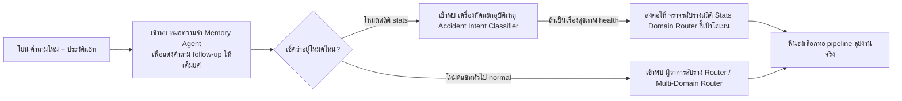

# 🧭 เอเจนต์กองกลางส่วนกลาง — ระบบความจำ (Memory) & คนสับราง (Router)

← กลับไป [[00 - Agent Catalogue]] · ตอนถัดไป → [[02 - Stats Tool Agents]]

> นี่คือกองกำลังเอเจนต์ด่านแรกสุด ที่จะได้รับเกียรติให้ทำงาน **ก่อน** ที่ระบบจะจับคำถามไปโยนลงสายพาน (pipeline) การวิเคราะห์ทุกครั้ง (เป็นตำแหน่งฟรีแลนซ์ที่ไม่ขึ้นตรงกับเครื่องมือไหนเป็นพิเศษ)

---

## 1. หมอความจำ Memory Agent (ซ่อนอยู่ใน `question_resolver.py`)

**ชนิดพนักงาน:** สายยิงตรงหา Gemini (ใช้ปลั๊กอิน litellm) — ตัวนี้ไม่ได้สังกัดพรรค CrewAI Agent
**สมองโมเดลที่ใช้:** สายไว `gemini-2.5-flash-lite` · ค่าความเพ้อ 0.1 · จำกัดการพูด `max_tokens: 300` คำ

- **คำสั่งสะกดจิต (System prompt):** *"คุณคือผู้ช่วยมือฉมังที่โคตรเข้าใจบริบทการสนทนาภาษาไทย และมีหน้าที่เดียวคือคอยปรับแต่งคำถาม
  ที่ชาวบ้านถามห้วนๆ (follow-up) ให้กลายเป็นประโยคเต็มที่สมบูรณ์ชัดเจน"*
- **เนื้องาน (Task):** ระบบจะโยน `history` (ประวัติแชทเก่า) + คำถามใหม่ไปให้มันอ่าน → ถ้าพบว่าคำถามใหม่ชี้เป้าลอยๆ อ้างถึงของเก่าแบบแหว่งๆ (ตัวอย่างเช่น พิมพ์แค่ว่า "แล้วของจังหวัดนั้นล่ะ?", "เรื่องโรคที่คุยตะกี้ไง", "ขอเจาะดูทุกอำเภอหน่อย", หรือใช้พวกสรรพนาม "ไอ้นั่น/ดังกล่าวนั้น") → เอเจนต์ตัวนี้จะต้องงัดประวัติมาปะติดปะต่อ แล้ว **เขียนคำถามประโยคใหม่ยาวๆ ให้ครบถ้วนบริบูรณ์**;
  แต่ถ้าอ่านแล้วคำถามมันสมบูรณ์ในตัวเองดีอยู่แล้ว ให้ตอบกลับสั้นๆ รหัสลับว่า `UNCHANGED`
- **ขีดความสามารถพิเศษ:** เติมเต็มความจำที่แหว่งวิ่นของ user (follow-up) ให้ AI ตัวหลังอ่านรู้เรื่อง (ตัวนี้ไม่มี tools ให้จับ) · แต่มีการฝังการ์ดป้องกัน (guard) คอยตบหัวถ้ามันดันเพ้อเจ้อ (hallucinate) ตอบมายาวเกิน `max(len*6, 400)` อักขระ
- **ผลผลิต (Output):** พ่นค่า `(resolved_prompt, was_changed)` ออกมา — เพื่อให้เอเจนต์ตัวถัดๆ ไป (downstream) ทำงานบนชุดคำถามที่ถูกเกลาแก้ไขแล้วเสมอ

---

## 2. เครื่องคัดแยกเจตนาอุบัติเหตุ Accident Intent Classifier (ซ่อนอยู่ใน `router.py`)

**ชนิดพนักงาน:** สังกัดพรรค CrewAI Agent · โมเดลสายไว fast · คิดซ้ำไม่เกิน max_iter 2 · ไม่มีของเล่น tools ให้ใช้

- **หมวกที่สวม (role):** เครื่องคัดแยกเจตนา `Accident Intent Classifier`
- **เป้าหมาย (goal):** *"ต้องฟันธงให้ได้ว่า ประโยคคำถามนี้เป็นเรื่อง อุบัติเหตุ/ความปลอดภัยทางถนน หรือว่าเป็นเรื่อง โรคภัยไข้เจ็บ/สุขภาพทั่วไป"*
- **ปูมหลัง (backstory):** คุณคือผู้เชี่ยวชาญช่ำชองการคัดแยกคำถามสายสุขภาพ มีหน้าที่แยกแยะคำถามหมวด "อุบัติเหตุทางถนน" (เช่น มีคนเจ็บ/คนตายบนถนน, รถชน, วิกฤตจราจร) แยกออกจากหมวด "โรคหรือสุขภาพทั่วไป" (เช่น เบาหวาน, ความดันเลือด, ปัญหาสุขภาพจิต, โภชนาการอาหาร) — **มีกฎเหล็กว่าให้ตอบคายออกมาแค่คำเดียวโดดๆ เท่านั้น**
- **ขีดความสามารถ:** ระบบจะใช้ตัวนี้เป็นด่านเสริม เมื่อระบบโค้ดจับคำคีย์เวิร์ด `_has_accident_signal` ได้ไม่ชัดเจนพอ — มันจะคายค่า `accident` หรือไม่ก็ `health` ออกมา

---

## 3. จราจรสับรางสายสถิติ Stats Domain Router (context-aware) (ซ่อนอยู่ใน `router.py`)

**ชนิดพนักงาน:** สังกัดพรรค CrewAI Agent · โมเดลสายไว fast · ไม่มี tools

- **หมวกที่สวม (role):** จราจรสับรางสถิติแบบสนบริบท `Stats Domain Router (context-aware)`
- **เป้าหมาย (goal):** *"กวาดสายตาอ่านบริบทการสนทนาทั้งหมด แล้วตัดสินใจเลือกโดเมนตารางข้อมูลสถิติที่ถูกต้อง พร้อมชี้แจงอธิบายเหตุผลประกอบ"*
- **ปูมหลัง (backstory):** คุณคือ Router ที่ยึดมั่นในอุดมการณ์ **"ความต่อเนื่องของบทสนทนา"** — จะไม่มองแค่ประโยคคำถามล่าสุดประโยคเดียว; แต่ถ้าคำถามล่าสุดเป็นแค่การขอเจาะลึกรายละเอียด/แยกย่อยเนื้อหา/สโคปกรองพื้นที่-หรือปี ของเรื่องเก่า ให้ถือว่านั่นคือการอยู่ใน **โดเมนเดิม (domain เดิม)** เสมอ (กติกานี้มีไว้ป้องกันอาการที่ AI หน้ามืดสับรางเปลี่ยนหัวข้อ (re-classify) มั่วซั่วกลางคัน)
- **ขีดความสามารถ:** มันจะพ่นข้อมูลชุด `(domains[], is_multi, reasoning)` ออกมา — ชี้เป้าว่าต้องลงไปล้วงโดเมน `d2`/`d3`/`d4` ตัวไหน; และส่วนของ `reasoning` จะถูกพิมพ์โชว์ออกหน้าจอให้ผู้ใช้อ่านว่าทำไมมันเลือกแบบนั้น

---

## 4. ผู้ว่าการสับรางตัวแม่ Router Agent / Multi-Domain Router / Smart Router (ซ่อนอยู่ใน `router.py`)

**ชนิดพนักงาน:** สังกัดพรรค CrewAI Agent · โมเดลสายไว fast · ไม่มี tools

- มักถูกปลุกขึ้นมาใช้งานตอนผู้ใช้อยู่ในโหมดจับฉ่าย `normal` (ทำงานผ่านฟังก์ชัน `route_multi_domain()` / `route_domain()` / `route_with_web_search()`)
- **ภาระหน้าที่:** เป็นคนฟันธงจับคำถามโยนเข้าตะกร้าโดเมนต่างๆ `d0`–`d4` / ไปท่อวิจัย `dt` / หรือโยนเข้าห้องสมุด `obsidian` และเป็นศาลเตี้ยตัดสินว่า ข้อนี้เป็นแบบ **โดเมนเดี่ยว (ตารางเดียวจบ) หรือ หลายโดเมน (ต้องเอาหลายตารางมาชนกัน)**
- จังหวะการคิด: มันจะให้โค้ดช่วยสแกนจับคีย์เวิร์ดแบบไวๆ ก่อน (เช่น ดักคำว่า ThaiJo, Obsidian/เจอชื่อจังหวัดเขต, หรือจับคำอุบัติเหตุ) ถ้าโค้ดงงจับทางไม่ถูก ค่อยปลุก LLM ตัวนี้ขึ้นมาช่วยสแกนตีความต่อ
- **ขีดความสามารถ:** สั่งเบนเข็มทิศเลือกท่อ pipeline ปลายทางที่จะวิ่งไป; มีทริคซ่อนอยู่คือ ถ้าผู้ใช้อยู่ในโหมดปกติ (normal) แล้วดันถามเรื่องโดเมนอุบัติเหตุ (`d1`) มันจะแอบตีเนียนเตะชิ่งไปหาตู้ห้องสมุด Obsidian แทน (เพื่อให้ตอบกว้างๆ แทนที่จะลงลึก SQL)

---

## 🗺️ สรุปรวมญาติ แผนผังการทำงานร่วมกันของกองกลาง

*เมื่อผ่านกองกลางเสร็จ ก็จะถูกเตะส่งไปหาเอเจนต์สายปฏิบัติการเฉพาะเครื่องมือ: ไปต่อที่ [[02 - Stats Tool Agents]] · [[03 - Knowledge Tool Agent]] · [[04 - Research Tool Agents]] · [[05 - Web Search Tool Agents]]*
