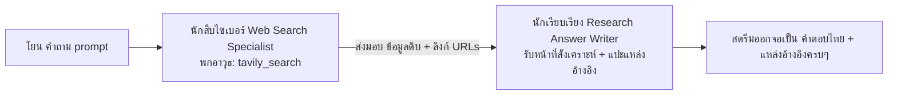

# 🔍 ขบวนการเอเจนต์ประจำปุ่ม "ค้นหาทั่วไป" (Web Search Tool)

← กลับไป [[04 - Research Tool Agents]] · ตอนถัดไป → [[06 - Report & Policy Agents]] · ไปดูเส้นทางเวิร์กโฟลว์: [[05 - Web Search Workflow]]

> สมรภูมินี้ถูกสั่งการผ่านไฟล์ `tavily_pipeline.py` — ซึ่งจะเป็นการจัดตี้ 2 เอเจนต์วิ่งผลัดส่งไม้ต่อกัน (คนแรกไปค้น → คนสองเอามาเขียนเรียบเรียงคำตอบ) โดยทั้งคู่เลือกสวมสมองกลสายสปีด (โมเดล fast) ทั้งคู่เพื่อความไวแสง

---

## 1. นักสืบไซเบอร์ Web Search Specialist (Tavily Search Agent)
- **อาวุธ tools:** พกมีดพับสวิส `[tavily_search]` · **คิดซ้ำสุด:** 5 รอบ
- **เป้าหมาย (goal):** *"ควานหาข้อมูลที่สดใหม่ ถูกต้อง และครบถ้วนที่สุดจากโลกอินเทอร์เน็ต ด้วยพละกำลังของระบบ Tavily"*
- **ปูมหลัง (backstory):** *"คุณคือนักสืบออนไลน์ระดับพระกาฬ มีชั้นเชิงในการแต่งคำค้น (search query) ที่แหลมคม และมีทักษะดูดข้อมูลจากร้อยแปดพันเก้าแหล่ง กฎเหล็กของคุณคือ**ต้องรายงานข้อมูลดิบที่เจอมาอย่างครบถ้วนตามความเป็นจริง โดยห้ามใส่ไข่หรือตีความเอาเองเด็ดขาด**"*
- **เนื้องาน (Task):** ได้รับอนุญาตให้งัด `tavily_search` ออกมาใช้ได้ **แค่ 1 ครั้งเท่านั้น** จากนั้นต้องรีบโยนรายงานสรุป + กองแหล่งอ้างอิงทั้งหมดส่งต่อให้เพื่อนทันที (ห้ามมัวแต่เอ้อระเหยค้นซ้ำไปซ้ำมา)
- **ความสามารถล้นเหลือ:** เป็นตัวตั้งตัวตียิงคำขอไปที่ป้อม Tavily API (มีการเปิด boost กระตุ้นให้เน้นควานหาเว็บภาษาไทย, ลิมิตขอดูไม่เกิน 10 ผลลัพธ์, และขอสกัดตัวอักษร 1200 ตัว/ต่อหนึ่งเว็บ) → ผลที่คายออกมาจะเป็นก้อนข้อมูลดิบ + พร้อมแนบลิงก์ URLs

## 2. นักเรียบเรียงผลการวิจัย Research Answer Writer
- **อาวุธ tools:** — (มามือเปล่า) · **คิดซ้ำสุด:** 3 รอบ · พกข้อมูล `context=[search_task]` (รับมรดกก้อนผลลัพธ์มาจากตัวสืบไซเบอร์คนแรก)
- **เป้าหมาย (goal):** *"สังเคราะห์ก้อนข้อมูลดิบที่ได้จากการค้นหา ให้ออกมาเป็นคำตอบภาษาไทยที่เคลียร์ ชัดเจน และต้องมีแหล่งอ้างอิงประกอบเสมอ"*
- **ปูมหลัง (backstory):** *"คุณคือนักวิจัยชั้นเซียนที่ถนัดการจับแพะชนแกะข้อมูลจากหลากแหล่ง บรรจงเขียนคำตอบที่พุ่งตรงประเด็น วางโครงสร้างให้อ่านง่าย และ**ที่สำคัญคือต้องแปะแหล่งที่มาทุกครั้งที่อ้าปากพูด**"*
- **สิ่งที่คาดหวังให้ออกมา (expected_output):** ผลลัพธ์ต้องเป็นภาษาไทยแต่งหน้าด้วย Markdown — เริ่มต้นด้วยบทสรุป + ใช้ bullet แจกแจงตัวเลข/สถิติทุกเม็ด (ลอกมาเป๊ะๆ คำต่อคำ) + ขยำข้อมูลทุกแหล่งเข้าด้วยกัน + แปะแหล่งอ้างอิงอุดรอยรั่วให้ครบ
- **ความสามารถล้นเหลือ:** ถูกตีกรอบให้หยิบใช้เฉพาะวัตถุดิบที่รับสืบทอดมาจาก Search Agent คนแรกเท่านั้น ห้ามมโนเอง และโดนขู่สำทับว่าห้ามแอบอู้ตอบสั้นเกินไปจนข้อมูลสำคัญตกหล่น

---

## 🗺️ แผนภาพการส่งไม้ต่อ

## 📝 บันทึกเตือนความจำ (หมายเหตุ)
- รหัสคาถาสะกดจิตแบบเต็มๆ (พรอมต์รายละเอียด) ถูกฝังซ่อนไว้ในฟังก์ชัน `_search_agent_prompt()` และตัวแปร `ANSWER_WRITER_PROMPT` ของไฟล์ `tavily_pipeline.py`
- วัตถุดิบผลดิบ (ทั้งชื่อเรื่อง title/ลิงก์ url/บทย่อ summary) จะถูกเก็บกวาดแพ็กใส่ถุงรอไว้เผื่อให้ลูกพี่ [[06 - Report & Policy Agents|report generator]] ดึงไปเขียนขยายความอ้างอิงแยกเป็นทีละแหล่งต่อไป
- ระบบนี้จะง่อยเปลี้ยเสียขาทำงานไม่ได้เลย ถ้าคุณลืมเสียบกุญแจ `TAVILY_API_KEY` (เข้าไปเช็คดูในหมวดตั้งค่า `config.py` ได้เลย)
