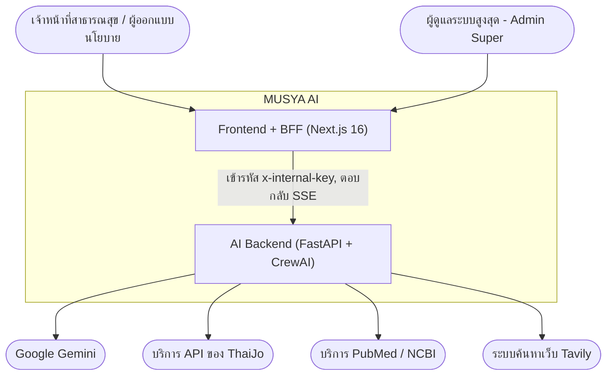
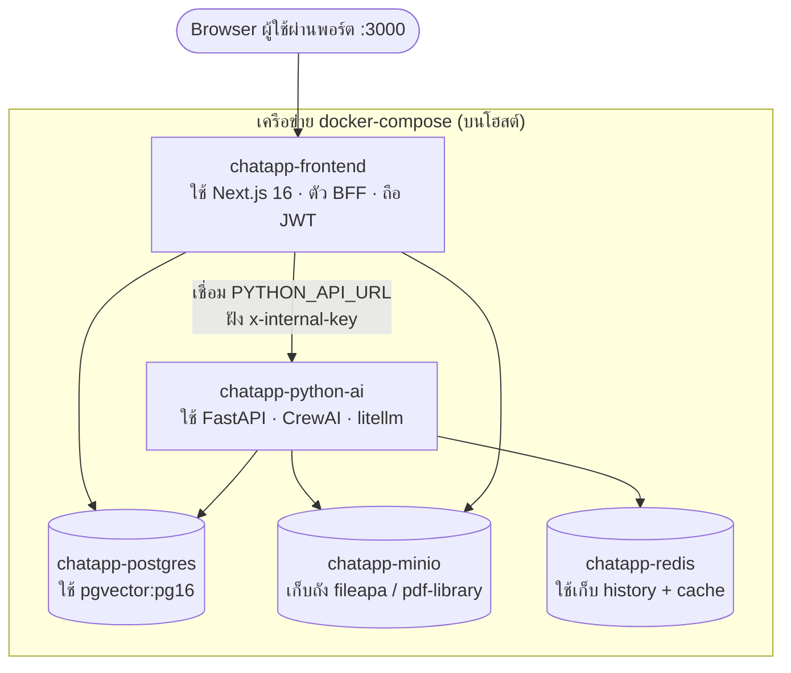
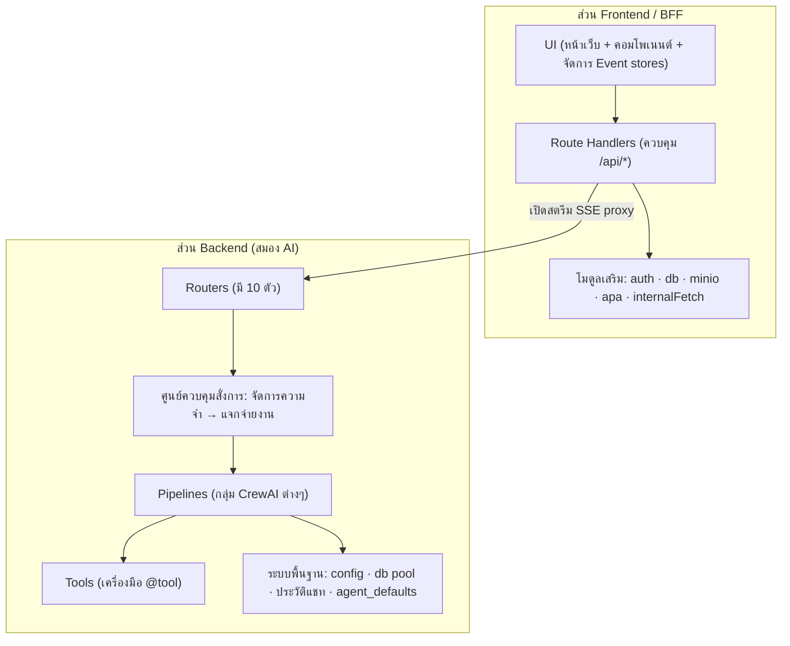

# 🏗️ ภาพรวมสถาปัตยกรรมระดับระบบ (Architecture Overview - As-Built)

← [[index|หน้าหลัก (Vault Home)]] · กลับสู่ส่วน SRS: [[02 - Overall Description]] · หน้าต่อไป → [[01 - Backend Design]]

> ส่วนนี้คือ **มุมมองการออกแบบ (Design View)** อธิบายว่าระบบถูกจัดวางโครงสร้างและสถาปัตยกรรมอย่างไร เพื่อให้ตอบสนองเป้าหมาย [[03 - Functional Requirements|ฟังก์ชันหลัก (FRs)]] และ [[05 - Non-Functional Requirements|ข้อกำหนดเสริม (NFRs)]] 
> เนื้อหาทั้งหมดถูกวิเคราะห์ถอดแบบมาจากโค้ดจริงของ `chatapi.python` (ระบบเบื้องหลัง) และ `chatappandpython` (ระบบหน้าจอ) สำหรับข้อมูลเชิงลึกเรื่องโมเดลฐานข้อมูล ให้ไปดูที่ [[06 - Data Requirements]]

## 1. รูปแบบของสถาปัตยกรรม (Architectural style)

- **ระบบ 2 ชั้น (Two-tier) ควบคู่กับ BFF:** ระบบใช้ Next.js มาทำหน้าที่เป็น **Backend-for-Frontend (BFF)** ถือสิทธิ์ครอบครองการตรวจสอบผู้ใช้งานและฐานข้อมูลหลักของแอป โดย BFF ตัวนี้จะเป็น *ลูกค้า (Client) เพียงผู้เดียว* ที่ได้รับอนุญาตให้ส่งคำสั่งไปหา Python AI Backend
- **การใช้หลายเอเจนต์ประสานงาน (Multi-agent orchestration):** ระบบเบื้องหลัง (Backend) ออกแบบเป็นโครงสร้างแบบ **ผู้แจกจ่ายงาน + ท่อสายพาน (Router + Pipeline)** โดยอาศัยขุมพลังของ **CrewAI** (ทำงานสอดประสานกันด้วย Agent/Crew/Task) ร่วมกับไลบรารี **litellm** สำหรับสตรีมข้อมูลผลลัพธ์จากโมเดลภาษา LLM แบบเรียลไทม์
- **ยึดการสตรีมเป็นหลัก (Streaming-first):** การวิเคราะห์และตอบคำถามทุกประเภทจะใช้โปรโตคอล **Server-Sent Events (SSE)** ฝั่ง UI จะนำข้อมูลที่สตรีมมาวาดขึ้นจอทีละส่วน ไม่มีการโหลดค้าง
- **เพิ่มพูนความรู้ภายนอก (Retrieval-augmented):** คำตอบที่ AI สรุปออกมาจะต้องถูก "ตีกรอบ" และ "อ้างอิง" จากฐานความรู้ภายนอกเท่านั้น (เช่น ดึงจาก PostgreSQL, ค้นไฟล์ใน MinIO, ยิงถาม External APIs) ระบบจะ **ไม่ปล่อยให้ LLM สร้างคำตอบเองจากความจำภายในโมเดล (Parametric memory) อย่างเด็ดขาด**

## 2. C4 Model — มุมมองระดับบริบทของระบบ (System context)

## 3. C4 Model — มุมมองระดับคอนเทนเนอร์และการติดตั้ง (Container / deployment view)

ระบบประกอบด้วยบริการ (Services) 5 ตัวที่รันคู่ขนานกันผ่าน Docker Compose (โดยให้ฝั่ง Frontend เป็นตัวหลักในการสั่ง Build):

| ชื่อคอนเทนเนอร์ (Container) | เครื่องมือ/เทคโนโลยี (Image / stack) | พอร์ตใช้งาน (Ports) | เงื่อนไขการสตาร์ทระบบ (Key deps) |
|---|---|---|---|
| frontend | Next.js 16 / React 19 / TS / Tailwind 4 | 3000 | สั่งรอให้ python-ai + postgres + minio สุขภาพพร้อมทำงานก่อน |
| python-ai | FastAPI + Uvicorn + CrewAI + litellm | 8000 | สั่งรอให้ postgres + minio พร้อม และ redis เปิดทำงาน |
| postgres | `pgvector/pgvector:pg16` | 5432 | รันสคริปต์จำลองตาราง Schema + สถิติอุบัติเหตุ SQL + โครงสร้าง Obsidian |
| minio | `minio/minio` | 9000/9001 | มีการเช็คสุขภาพภายใน (healthcheck `mc ready`) |
| redis | `redis:7-alpine` | 6379 | — |

## 4. แผนผังชั้นการทำงานเชิงตรรกะ (Logical layers)

- **ข้อมูลเจาะลึก Backend:** ไปที่ [[01 - Backend Design]]
- **ข้อมูลเจาะลึก Frontend:** ไปที่ [[02 - Frontend Design]]
- **ลำดับการทำงาน (Runtime sequences):** ไปที่ [[03 - Runtime Views]]

## 5. การออกแบบสถาปัตยกรรมตอบโจทย์คุณสมบัติอย่างไร (How the design meets key quality attributes)

| คุณสมบัติ (Attribute) | กลไกการออกแบบ (Design mechanism) | อ้างอิงถึงข้อกำหนด (Trace) |
|---|---|---|
| **ตอบสนองฉับไว (Responsiveness)** | สตรีมแบบ SSE และมีหน้าจอเผยแพร่สถานะสดๆ ของ Agents | NFR-PERF-01, FR-CHAT-07 |
| **ป้องกันเซิร์ฟเวอร์พัง (Load safety)** | ใช้เทคนิค `BoundedSemaphore(5)` บีบให้รับงานได้จำกัด และเทคนิค Stagger ปล่อยงานทีละชุด | NFR-PERF-02/05 |
| **ความยืดหยุ่นทนทาน (Resilience)** | มีการแทรกแซงโค้ด (Monkey-patch) เพื่อหน่วงเวลาเวลาถูก LLM ปฏิเสธ (429) และสั่งทวนซ้ำถ้าผลลัพธ์ว่างเปล่า | NFR-REL-01/02 |
| **เซฟชิ้นงานแม้เน็ตหลุด (Durability under disconnect)** | BFF ใช้วิธีแยกสายสตรีม `stream.tee()` เพื่อให้มีอีกสายคอยรับคำตอบเอาไปเซฟเผื่อเน็ตฝั่งผู้ใช้งานหลุดกลางทาง | FR-CHAT-14, NFR-REL-03 |
| **ความปลอดภัย (Security boundary)** | ใช้ JWT แบบ (HttpOnly) ป้องกันฝั่งหน้าเว็บ; ล็อก Backend ด้วยกุญแจ `x-internal-key` มิดชิด; และมีการแบ่งสิทธิ์ (RBAC) ชัดเจน | NFR-SEC-01/04/05 |
| **คำตอบมีน้ำหนักและน่าเชื่อถือ (Grounded answers)** | ทุกระบบต้องผ่านฐานข้อมูลสถิติ SQL, คลัง RAG หรือโยงอ้างอิงแหล่งที่มาแยกเป็นเรื่องๆ | FR-CHAT-05, FR-REPORT-08 |
| **ตีวงล้อมพื้นที่ข้อมูล (Scope safety)** | มีด่านคัดกรองจังหวัด (Out-of-zone guard) และระบบบันทึกความล้มเหลวไว้ | FR-CHAT-08 |

## 6. ช่องว่างระหว่างที่ตั้งใจออกแบบไว้กับงานจริง (Design-vs-intent gaps)

ในการออกแบบแรกเริ่ม ระบบมีความทะเยอทะยานสูงกว่าโค้ดที่รันจริงในปัจจุบัน ซึ่งช่องโหว่เหล่านี้เป็นสิ่งท้าทายสำหรับการพัฒนาในรุ่นถัดไป (Future Work):

- ยังไม่มีกระบวนการ **สะท้อนทบทวนตัวเองแบบสมบูรณ์ (Self-reflection loop)** ภายในโมเดล AI; ตอนนี้ยังคงเป็นระบบ Router วิ่งแบบทิศทางเดียว (Pipelines only)
- ระบบ Retrieval ยังคงใช้เพียว **pgvector + pg_trgm** ยังไม่ได้พัฒนาเป็นระดับ Knowledge Graph ของ Neo4j หรือใช้ระบบ ColBERT ในการตีความใหม่ (Rerank) อย่างที่เคยตั้งใจ
- รูปแบบการอ้างอิงเป็น **APA** ธรรมดา ยังไม่มีการใช้เอนจินประมวลผลคำอ้างอิงขั้นสูง (Citation Query Engine) มาช่วยบังคับควบคุมความแม่นยำ
- ยังขาดระบบประเมินผลตัวเองอัตโนมัติ **(Automated evaluation harness)** (เช่น เทคนิคสไตล์ Ragas)
- การเขียนโค้ดที่ซ้ำซ้อนในระบบ: เอเจนต์ `obsidian_agent` ทับซ้อนกับ `obsidian_fullcontext`, โค้ดของ `compare_agent` เหมือนกับ `report_agent`, มีการฮาร์ดโค้ดชื่อรหัสโดเมน (Domain codes) และไฟล์ `progress.py` ยังมีการฝังรายชื่อเอเจนต์แบบดิบๆ อยู่ในโค้ด

> **ข้อสังเกต:** ปัญหาที่ต้องแก้ไขเหล่านี้ถูกมัดรวมไว้เป็นโปรเจกต์มหากาพย์ระยะ 2 (Phase-2 Epics) ที่จดบันทึกไว้ในคลังเอกสารสหายร่วมทางชื่อ `musya-obsidian-document`
