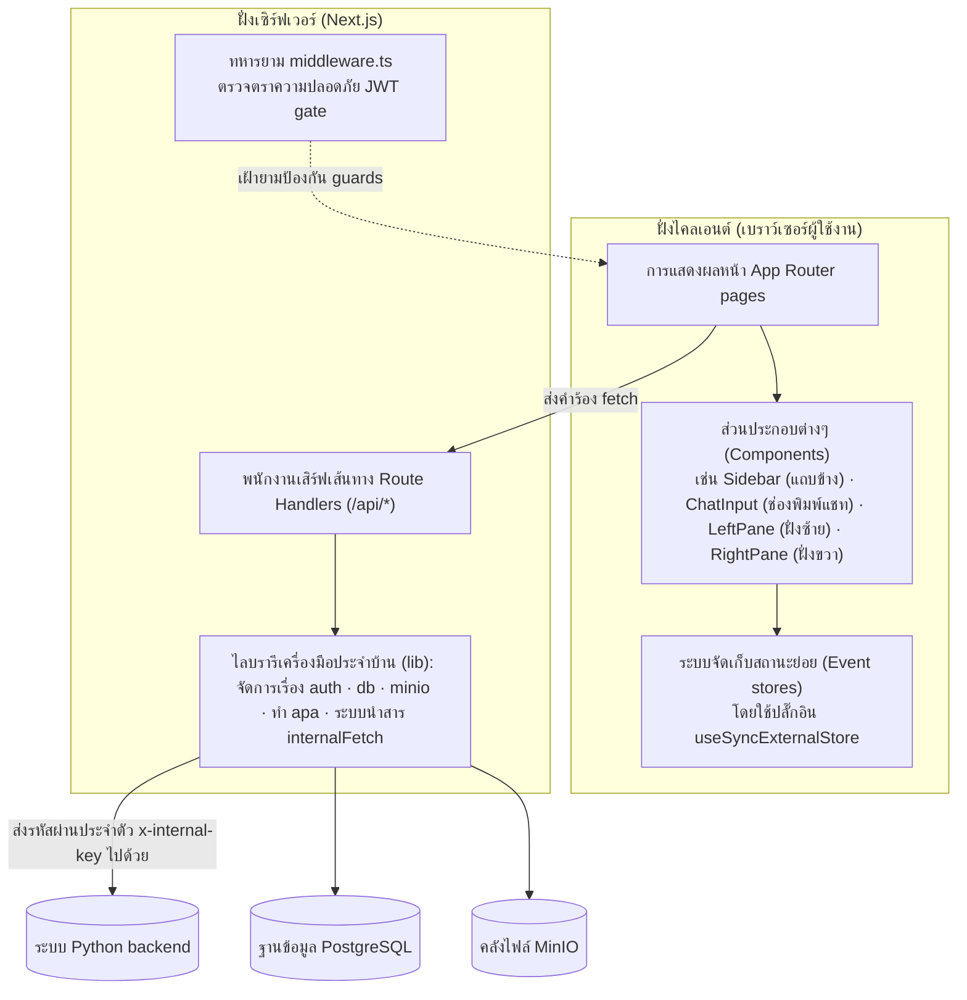
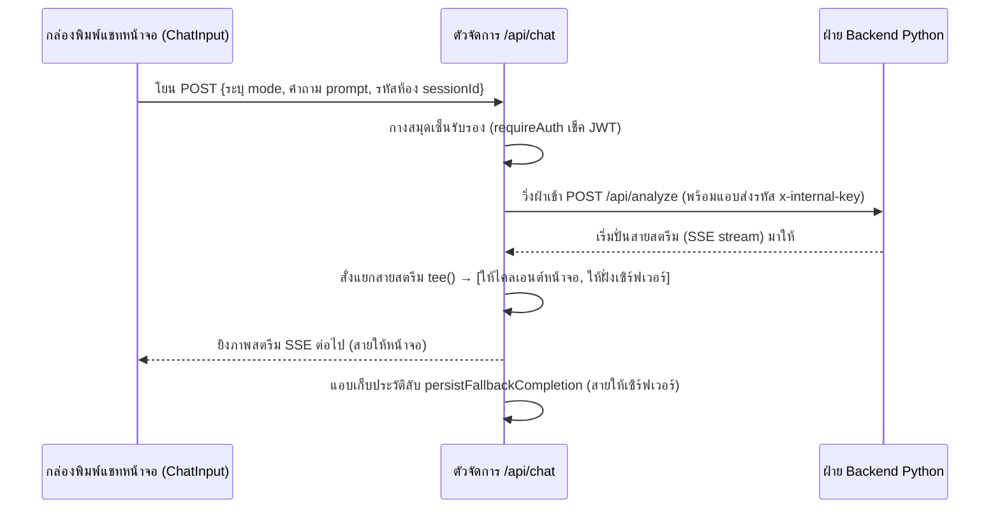

# 🖥️ การออกแบบส่วน Frontend — โปรเจกต์ `chatappandpython` (`musyav2`)

← [[01 - Backend Design]] · หน้าต่อไป → [[03 - Runtime Views]]

> โปรเจกต์นี้พัฒนาบนพื้นฐานของ **Next.js 16 App Router** ซึ่งทำหน้าที่สวมหมวกสองใบคือเป็นทั้ง **ผู้ส่งแสดงหน้าจอ UI** ให้กับผู้ใช้ และเป็น **ผู้หน้าด่านตรวจคนเข้าเมือง (BFF - Backend-for-Frontend)** ในฝั่งเซิร์ฟเวอร์ 
> BFF ตัวนี้จะผูกขาดดูแลจัดการตารางฐานข้อมูลหลักของแอปพลิเคชัน (ระบบบันทึกบัญชี, ระบบเซสชัน, ระบบคลังเอกสาร Journal) ใช้อำนาจเด็ดขาดในการตรวจสอบตัวตนคนส่ง (Authenticate) ทุกเส้นทาง และจะทำหน้าที่ส่งมอบภาระการประมวลผลไปอ้อนวอนกับ Python Backend ก่อนจะรับผลลัพธ์ผ่านทางสายสตรีม (SSE) มาระบายต่อออกสู่เบราว์เซอร์ของผู้ใช้

## 1. ผังโมเดลความสัมพันธ์ (Layer model)

## 2. หน้าต่างเส้นทางหน้าเว็บเพจ (Page routes)

อ้างอิงรายละเอียดย่อยได้ที่ [[04 - External Interface Requirements]] ย่อหน้าที่ 4.1:

- **สายพื้นที่สาธารณะ (Public):** `/` (หน้าแรก), `/login` (เข้าสู่ระบบ), `/register` (ลงทะเบียน), `/forgot-password` (ขอกู้รหัสผ่าน)
- **สายคนในพื้นที่เฉพาะยืนยันตัว (Authenticated):** `/account` (ข้อมูลส่วนตัว), `/chat` (หน้าแชทหลัก), `/chat/sessions/[id]` (คุยงานเก่า), `/journal` (คลังห้องสมุด), `/fileapa*` (จัดทำระบบบรรณานุกรม), `/pdf-upload` (หน้าอัปโหลดเข้าห้องสมุด), `/musyaend` (โหมดแชทเต็มจอ), `/musyaend/db-explorer` (ลงไปสอดส่องดาต้าเบส), `/musyaend/obsidian` (ค้นหาคลังองค์ความรู้)
- **สายสงวนสิทธิ์ขั้นสูงแอดมิน (Admin-only):** `/approved` (จัดการสิทธิ์เฉพาะชนชั้น `adminsuper`)

## 3. ดีไซน์ของระบบคัดกรองบุคคล (Auth design)

- **`lib/auth.ts`** — ควบคุมกลไกการแฮชเข้ารหัสผ่าน bcrypt(12); ตัวรหัสคุกกี้ JWT บังคับเข้ารหัสแบบ **HS256**, อายุ 7 วัน, เขียนโค้ดผ่าน `jose`; มีระบบตรวจเช็คกุญแจลับ `JWT_SECRET` หากสั้นไป หรือเป็นค่ามั่วๆ (Placeholder) หรือหายไป ระบบจะหยุดทำงาน (fail-closed) ทันทีเพื่อล็อกประตูตายนิรภัยไม่ให้โดนแฮก (NFR-SEC-02)
- **ระบบคุกกี้ (Cookie)** — บัตรผ่านชื่อ `auth_token` จะถูกฝังระบบความคุ้มครอง **HttpOnly**, ตั้งค่า `sameSite=lax` (เพื่อป้องกัน CSRF); บัตรนี้ห้ามหลุดไปโผล่ในความจำประเภท `localStorage` เด็ดขาดเพื่อสกัดภัยคุกคามขโมยข้อมูลหน้าจอ
- **`middleware.ts`** — ระบบป้อมยามหน้าประตูบานเดียว: คอยสแกนดูตั๋วเข้างาน JWT, ถ้าไม่มีก็โดนเตะโด่งผลักกลับไปหน้า `/login` ทั้งหมด, และสงวนห้องบัญชาการ `/approved` ไว้สำหรับสิทธิ์ขั้นตระกูล `adminsuper` เท่านั้น
- **`lib/internalFetch.ts`** — คอยประกบพ่วง `requireAuth()` (โยนรหัส 401 ถ้าบุกรุกโดยไม่ได้รับเชิญ) + และสวมหน้ากาก `internalHeaders()` เพื่อแอบฝังพารามิเตอร์ลับ `x-internal-key` ลงในการวิ่งเข้าไปสั่งงาน Backend ทุกๆ ครั้ง

## 4. BFF กับบทบาทพนักงานสตรีมสัญญาณภาพทางไกล (BFF as SSE proxy — `app/api/chat/route.ts`)

จุดแข็งการออกแบบไฮไลต์สำคัญ:
- แปลงสารข้อมูล **`โหมดส่งมา (mode)` → ให้จับคู่กับปลายทางบนเซิร์ฟเวอร์ที่ใช่ (upstream endpoint)** (เช่น พวก `thaijo`/`compare`/`report`/`database`/`pubmed` จะถูกโยนตรงไปยังบ้านพักประจำตัวเลย; ส่วนที่เหลือจะโดนจับยัดเข้าลานกว้าง `/api/analyze`)
- **จำกัดเวลาขาดใจ 10 นาที (10-minute timeout)** ถ้าโดน Pipeline ฝั่ง Python ดูดหายเงียบเข้ากลีบเมฆ จะตัดสายทิ้งทันที
- **ท่ารับมือเน็ตหลุด (Durable completion):** ใช้ไม้ตายแยกร่างสตรีมสัญญาณผ่าน `stream.tee()` — ทางหนึ่งยิงสตรีม SSE กระพริบโชว์บนหน้าเว็บให้ผู้ใช้ดูสบายใจเฉิบ, อีกเส้นแอบต่อสายดิ่งลงดินหลังบ้านให้ตัวละครนินจาชื่อ `persistFallbackCompletion()` เป็นคนคอยงับรอไว้ หากพบเห็นว่าหน้าจอตัดขาดการทำงาน (เช่น ผู้ใช้ออกจากเว็บ แต่สถานะข้างหลังยัง `status='running'`) ตัวช่วยลับก็จะยืนยันรับคำตอบฉบับสุดท้ายไปจดลงใน `chat_sessions` ให้เองอย่างเงียบกริบ (FR-CHAT-14, NFR-REL-03)

## 5. การจัดทรงหน้าต่างแชทและหน่วยความจำ (Chat UI & state)

- **มีหน้าต่าง 2 ฝั่งหดเลื่อนได้ (Two resizable panes):** ฝั่งบานประตูซ้าย `LeftPane` (เอาไว้แสดงลิสต์เซสชัน, กล่องสนทนาโต้ตอบ, และดูแสงกระพริบสถานะของไปป์ไลน์แบบสดๆ), ส่วนฝั่งบานประตูขวา `RightPane` (ใช้สำหรับแช่ภาพแสดงผล HTML ร่างทำรายงาน / โชว์ข้อความร่ายยาวเป็นตัวพิมพ์ดีด, พร้อมปุ่มกดยกโหลด PDF/Word)
- **วิธีรักษาสถานะแบบไม่พึ่งพา Redux (State without Redux):** ทีมพัฒนาเลือกใช้ช่องพิเศษแบบคัสตอมลื่นๆ **(Event stores)** ไปกอดเกาะกินอยู่กับปลั๊กอิน `useSyncExternalStore` — เกิดเป็นกลุ่มร้านค้าเก็บข้อมูลอย่าง `chatSessionStore`, `streamingStore`, `attachedFilesStore`, `chatDraftStore`, `thaijoStore`, `databaseExplorerStore` เหตุผลคือเบาแรง ไม่เป็นภาระ แถมปลอดภัยเรื่องฝั่งประมวลผลเซิร์ฟเวอร์ล่วงหน้า (SSR safety) ด้วย
- **ตัวกล่องป้อนสนทนา (`ChatInput`)** — สวมหน้ากากเป็นตัวเลือกเครื่องมือ. ผูกติดไว้กับ `TOOL_DEFS` เพื่อสลับไปหาจุดที่เรียกว่าโหมดมีผลทันตา `getEffectiveMode()`:

| ชื่อป้ายเครื่องมือบนจอ (Tool - Thai label) | รหัสโค้ด (id) | โหมดที่สั่งทำเบื้องหลัง (Effective mode) |
|---|---|---|
| สร้างรายงาน | `report` | `report-gather` (+ กระบวนการรวมตัวสร้างฟอร์ม wizard) |
| สถิติ | `stats` | `stats` |
| ค้นหาทั่วไป | `tavily` | `tavily` |
| วิจัย | `thaijo` | ถ้าหาหมดใช้ `research` (ทั้งคู่) / แต่ถ้าแยกก็จะเป็น `thaijo` / `pubmed` |
| คลังความรู้รายงาน | `obsidian` | `obsidian` |
| (ไม่มีการเลือกใดๆ) | — | เป็นโหมดทั่วไป `normal` |
| (เผลอแนบไฟล์มาด้วย) | — | เปลี่ยนใจสลับเป็นหมวด `database` วิเคราะห์ตารางทันที |

## 6. โฉนดที่ดินความครอบครองข้อมูลในมุมมองฝั่ง BFF (Data ownership)

ระบบ BFF ฝั่งหน้าด่านนี้มีโฉนดกรรมสิทธิ์ถือครองข้อมูลแอปใน PostgreSQL ทั้งหมด (ตาราง `accounts`, `chat_sessions`, `journal_reports` - อ่านต่อที่ [[06 - Data Requirements]]) และยังมีสิทธิ์เดินเข้าออกสั่งอ่าน/เขียนในคลัง MinIO สำหรับงานไฟล์อัปโหลด, เอกสาร APA, และบันทึกคลังตัวอักษรรายงาน
ขณะที่ฝ่ายเพื่อนร่วมทีม Backend จะถือโฉนดสัมปทานตารางข้อมูลเชิงสถิติอุบัติเหตุ และควบคุมอำนาจจัดดัชนีคลังสมองความรู้ Obsidian (RAG Index) แต่ทั้งหมดถูกบรรจุอาศัยพึ่งใบบุญอยู่ใน **ฐานข้อมูลดาต้าเบสก้อนเดียวกัน** เพียงแค่แบ่งเขตอนุรักษ์กันดูแล

## 7. ประสบการณ์การรังสรรค์ทำเอกสารนโยบาย (Report generation UX)

เมื่อผู้ใช้เรียกฟังก์ชันรวมข้อมูล (`report-gather`) แผงวงจรจะวิ่งส่งคำตอบดิบ "ข้อมูลพื้นฐาน" ถาโถมเข้าไปสาดสตรีมขึ้นที่ตู้บานประตูขวา (RightPane) ในขณะเดียวกันจะงัดกลไกหน้าจอ **ผู้ช่วยส่วนตัว (wizard)** โผล่มาเชิญชวนผู้ใช้ให้เลือกแม่แบบประเภทเอกสารที่จะเขียน (`doc_type`: เช่น สรุปนโยบาย policy/ แผนการ plan/ หรือแผนงาน workplan) และจัดการปรับแต่งรูปแบบตัวโครงสร้างภาษา HTML
เมื่อพอใจผู้ใช้ก็กดเซฟเก็บเอกสารนี้แหมะไปวางบนลิ้นชักตู้สมบัติ `journal_reports` ได้เลย และสามารถกระชากมันออกมาปั้นเป็นฟอร์มไฟล์ DOCX/PDF หรูๆ ได้ด้วยฟังก์ชันช่วยพิมพ์เฉพาะทาง (`buildJournalHtml`, `journalDocxStyles`) รายละเอียดฟินๆ แบบเต็มรูปแบบเชิญเสพต่อใน [[03 - Report Generation]]
