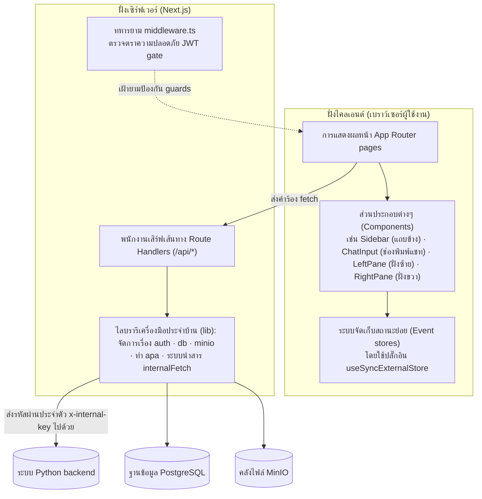
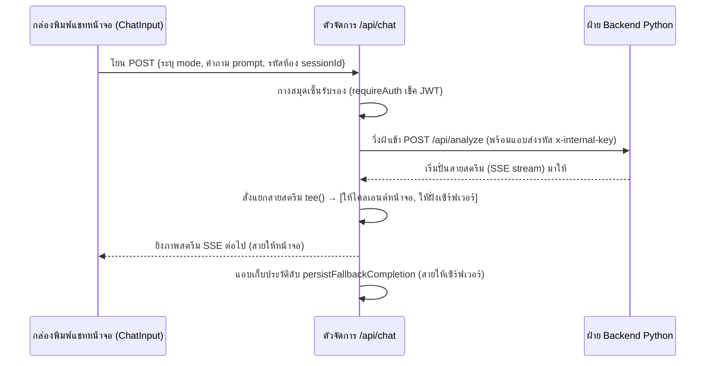

# 🖥️ การออกแบบส่วน Frontend — โปรเจกต์ `chatappandpython` (`musyav2`)

← [[01 - Backend Design]] · หน้าต่อไป → [[03 - Runtime Views]]

> โปรเจกต์นี้พัฒนาบนพื้นฐานของ **Next.js 16 App Router** ซึ่งทำหน้าที่สวมหมวกสองใบคือเป็นทั้ง **ผู้ส่งแสดงหน้าจอ UI** ให้กับผู้ใช้ และเป็น **ผู้หน้าด่านตรวจคนเข้าเมือง (BFF - Backend-for-Frontend)** ในฝั่งเซิร์ฟเวอร์ 
> BFF ตัวนี้จะผูกขาดดูแลจัดการตารางฐานข้อมูลหลักของแอปพลิเคชัน (ระบบบันทึกบัญชี, ระบบเซสชัน, ระบบคลังเอกสาร Journal) ใช้อำนาจเด็ดขาดในการตรวจสอบตัวตนคนส่ง (Authenticate) ทุกเส้นทาง และจะทำหน้าที่ส่งมอบภาระการประมวลผลไปอ้อนวอนกับ Python Backend ก่อนจะรับผลลัพธ์ผ่านทางสายสตรีม (SSE) มาระบายต่อออกสู่เบราว์เซอร์ของผู้ใช้

## 1. ผังโมเดลความสัมพันธ์ (Layer model)

## 2. หน้าต่างเส้นทางหน้าเว็บเพจ (Page routes)

อ้างอิงรายละเอียดย่อยได้ที่ [[04 - External Interface Requirements]] ย่อหน้าที่ 4.1:

- **สายพื้นที่สาธารณะ (Public):** `/` (หน้าแรก), `/login` (เข้าสู่ระบบ), `/register` (ลงทะเบียน), `/forgot-password` (ขอกู้รหัสผ่าน)
- **สายคนในพื้นที่เฉพาะยืนยันตัว (Authenticated):** `/account` (ข้อมูลส่วนตัว), `/chat` (หน้าแชทหลัก), `/chat/sessions/[id]` (คุยงานเก่า), `/journal` (คลังห้องสมุด), `/fileapa*` (จัดทำระบบบรรณานุกรม), `/pdf-upload` (หน้าอัปโหลดเข้าห้องสมุด), `/musyaend` (โหมดแชทเต็มจอ), `/musyaend/db-explorer` (ลงไปสอดส่องดาต้าเบส), `/musyaend/obsidian` (ค้นหาคลังองค์ความรู้)
- **สายสงวนสิทธิ์ขั้นสูงแอดมิน (Admin-only):** `/approved` (จัดการสิทธิ์เฉพาะชนชั้น `adminsuper`)

> [!note] 🆕 ป้ายเวอร์ชันโปรแกรม
> หน้า `/account` แสดงป้าย **`Beta V2.0`** ข้างป้ายสถานะบัญชีในหัวหน้าเพจ
> ค่านี้มาจาก **`lib/appVersion.ts`** (`APP_VERSION_LABEL`) ที่เป็นแหล่งความจริงจุดเดียว
> — **ห้าม hardcode สตริงเวอร์ชันซ้ำในแต่ละหน้า** เวลาขึ้นเวอร์ชันใหม่จะตกหล่น
> และต้องอัปเดตให้ตรงกับ `version` ใน `package.json` (ปัจจุบัน `2.0.0`) เสมอ

## 3. ดีไซน์ของระบบคัดกรองบุคคล (Auth design)

- **`lib/auth.ts`** — ควบคุมกลไกการแฮชเข้ารหัสผ่าน bcrypt(12); ตัวรหัสคุกกี้ JWT บังคับเข้ารหัสแบบ **HS256**, อายุ 7 วัน, เขียนโค้ดผ่าน `jose`; มีระบบตรวจเช็คกุญแจลับ `JWT_SECRET` หากสั้นไป หรือเป็นค่ามั่วๆ (Placeholder) หรือหายไป ระบบจะหยุดทำงาน (fail-closed) ทันทีเพื่อล็อกประตูตายนิรภัยไม่ให้โดนแฮก (NFR-SEC-02)
- **ระบบคุกกี้ (Cookie)** — บัตรผ่านชื่อ `auth_token` จะถูกฝังระบบความคุ้มครอง **HttpOnly**, ตั้งค่า `sameSite=lax` (เพื่อป้องกัน CSRF); บัตรนี้ห้ามหลุดไปโผล่ในความจำประเภท `localStorage` เด็ดขาดเพื่อสกัดภัยคุกคามขโมยข้อมูลหน้าจอ
- **`middleware.ts`** — ระบบป้อมยามหน้าประตูบานเดียว: คอยสแกนดูตั๋วเข้างาน JWT, ถ้าไม่มีก็โดนเตะโด่งผลักกลับไปหน้า `/login` ทั้งหมด, และสงวนห้องบัญชาการ `/approved` ไว้สำหรับสิทธิ์ขั้นตระกูล `adminsuper` เท่านั้น
- **`lib/internalFetch.ts`** — คอยประกบพ่วง `requireAuth()` (โยนรหัส 401 ถ้าบุกรุกโดยไม่ได้รับเชิญ) + และสวมหน้ากาก `internalHeaders()` เพื่อแอบฝังพารามิเตอร์ลับ `x-internal-key` ลงในการวิ่งเข้าไปสั่งงาน Backend ทุกๆ ครั้ง

## 4. BFF กับบทบาทพนักงานสตรีมสัญญาณภาพทางไกล (BFF as SSE proxy — `app/api/chat/route.ts`)

จุดแข็งการออกแบบไฮไลต์สำคัญ:
- แปลงสารข้อมูล **`โหมดส่งมา (mode)` → ให้จับคู่กับปลายทางบนเซิร์ฟเวอร์ที่ใช่ (upstream endpoint)** (เช่น พวก `thaijo`/`compare`/`report`/`database`/`pubmed` จะถูกโยนตรงไปยังบ้านพักประจำตัวเลย; ส่วนที่เหลือจะโดนจับยัดเข้าลานกว้าง `/api/analyze`)
- **จำกัดเวลาขาดใจ 10 นาที (10-minute timeout)** ถ้าโดน Pipeline ฝั่ง Python ดูดหายเงียบเข้ากลีบเมฆ จะตัดสายทิ้งทันที
- **ท่ารับมือเน็ตหลุด (Durable completion):** ใช้ไม้ตายแยกร่างสตรีมสัญญาณผ่าน `stream.tee()` — ทางหนึ่งยิงสตรีม SSE กระพริบโชว์บนหน้าเว็บให้ผู้ใช้ดูสบายใจเฉิบ, อีกเส้นแอบต่อสายดิ่งลงดินหลังบ้านให้ตัวละครนินจาชื่อ `persistFallbackCompletion()` เป็นคนคอยงับรอไว้ หากพบเห็นว่าหน้าจอตัดขาดการทำงาน (เช่น ผู้ใช้ออกจากเว็บ แต่สถานะข้างหลังยัง `status='running'`) ตัวช่วยลับก็จะยืนยันรับคำตอบฉบับสุดท้ายไปจดลงใน `chat_sessions` ให้เองอย่างเงียบกริบ (FR-CHAT-14, NFR-REL-03)

## 5. การจัดทรงหน้าต่างแชทและหน่วยความจำ (Chat UI & state)

- **มีหน้าต่าง 2 ฝั่งหดเลื่อนได้ (Two resizable panes):** ฝั่งบานประตูซ้าย `LeftPane` (เอาไว้แสดงลิสต์เซสชัน, กล่องสนทนาโต้ตอบ, และดูแสงกระพริบสถานะของไปป์ไลน์แบบสดๆ), ส่วนฝั่งบานประตูขวา `RightPane` (ใช้สำหรับแช่ภาพแสดงผล HTML ร่างทำรายงาน / โชว์ข้อความร่ายยาวเป็นตัวพิมพ์ดีด, พร้อมปุ่มกดยกโหลด PDF/Word)
- **วิธีรักษาสถานะแบบไม่พึ่งพา Redux (State without Redux):** ทีมพัฒนาเลือกใช้ช่องพิเศษแบบคัสตอมลื่นๆ **(Event stores)** ไปกอดเกาะกินอยู่กับปลั๊กอิน `useSyncExternalStore` — เกิดเป็นกลุ่มร้านค้าเก็บข้อมูลอย่าง `chatSessionStore`, `streamingStore`, `attachedFilesStore`, `chatDraftStore`, `thaijoStore`, `databaseExplorerStore` เหตุผลคือเบาแรง ไม่เป็นภาระ แถมปลอดภัยเรื่องฝั่งประมวลผลเซิร์ฟเวอร์ล่วงหน้า (SSR safety) ด้วย
  - 🆕 **ร้านค้าใหม่อีก 3 หลังของสายสร้างรายงาน** (ทุกตัวใช้ `CustomEvent` แจ้ง subscriber แบบเดียวกับ `thaijoStore`): `reportSourceStore` (สถานะ badge 5 แหล่ง), `preGatherTopicsStore` (สะพานเลือกหัวข้อก่อนระดมข้อมูล), `reportReadyStore` (สัญญาณว่า "ข้อมูลพร้อมแล้ว รอผู้ใช้กดสร้าง")
  - 🆕 **โมดูลผู้ช่วยที่ไม่ใช่ร้านค้า** อีก 4 ตัว — `reportRetry.ts` (ยิงลองใหม่รายแหล่ง), `wizardPersist.ts` + `reportSavePersist.ts` (ยัดสถานะลง DB กันหายตอน reload), `obsidianApa.ts` (แปลงอ้างอิงคลังความรู้เป็นบรรณานุกรม APA — ดูส่วนที่ 8)
- **ตัวกล่องป้อนสนทนา (`ChatInput`)** — สวมหน้ากากเป็นตัวเลือกเครื่องมือ. ผูกติดไว้กับ `TOOL_DEFS` เพื่อสลับไปหาจุดที่เรียกว่าโหมดมีผลทันตา `getEffectiveMode()`:

| ชื่อป้ายเครื่องมือบนจอ (Tool - Thai label) | รหัสโค้ด (id) | โหมดที่สั่งทำเบื้องหลัง (Effective mode) |
|---|---|---|
| สร้างรายงาน | `report` | `report-gather` (+ กระบวนการรวมตัวสร้างฟอร์ม wizard) |
| สถิติ | `stats` | `stats` |
| ค้นหาทั่วไป | `tavily` | `tavily` |
| วิจัย | `thaijo` | ถ้าหาหมดใช้ `research` (ทั้งคู่) / แต่ถ้าแยกก็จะเป็น `thaijo` / `pubmed` |
| คลังความรู้รายงาน | `obsidian` | `obsidian` |
| (ไม่มีการเลือกใดๆ) | — | เป็นโหมดทั่วไป `normal` |
| (เผลอแนบไฟล์มาด้วย) | — | เปลี่ยนใจสลับเป็นหมวด `database` วิเคราะห์ตารางทันที |

## 5.5 🆕 ตัวเรนเดอร์คำตอบ — ตาราง กราฟ และสมการ (`app/component/chat/`)

คำตอบจากทุก pipeline คือ **Markdown ก้อนเดียว** ที่ผ่าน `MarkdownContent.tsx` (parser เขียนเอง ไม่มี dependency markdown) แยกความรับผิดชอบเป็น 4 ไฟล์:

| ไฟล์ | หน้าที่ |
| --- | --- |
| `MarkdownContent.tsx` | ตัด Markdown เป็นบล็อก (heading/ตาราง/list/code/**สมการ**) แล้วเรนเดอร์ |
| `chartAdvisor.ts` | **ตรรกะล้วน** — อ่านทรงตาราง → ชุดข้อมูลกราฟ + จัดอันดับกราฟที่เหมาะสม + จัดรูปตัวเลข |
| `TableCharts.tsx` | วาด SVG 4 ชนิด: แท่งแนวตั้ง · แท่งแนวนอน · เส้น · วงกลม (รองรับหลายชุดข้อมูล) |
| `MathContent.tsx` | เรนเดอร์ LaTeX subset (`\frac \text \left\right ^ _ \hat \sqrt \times …`) |

**การจัดอันดับกราฟ (`rankCharts`)** — ผู้ใช้เห็นป้าย *อันดับ 1 / 2 / 3* บนปุ่ม พร้อมเหตุผลใต้กราฟ แต่ยังกดเลือกเองได้ทุกปุ่ม
- แกน X เป็นมิติเวลา ⇒ **กราฟเส้นชนะเสมอ** · วงกลมตกอันดับ (แสดงสัดส่วน ณ จุดเดียว)
- เทียบข้ามหมวด ⇒ **แท่ง** (แนวตั้งถ้าชื่อสั้น/รายการน้อย · แนวนอนถ้าชื่อยาวหรือเกิน 12 รายการ)
- **วงกลม** ใช้ได้เฉพาะ *ชุดเดียว · ค่าบวกล้วน · 2–7 รายการ* และถ้าเป็นคอลัมน์ร้อยละ ต้องรวมกันได้ ≈100 (ไม่งั้นไม่ใช่ส่วนแบ่งของยอดรวม)

> [!note] ทำไมตัดสินด้วยโค้ด ไม่ใช่ยิง LLM ถามว่าควรใช้กราฟอะไร
> ข้อมูลตารางอยู่ครบฝั่งหน้าจอแล้ว และเกณฑ์เลือกกราฟเขียนเป็นกฎตรง ๆ ได้
> ยิง LLM เพิ่มจะได้คำตอบไม่คงที่ระหว่างรอบ + หน่วงจอ + กินโควตา โดยไม่ได้ความแม่นเพิ่ม

**รูปทรงตารางที่รองรับ** (agent ผลิตออกมาทั้ง 2 แบบ ต้องได้กราฟหน้าตาเดียวกัน):
- ปีเป็น**หัวคอลัมน์** `| ระยะ CKD | 2561 | 2562 | … |` ⇒ แกน X = ปี, หนึ่งเส้น = หนึ่ง stage
- ปีเป็น**แถว** `| ปี | Stage 3 | Stage 4 | … |` ⇒ แกน X = ปี, หนึ่งเส้น = หนึ่ง stage

> [!bug] 🆕 บั๊กที่แก้ไปพร้อมกัน
> 1. **ตัวเดิมหยิบคอลัมน์ตัวเลขแค่คอลัมน์แรกคอลัมน์เดียว** — ตารางแนวโน้มแยก stage วาดได้แค่ stage เดียว ที่เหลือหายเงียบ
> 2. **ไม่มีกราฟเส้นให้เลือกเลย** ทั้งที่ตารางแนวโน้มรายปีต้องใช้กราฟเส้น
> 3. **`$$…$$` แสดงเป็นโค้ดดิบ** ทั้งที่พรอมต์สั่ง agent เขียนสูตร LaTeX มาตั้งแต่ต้น ⇒ เพิ่ม `MathContent.tsx`
> 4. **จำนวนคนมีทศนิยม** (`45,231.00 คน`) ⇒ `formatCell()` ตัด `.00` **เฉพาะคอลัมน์ที่หัวตารางบอกว่าเป็นตัวนับ**
>    (จำนวน/ราย/คน/ครั้ง/แห่ง/ผู้ป่วย/ประชากร) — **ห้ามแตะคอลัมน์ร้อยละ/อัตราเด็ดขาด** เพราะปัด 52.87% เป็น 53% คือทำข้อมูลเสียหาย
>    เป็นการกันซ้ำชั้นที่ 2 · ชั้นแรกแก้ที่พรอมต์ (`prompt_profile.NUMBER_FORMAT_POLICY`)
> 5. **ตารางที่มีทั้งคอลัมน์จำนวนคนและร้อยละ** ถูกวาดรวมแกนเดียว (แท่ง 5.12% เตี้ยจนมองไม่เห็นข้าง 189,542)
>    ⇒ `buildChartData()` เลือกเฉพาะกลุ่มคอลัมน์ที่มีมากกว่า เสมอกันให้ตัวนับชนะ

## 6. โฉนดที่ดินความครอบครองข้อมูลในมุมมองฝั่ง BFF (Data ownership)

ระบบ BFF ฝั่งหน้าด่านนี้มีโฉนดกรรมสิทธิ์ถือครองข้อมูลแอปใน PostgreSQL ทั้งหมด (ตาราง `accounts`, `chat_sessions`, `journal_reports` - อ่านต่อที่ [[06 - Data Requirements]]) และยังมีสิทธิ์เดินเข้าออกสั่งอ่าน/เขียนในคลัง MinIO สำหรับงานไฟล์อัปโหลด, เอกสาร APA, และบันทึกคลังตัวอักษรรายงาน
ขณะที่ฝ่ายเพื่อนร่วมทีม Backend จะถือโฉนดสัมปทานตารางข้อมูลเชิงสถิติอุบัติเหตุ และควบคุมอำนาจจัดดัชนีคลังสมองความรู้ Obsidian (RAG Index) แต่ทั้งหมดถูกบรรจุอาศัยพึ่งใบบุญอยู่ใน **ฐานข้อมูลดาต้าเบสก้อนเดียวกัน** เพียงแค่แบ่งเขตอนุรักษ์กันดูแล

## 7. ประสบการณ์การรังสรรค์ทำเอกสารนโยบาย (Report generation UX)

> [!warning] 🆕 ส่วนนี้ถูกรื้อลำดับขั้นใหม่หมด — ของเดิม "ยิงก่อน แล้วค่อยถาม" ตอนนี้เป็น **"ถามให้ครบก่อน แล้วค่อยยิง"**

**ลำดับใหม่ 5 ขั้น** (ของเดิมคือ: ยิง `report-gather` ด้วย prompt ดิบ → สตรีมข้อมูลเข้า RightPane → wizard เด้งถามประเภทเอกสาร → auto-generate HTML ทันทีที่ข้อมูลครบ):

| ขั้น | เกิดอะไรขึ้น | โมดูลที่รับผิดชอบ |
|---|---|---|
| **1. เลือกประเภท + หัวข้อ *ก่อน* ระดมข้อมูล** | `ChatInput` เรียก `/api/thaijo-topics` ด้วย `articles_text=""` (ยังไม่มีข้อมูลจริง ให้ AI เดาหัวข้อจากคำถามล้วน ๆ) แล้วเปิดหน้าจอให้ผู้ใช้ติ๊ก/แก้หัวข้อ — `ChatInput` **ค้าง `await` Promise รอ** จนผู้ใช้กด "ยิงไปหาข้อมูล →" | `preGatherTopicsStore.ts` |
| **2. ยิงจริงพร้อมของแถม** | ค่อยยิง `mode=report-gather` โดยแนบ `doc_type` + `report_title` ไปด้วย (prompt ถูกเสริมหัวข้อที่เลือกไว้แล้ว) | `ChatInput` → BFF |
| **3. ดูสถานะรายแหล่งแบบสด** | badge 5 อันโชว์ `pending → running → done/error` แยกกัน แหล่งไหนพังมีปุ่ม "ลองใหม่" ขึ้นทันที ไม่ต้องรอจบงาน | `reportSourceStore.ts` + `ReportSourceBadges.tsx` |
| **4. ตรวจก่อน แล้วค่อยกดสร้าง** | 🔑 **เลิก auto-generate แล้ว** — พอ gather เสร็จระบบแค่ขึ้นสถานะ "พร้อมให้กด" ผู้ใช้ต้องอ่านข้อมูลพื้นฐานที่รวบรวมมาก่อน แล้วกดปุ่มเองถึงจะเริ่ม generate HTML จริง | `reportReadyStore.ts` |
| **5. เซฟ + ส่งออก** | เซฟลง `journal_reports` แล้วปั้นเป็น DOCX/PDF ด้วย `buildJournalHtml`, `journalDocxStyles` ตามเดิม | — |

**🆕 กันงานหายเวลา reload กลางทาง** — เดิมสถานะ wizard อยู่ใน memory ล้วน ๆ (`thaijoStore`) refresh ทีเดียวหายเกลี้ยง ต้อง gen ใหม่ทั้งหมด ตอนนี้ยัดลง `messages_json` ของ `chat_sessions` แทน:
- `wizardPersist.ts` — เซฟความคืบหน้าขั้นเลือก/แก้หัวข้อแบบ **debounce** (ชนิด `WizardProgressSaved`)
- `reportSavePersist.ts` — เซฟ `id` + `title` ของรายงานที่ auto-save สำเร็จ (ชนิด `SavedReportRef[]`) เพื่อให้ **ปุ่มเปิดรายงานในแชทเก่ายังกดได้หลัง reload**
- ทั้งคู่ใช้ท่าเดียวกัน: ไล่หาข้อความล่าสุดที่มี `reportData` จากท้ายรายการ แล้วแปะข้อมูลลงไปในข้อความนั้น

**🆕 ปุ่ม "ลองใหม่" รายแหล่ง** (`reportRetry.ts`) — ยิง `mode=report-gather-retry` พร้อม `retry_source` ไปแหล่งเดียว ผลที่ได้จะถูก **ต่อท้าย (append)** เข้ากับเนื้อหาเดิมใน RightPane ไม่ใช่เขียนทับ แล้ว `persistRetryResult()` เซฟทับลง DB ให้ด้วย — ไม่งั้นเนื้อหาที่เพิ่งกู้กลับมาได้จะอยู่แค่ใน memory แล้วหายอีกรอบตอน reload

รายละเอียดฟินๆ แบบเต็มรูปแบบเชิญเสพต่อใน [[03 - Report Generation]] และ [[06 - Report Generation Workflow]]

## 8. 🆕 บรรณานุกรม APA ของเอกสารอ้างอิงจากคลังความรู้

ท้ายคำตอบโหมดคลังความรู้ (`obsidian`) เดิมแสดง `notesReferenced` เป็น **ป้ายกลม (pill) เรียงต่อกัน** — อ่านง่ายแต่ **ก๊อปไปใส่เอกสารทางการไม่ได้** เพราะไม่มีรูปแบบการอ้างอิงมาตรฐาน ตอนนี้เปลี่ยนเป็น **รายการบรรณานุกรมรูปแบบ APA** แทน

| ชิ้นส่วน | หน้าที่ |
|---|---|
| `app/chat/obsidianApa.ts` | ตรรกะล้วน — แกะ `ObsidianNoteRef` ออกเป็นชิ้นส่วน APA (ไม่มี React) |
| `app/component/chat/ApaReferences.tsx` | ส่วนแสดงผล + ปุ่มคัดลอกทั้งชุด |
| `app/chat/LeftPane.tsx` | เรียกใช้แทนบล็อกป้ายกลมเดิม |

**รูปแบบที่ได้:** `ชื่อเรื่อง [ประเภท]. (ปี). คลังความรู้ MUSYA เขตสุขภาพที่ 10.`

การแกะข้อมูลอาศัย **แบบแผนการตั้งชื่อไฟล์ในคลัง** คือ `<PREFIX>_<หัวเรื่อง>-<ขอบเขต>-<ปี พ.ศ.>`:
- **prefix → ประเภทเอกสาร** — `R`=รายงาน · `P`=แผนงาน · `A`=คู่มือ · `M`/`F`=งานวิจัย · ไม่มี prefix=เอกสาร
- **ปี** — จับเฉพาะเลข 4 หลักช่วง 2300-2699 ที่อยู่ท้ายสุด (กันเลขอื่นเช่นจำนวนผู้ป่วยโดนจับผิด) รองรับช่วงปีเช่น `2566-2570` · ถ้าไม่พบใช้ **`ม.ป.ป.`**
- **ส่วนต่อท้ายจากการหั่นไฟล์** (`-ส่วนที่NN`, `-INDEX`) ถูกตัดออก (วนตัดจนหมด เพราะบางไฟล์ซ้อนหลายชั้น)

> [!warning] 🔑 การตัดสินใจสำคัญ — **จงใจไม่ใส่ชื่อผู้แต่ง**
> `ObsidianNoteRef` มีแค่ `note_id` / `title` / `province` / `district` / `pdf_url` — **ไม่มีข้อมูลผู้แต่งเลย** จึงตั้งใจ *ไม่* เดาว่าเป็น "สำนักงานสาธารณสุขจังหวัด X" เพราะ **การกุชื่อผู้แต่งลงบรรณานุกรมคือการสร้างหลักฐานเท็จ** และไม่จริงเสมอไป (เช่น `A_คู่มือ...-กองการแพทย์ทางเลือก-2563` เจ้าของคือกองการแพทย์ทางเลือก ไม่ใช่จังหวัด)
>
> ใช้กติกา APA สำหรับงานที่ไม่ปรากฏผู้แต่งแทน คือ **เลื่อนชื่อเรื่องขึ้นมาอยู่ตำแหน่งผู้แต่ง** ซึ่งถูกต้องตามหลัก APA — ถ้าภายหลังยืนยันกฎการระบุผู้แต่งได้ค่อยเพิ่มทีหลัง
>
> อีกจุด: prefix `M_` กับ `F_` **แยกจากกันไม่ได้จากชื่อไฟล์** (ทั้งคู่เป็นงานวิจัย ไม่มีเอกสารกำกับความหมายไว้) จึงจัดเป็น `[งานวิจัย]` เหมือนกัน

> [!note] ทำไมไม่พิมพ์ URL ต่อท้ายรายการบนหน้าจอ
> **ชื่อเรื่องเป็นลิงก์อยู่แล้ว** (ใช้ `pdf_url` ตัวเดียวกับป้ายแบบเก่า) การพิมพ์ URL ซ้ำอีกรอบทำให้บรรทัดยาวและอ่านยากโดยไม่ได้ประโยชน์เพิ่ม
> **แต่ปุ่ม "คัดลอก" ยังแนบ URL แบบเต็มไปด้วยเสมอ** — เพราะข้อความล้วนที่ไปวางในเอกสารอื่นคลิกไม่ได้ จึงต้องมี URL ให้ตามกลับมา และต้องเป็น URL เต็ม (`window.location.origin` + path) ไม่ใช่ path สัมพัทธ์ซึ่งใช้นอกเว็บไม่ได้

การเรียงลำดับใช้ `localeCompare(…, "th")` ตามชื่อเรื่อง (ซึ่งทำหน้าที่แทนผู้แต่ง) ตามหลักการเรียงบรรณานุกรม APA
