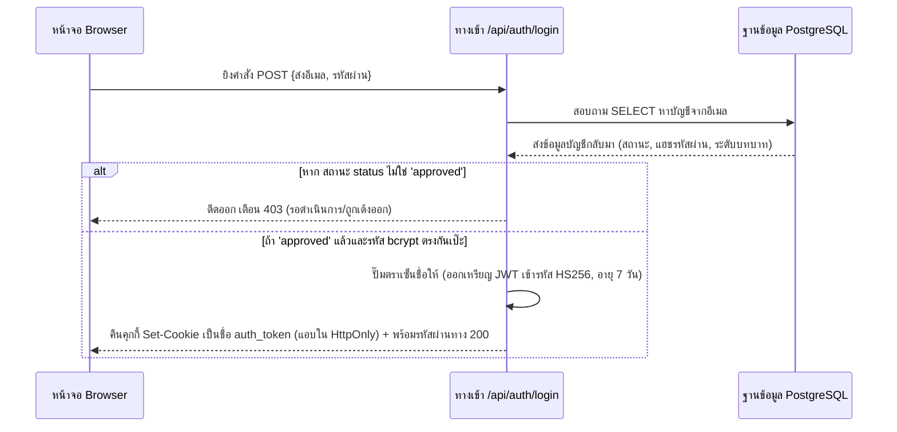
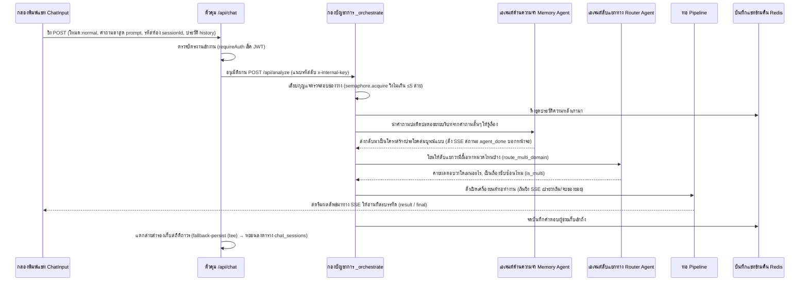
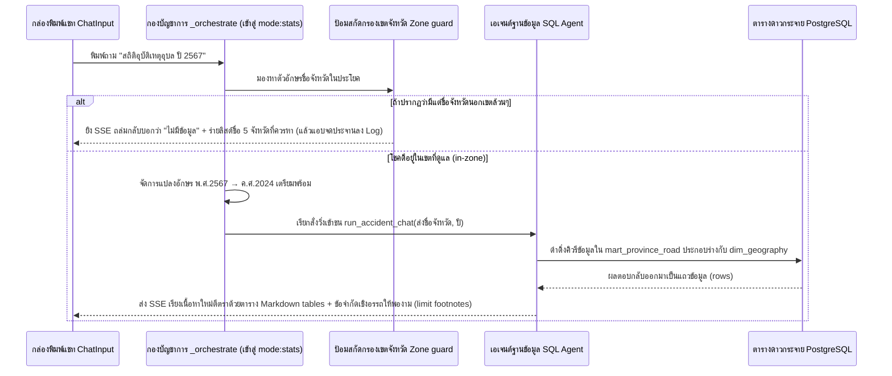
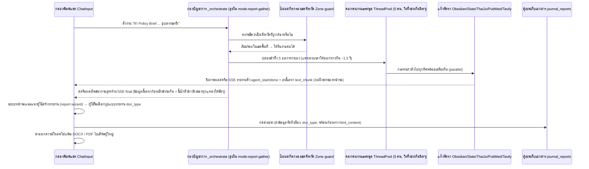
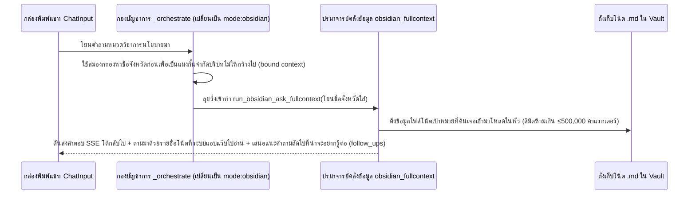

# 🔁 ภาพจำลองลำดับการทำงานเชิงระบบ (Runtime Views — Sequence Diagrams)

← [[02 - Frontend Design]] · กลับไปสู่หน้าภาพรวม → [[00 - Architecture Overview]]

> นี่คือมุมมองเคลื่อนไหว (Dynamic view) ที่จำลองเหตุการณ์จริงของการทำงานข้ามระบบจากบรรดา [[00 - Actors & Use-Case Map|ยูสเคสหลักๆ]] โดยใช้ตัวย่อของผู้แสดง (Actors) ดังนี้:
> **U**=ฝั่งผู้ใช้งานบนเบราว์เซอร์, **BFF**=ระบบหน้าด่าน Next.js, **BE**=ฝั่งสมองกลจัดสรรงาน FastAPI, **Mem**=ความจำอัจฉริยะ (Memory Agent), **Rtr**=สายแยกวง (Router Agent), **Pipe**=ท่อปฏิบัติงานเฉพาะกิจ (Pipeline ที่ถูกเลือก), **PG/Redis/MinIO**=คลังเสบียงฐานข้อมูลต่างๆ

## 1. ลำดับการล็อกอินเข้าสู่ระบบ ([[01 - Account & Access|อ้างอิง UC-02]])

## 2. ลำดับการแชทถามแบบปกติพร้อมรื้อฟื้นความจำเดิม ([[02 - Chat & Domain Analysis|อ้างอิง UC-06/UC-12]])

## 3. ลำดับการงัดข้อสถิติข้อมูลอุบัติเหตุแบบรวดเร็ว ([[02 - Chat & Domain Analysis|อ้างอิง UC-07]])

## 4. ลำดับการสั่งผลิตชิ้นส่วนตั้งต้นเพื่อสร้างรายงานแบบมโหฬาร ([[03 - Report Generation|อ้างอิง UC-13/UC-14]])

## 5. ลำดับการตะลุยค้นความรู้เชิงลึกในองค์กร ([[02 - Chat & Domain Analysis|อ้างอิง UC-09]])

## 6. กฎรันไทม์บังคับที่คอยสอดส่องครอบคลุมทุกการทำงาน (Cross-cutting runtime rules)

| กฎเหล็กที่ระบบถือสา (Rule) | ด่านตรวจสอบจุดไหน (Where enforced) | อ้างอิงแหล่ง (Trace) |
|---|---|---|
| ต้องโชว์ตั๋ว Auth ทุกครั้งที่จะเข้าทำงาน | ถูกเช็คที่ยาม `middleware.ts` / และ `requireAuth` | FR-AUTH-09 |
| ขุดท่อไปป์ไลน์ให้วิ่งได้ไม่เกิน ≤5 สายต่อเวิร์กเกอร์ | ถูกคุมขังด้วยตัวแปร `_AI_SEMAPHORE` วางไว้ในห้อง `analyze.py` | NFR-PERF-02 |
| กฎการรอจังหวะหน่วงเวลาเมื่อเซิร์ฟเวอร์เต็ม 429 | ถูกสอดไส้ฝังทับอยู่ข้างในวิญญาณ `agent_defaults` | NFR-REL-01 |
| ระบบห้ามตายคากลางอากาศถ้าผู้ใช้ออฟไลน์ | ใช้วิชาแยกสตรีม `tee()` ของ BFF คู่กับวิชาบันทึกลับ `persistFallbackCompletion` | FR-CHAT-14 |
| ถามเรื่องนอกเขต ก็ต้องตีกลับว่าไม่มีข้อมูล (no-data) | ด่านสกัดกั้นหน้าประตูกับคนตรวจจับ `missing_data_logger` | FR-CHAT-08 |
| ภูมิประวัติคำตอบของผู้ช่วย BE ต้องถูกจดจำเสมอ | ฝังประวัติด้วย `history.append_history` (โยนเข้าความจำ Redis) | FR-CHAT-13 |
