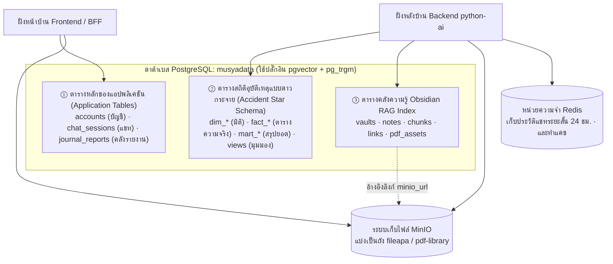
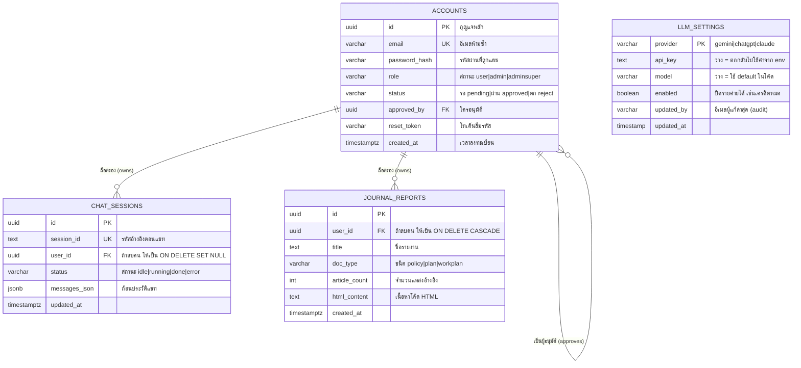
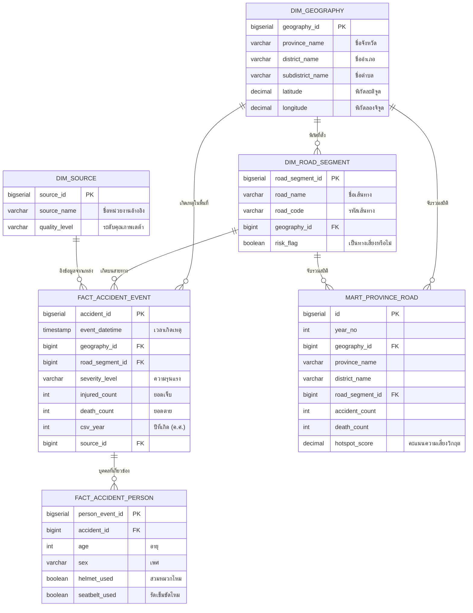
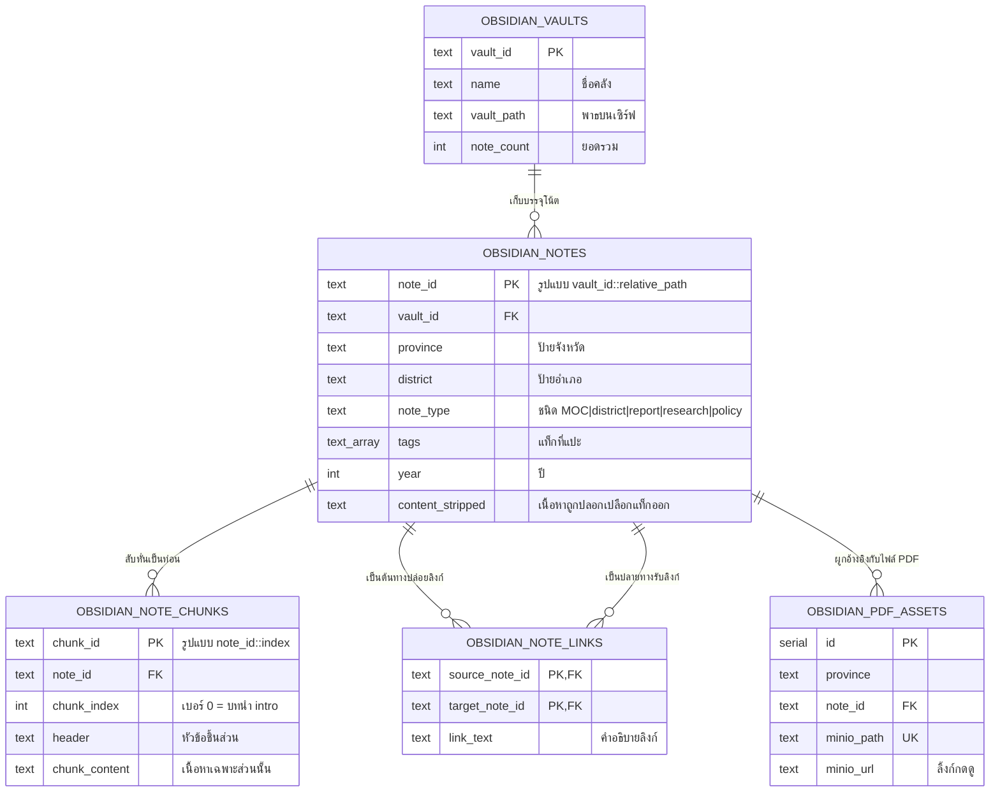

# 🗄️ การออกแบบสถาปัตยกรรมข้อมูลและโครงสร้างสคีมา (Data Architecture & Schema)

← [[03 - Runtime Views]] · กลับสู่ภาพรวม → [[00 - Architecture Overview]] · อ้างอิงข้อกำหนดเดิม: [[06 - Data Requirements]]

> เอกสารชุดนี้เป็น **มุมมองเชิงการออกแบบข้อมูล (Data Design View)** ซึ่งแกะแบบมาจากไฟล์ DDL ต้นฉบับที่รันจริงในระบบ
> ทั้งในฝั่ง `chatapi.python/database/` (เช่นไฟล์ `schema.sql`, และซีรีส์ `025`–`027` ของระบบ obsidian) รวมถึง
> ฝั่ง `chatappandpython/database/schema.sql` — รับรองได้ว่านี่คือ "แผนผังของจริงที่ระบบกำลังใช้อยู่" ไม่ใช่แค่แบบร่าง

---

## 1. หลักการออกแบบระบบ — "หนึ่งฐานข้อมูล สามอาณาจักร" (One DB, three subdomains)

โครงสร้างทั้งหมดใช้ขุมพลังของ **PostgreSQL เพียงก้อนเดียว** (ชื่อฐานข้อมูล `musyadata`, รันบนอิมเมจ `pgvector/pgvector:pg16`)
แต่ภายในถูกจัดสรรแบ่งโซนออกเป็น 3 อาณาจักรที่ระดับความละเอียดของข้อมูล (grain) และวงจรชีวิตแตกต่างกันอย่างชัดเจน โดยทำงานผสานกับ
แหล่งเก็บข้อมูลภายนอกอีก 2 แหล่งเสริมความแกร่ง:



| ชื่ออาณาจักร (Subdomain) | เจ้าของหลักดูแล | ระดับความละเอียด/ธรรมชาติของข้อมูล | ใช้ทำหน้าที่ตอบโจทย์อะไร |
|---|---|---|---|
| ① ระบบ Application | ฝั่ง Frontend (BFF) | เชิงปฏิบัติการ (มีข้อมูลแยกตามผู้ใช้/เซสชันแชท/เอกสารรายงาน) | ระบบล็อกอิน, ประวัติการแชทเก่า, และคลังเก็บผลงานรายงาน |
| ② ระบบ Accident Star | ฝั่ง Backend | เชิงวิเคราะห์ (Aggregate สรุปยอดรวมแยกตามพิกัด/เวลา/เส้นถนน) | ถาม-ตอบสถิติอุบัติเหตุของเขตสุขภาพที่ 10 |
| ③ ระบบ RAG Index | ฝั่ง Backend | เชิงสืบค้น (แบ่งเป็นตัวโน้ต/การหั่นย่อหน้า chunk/กราฟเชื่อมโยง) | ถาม-ตอบจากทฤษฎีในคลังความรู้ |
| แหล่งไฟล์ MinIO | ใช้งานร่วมกันทั้งคู่ | เป็นชิ้นไฟล์ไบนารี (Binary object) | เก็บไฟล์ดิบ CSV/PDF/DOCX + จัดการ APA + เซฟรายงาน |
| หน่วยจำ Redis | ฝั่ง Backend | เกิดดับรวดเร็ว (มีอายุขัย TTL 24 ชม.) | ความจำสั้นของแชทระหว่างเซสชัน + ทำระบบแคช |

> [!tip] เคล็ดลับการจำหลักคิดที่สำคัญ
> **"MinIO มีไว้เก็บ ตัวไฟล์อ้วนๆ (binary), ส่วน PostgreSQL มีไว้เก็บ ที่อยู่และป้ายกำกับ (path/URL/metadata)"**
> — ยกตัวอย่างเช่น ตาราง `obsidian_pdf_assets` จะมีคอลัมน์ `minio_path` เพื่อทำหน้าที่เป็นลายแทงชี้เป้าไปยังไฟล์ต้นฉบับใน MinIO

---

## 2. อาณาจักร ① — ผังความสัมพันธ์ตารางแอปพลิเคชัน (Application ERD)



### 🆕 `llm_settings` — ตั้งค่าค่าย AI จากหน้าเว็บ (2026-07-30)

ตารางเดี่ยว ๆ ไม่ผูก FK กับใคร เพราะเป็น **ค่าคอนฟิกระดับระบบ** ไม่ใช่ข้อมูลของผู้ใช้คนใด

| ทำไมต้องมี | เดิม API key กับชื่อรุ่นอยู่ใน `.env` ของ container การเปลี่ยนรุ่นหรือเติม key ต้องแก้ไฟล์ → rebuild → restart ซึ่งผู้ดูแลที่ไม่ใช่ dev ทำไม่ได้ |
|---|---|
| **ลำดับความสำคัญของค่า** | **DB > env > default ในโค้ด** — ตั้งจาก UI แล้วมีผลทันที |
| ใครแก้ได้ | เฉพาะ `adminsuper` ผ่าน `PUT /api/llm/admin/providers` |
| ความปลอดภัย | **ห้ามส่ง `api_key` ตัวเต็มออกจาก backend เด็ดขาด** แม้กับ adminsuper — แสดงแบบปิดบัง (`sk-p…XYZ (36 ตัวอักษร)`) เท่านั้น มีเทสต์ยืนยันว่า key ไม่ปนไป response ของผู้ใช้ทั่วไป |
| ล้างค่า | ตั้ง `api_key = ''` → กลับไปใช้ค่าจาก env (กัน admin ล้างค่าโดยไม่ตั้งใจแล้วระบบล่ม) |

**รุ่นเริ่มต้นที่ตรวจจาก API จริงของแต่ละค่ายเมื่อ 2026-07-30** (ไม่ได้เดาชื่อรุ่น):

| provider | รุ่นคุ้มค่า | env override |
|---|---|---|
| `gemini` | `gemini-3.6-flash` | `CHAT_MODEL_GEMINI` |
| `chatgpt` | `gpt-5.4-mini` | `CHAT_MODEL_OPENAI` |
| `claude` | `claude-haiku-4-5-20251001` | `CHAT_MODEL_ANTHROPIC` |

**ประเด็นน่าสนใจในการออกแบบชั้นนี้:**
- ระบบเลือกใช้กุญแจหลักเป็น **UUID** ทั้งหมด (เจนเนอเรตผ่านคำสั่ง `gen_random_uuid()` จากปลั๊กอิน `pgcrypto`) เพื่อความปลอดภัย
- ช่อง **`updated_at` จะเด้งอัปเดตอัตโนมัติ** ผ่านระบบฟังก์ชัน `update_updated_at()` ที่ผูก Trigger ไว้กับทุกตาราง
- กฎการลบบัญชีมีความแตกต่างกันโดยเจตนา: หากผู้ใช้ถูกลบ → ข้อมูลแชทของเขาจะใช้สิทธิ์ `SET NULL` (เพื่อเก็บ Log ไว้ดูเล่น) แต่เอกสารรายงานของเขาจะใช้สิทธิ์ `CASCADE` (สลายตามไปเลย) อ่านเพิ่มที่ [[06 - Data Requirements|DR-LIFE-02]]
- ฟิลด์ **`messages_json` เลือกใช้ชนิด JSONB** — เอาไว้แพ็กก้อนบทสนทนายัดใส่แถวเดียวเลย (ไม่เสียเวลากระจายแตกตารางทีละประโยคข้อความ)
- ระบบปุ่มกดอนุมัติคนใช้ โยงกลับเข้าหาตัวเอง (Self-reference) `approved_by → วิ่งไปหา accounts.id`

> [!warning] คำเตือนเรื่องช่องโหว่ความปลอดภัยเบื้องต้น (Governance)
> ภายในสคริปต์ไฟล์ `schema.sql` ทีมพัฒนาได้แอบ **หยอดบัญชีทดสอบพร้อมรหัสผ่านที่ตั้งง่ายๆ เอาไว้** (เช่น `musya@gmail.com`, `supermusya@gmail.com`, และ `musya01`–`musya50`) ดังนั้นตอนขึ้น Production จริงๆ ต้องอย่าลืมกวาดล้างลบทิ้งหรือบังคับเปลี่ยนรหัสผ่านทันที ([[05 - Non-Functional Requirements|NFR-SEC-08]])

> [!danger] กับดักตัวปลอม — มีตาราง `users` อยู่ด้วย แต่**ไม่ใช่ตัวจริง**
> ฐานข้อมูลมีทั้ง `accounts` (53 แถว) และ `users` (1 แถว) ชื่อชวนสับสนมาก
> **ตัวที่ใช้ล็อกอินจริงคือ `accounts`** — ยืนยันได้จาก `app/api/auth/login/route.ts`
> ที่ query `FROM accounts` ส่วน `users` ไม่มีโค้ดส่วนไหนเรียกใช้เลยทั้ง frontend และ backend
>
> เคยพลาดมาแล้ว: ตอนทำระบบสิทธิ์หน้าตั้งค่า AI มีการไปเพิ่ม role ให้ตาราง `users`
> ผลคือคนที่ได้สิทธิ์ไม่ใช่คนที่ล็อกอินได้ — เข้าหน้าตั้งค่าไม่ได้สักคน
>
> **คำที่ใช้เรียกบทบาทจริงในตาราง `accounts`:** `user` (51) · `admin` (1) · `adminsuper` (1)
> — ไม่ใช่ `superadmin` · ตารางนี้จงใจ**ไม่มี CHECK constraint** บน `role`
> เพราะผูกย้อนหลังกับข้อมูลจริง 53 แถวเสี่ยงล้ม โดยที่โค้ดตรวจสิทธิ์อยู่แล้ว

### 🆕 `csv_data_dict` + `hdc_import` — ป้ายอธิบายข้อมูล และทะเบียนของนำเข้า (2026-08-01)

สองตารางนี้ผูกกันด้วย `file_id` (ก็คือชื่อ object ใน MinIO) และตอบคนละคำถาม

| ตาราง | แถว | ตอบคำถามว่า |
|---|---|---|
| `csv_data_dict` | 228 | "ไฟล์นี้แปลว่าอะไร" — ความหมายรายคอลัมน์ · ขอบเขตปี/จังหวัด · ข้อควรระวัง · นิยาม/ตัวตั้ง/ตัวหาร/เป้าหมาย |
| `hdc_import` | 183 | "ไฟล์นี้มาจากไหน" — ชื่อตารางต้นทาง · ลิงก์รายงาน · ปีที่ใช้ได้ · เวลาซิงก์ · `date_com` รายจังหวัด |

> [!important] `csv_data_dict` สร้างจาก**เนื้อไฟล์จริง ไม่ใช้ LLM**
> อ่านซ้ำกี่ครั้งก็ได้ผลเดิม ตรวจสอบย้อนได้ และไม่มีทางแต่งข้อมูลที่ไม่มีในไฟล์ขึ้นมา
> — ต่างจากการให้โมเดลเดาความหมายคอลัมน์ซึ่งผิดแล้วไม่มีใครจับได้
>
> ส่วนนิยาม/ตัวตั้ง/ตัวหาร/เป้าหมายไม่ได้เดาเช่นกัน แต่ดึงจากหน้ารายงาน HDC ตรง ๆ

**`date_com` เป็น JSON แยกรายจังหวัดโดยตั้งใจ** — หน้า HDC แสดงวันประมวลผลวันเดียว
แต่ของจริงแต่ละจังหวัดประมวลผลคนละเวลา ห่างกันได้หลายวัน เก็บวันเดียวจะกลายเป็น
ตัวเลขที่ดูน่าเชื่อแต่ผิดสำหรับ 4 ใน 5 จังหวัด

**การเขียนทับใช้ `coalesce(nullif(ค่าใหม่,''), ค่าเดิม)` ทุกช่องนิยาม** — รอบที่ดึง
นิยามไม่สำเร็จ (ต้นทางล่มชั่วคราว) จะไม่ลบของดีที่มีอยู่ทิ้ง

---

## 2.9 ตารางที่ยังไม่มีเอกสารกำกับ — สำรวจเมื่อ 1 ส.ค. 2569

ฐานข้อมูลมี **36 ตาราง** แต่เอกสารชุดนี้อธิบายไว้ราว 20 ตัว ที่เหลือแยกได้ 2 กลุ่ม

**ใช้งานจริงอยู่ แต่ยังไม่มีใครเขียนอธิบาย** — ควรเติมเมื่อมีคนแตะส่วนนั้น:

| ตาราง | แถว | เดาหน้าที่จากชื่อและโค้ดที่เรียก |
|---|---|---|
| `document_embeddings` | 976 | เวกเตอร์ของเอกสาร |
| `chat_messages` | 108 | ข้อความแชทรายข้อ (คนละที่กับ `messages_json`) |
| `document_registry` | 27 | ทะเบียนเอกสาร |
| `migration_history` | 17 | ประวัติการรัน migration |
| `indicator_catalog` | 12 | สารบัญตัวชี้วัด |
| `thaijo_search_cache` | 12 | แคชผลค้น ThaiJo |
| `claim_evidence_link` · `evidence_registry` | 4 · 1 | ผูกข้อกล่าวอ้างกับหลักฐาน |
| `obsidian_vaults` | 1 | ทะเบียน vault (ตอนนี้มีตัวเดียว) |

**ว่างเปล่า 0 แถว** — `dim_facility` · `dim_population_group` · `file_apa_metadata` ·
`planning_history` · `obsidian_note_chunks`

> [!danger] `obsidian_note_chunks` ว่าง = การค้นคลังความรู้วิ่ง fallback ตลอดเวลา
> `tools/obsidian.py` ออกแบบไว้ 2 ชั้น: **ชั้น 1** ค้น chunk ด้วย `similarity()` ของ
> pg_trgm ได้คะแนนความใกล้เคียงจริง · **ชั้น 2** ถอยไปค้นทั้งโน้ตด้วย `LIKE`
>
> แต่ตารางชั้น 1 ไม่มีข้อมูลสักแถว ⇒ `_chunks_available()` คืน False ทุกครั้ง
> ⇒ **ระบบใช้ชั้น 2 มาโดยตลอด** โค้ดรองรับไว้แล้วและเขียน log เตือนไว้ที่
> `tools/obsidian.py:354` จึงไม่พังแต่ได้ผลค้นหยาบกว่าที่ออกแบบ
>
> ยังไม่ได้ตรวจว่าตั้งใจปิดไว้ หรือ migration 026 ไม่เคยถูก populate — ต้องดูก่อน
> ตัดสินใจว่าจะเติม chunk หรือเลิกใช้ชั้น 1 ไปเลยแล้วตัดโค้ดทิ้ง

---

## 3. อาณาจักร ② — ผังดาวกระจายสถิติอุบัติเหตุ (Accident Star Schema ERD)



**ตารางสายมิติ (Dimensions):** `dim_geography` (ซอยย่อยลงจาก จังหวัด→อำเภอ→ตำบล + พิกัดพิน), `dim_time` (หยอดข้อมูลรอไว้ตั้งแต่ปี 2020–2030), `dim_source`, `dim_road_segment`
**ตารางสายความจริงข้อมูลดิบ (Facts):** `fact_accident_event` (นับยอดเป็นรายเหตุการณ์ที่เกิดขึ้น), `fact_accident_person` (นับยอดระดับตัวบุคคล)
**ตารางสายสรุปรวบยอด (Marts):** `mart_accident_summary`, `mart_accident_hotspot`, `mart_province_year`, `mart_province_road`
**ตารางสายมุมมองเสริม (Views):** `v_province_year_summary`, `v_province_road_year`

> [!danger] ระวัง! ข้อจำกัดทางข้อมูลที่จะส่งผลกระทบต่อคำตอบของ AI
> - **ตาราง `fact_accident_person` ปัจจุบันมีแต่ความว่างเปล่า** → ทำให้ AI ไม่สามารถตอบเรื่องสถิติหมวกกันน็อค/การคาดเข็มขัดนิรภัย/แยกอายุหรือเพศได้เลย → ไปป์ไลน์จึงจำเป็นต้องห้อยท้ายเชิงอรรถข้อจำกัดข้อมูลเอาไว้กันเหนียว
> - **คอลัมน์ชื่อถนน `road_name` ในตาราง `mart_province_road` ส่วนใหญ่มักเป็นค่าความว่างเปล่า (NULL)**
> - **ข้อมูลปีทั้งหมดถูกเก็บเป็น ค.ศ. (`csv_year` / `year_no` = 2021–2026)** → หากผู้ใช้ดันถามมาเป็นระบบ พ.ศ. โค้ดจะต้องจัดการจับตัวเลขไปลบออก −543 ก่อนส่งไปทำคิวรี แล้วค่อยบวกกลับ +543 ตอนจะแสดงผลหน้าจอให้คนดู ([[03 - Functional Requirements|FR-CHAT-09]])
> - ตัวตาราง `dim_time` ถึงจะมีการเตรียมข้อมูลไว้ แต่ก็ **ไม่ได้ถูกจับผูกเส้น FK** โยงจากตารางข้อเท็จจริงโดยตรง (ตารางตัว event หันไปยึดติดกับคอลัมน์ `event_datetime` แทน)

> [!warning] ข้อมูลอุบัติเหตุมีทั้งประเทศ แต่ระบบปฏิเสธจังหวัดนอกเขต 10 (พบ 2026-08-03)
> `dim_geography` มี **98 จังหวัด** และมีข้อมูลจริงนอกเขต 10 อยู่มาก —
> ขอนแก่น 1,434 เหตุการณ์ · นนทบุรี 809 · กรุงเทพฯ 10,460 · ชลบุรี 6,260
> ซึ่ง **มากกว่าทุกจังหวัดในเขต 10** (อุบลฯ 1,086 · ศรีสะเกษ 887 · มุกดาหาร 758)
>
> แต่ `detect_out_of_zone10_provinces` ปฏิเสธคำถามเรื่องจังหวัดนอกเขตตั้งแต่ต้นทาง
> ⇒ **ถามขอนแก่นได้คำตอบว่า "ระบบไม่มีข้อมูล" ทั้งที่มี 1,434 เหตุการณ์อยู่จริง**
>
> การ์ดนี้ถูกออกแบบมากันการแอบสลับข้อมูลเขตอื่นมาตอบ ซึ่ง **ถูกต้องสำหรับ CSV**
> (ที่มีแค่ 5 จังหวัดจริง ๆ) แต่ **ใช้กับฐานอุบัติเหตุที่เป็นข้อมูลทั้งประเทศไม่ได้**
> ⇒ ควรแยกเงื่อนไขตามโดเมน ไม่ใช่ใช้การ์ดเดียวกันทั้งระบบ
>
> ยอดรวมทั้งฐาน: 112,066 เหตุการณ์ · ปี 2021–2026 · เสียชีวิต 14,351 · บาดเจ็บ 94,931

> [!info] 27 ไฟล์ CSV ไม่มีรหัสโดเมน (พบ 2026-08-03)
> ไฟล์ 27 ไฟล์อยู่ใน path `D6_Other/` แต่ฟิลด์ `domain` เป็นค่าว่าง
> ขณะที่อีก 24 ไฟล์ในโฟลเดอร์เดียวกันมีรหัส `d6` ครบ
> Router เลือกไฟล์จากรหัสโดเมน ⇒ **ไฟล์ทั้ง 27 นี้อาจไม่ถูกค้นเจอ** แม้อยู่ในโฟลเดอร์ที่ถูกต้อง

**การรีเฟรชข้อมูลในตาราง mart:** เนื่องจากตารางกลุ่ม mart เป็นก้อนผลรวม aggregate — จึงต้องคอยมีช่วงเวลาอัปเดตข้อมูลเข้าไปให้สดใหม่ (ตัวอย่างเช่นรัน `030_populate_mart_province_road.sql`) (ในอนาคตควรเขียน Job ตั้งเวลาและตีตรา timestamp กำกับความสดไว้ด้วย)

---

## 4. อาณาจักร ③ — ผังดัชนีคลังความรู้ RAG (Obsidian RAG ERD)



**ดีไซน์การค้นหาข้อมูลแบบลูกผสม (Hybrid Search ด้วย pg_trgm):**
- อาศัยเปิดส่วนเสริม **`pg_trgm`** — ซึ่งเป็นท่าไม้ตายในการจับ **ค้นหาภาษาไทยแบบตรงบ้างไม่ตรงบ้าง (partial-match)** โดยไม่ต้องแคร์การตัดคำ tokenizer
- สร้างดัชนีแบบ **GIN trigram** คลุมทับฟิลด์ `content_stripped`, `title`, และ `chunk_content` เอาไว้
- **ระดับที่ 1 (หาแบบแม่นๆ):** เล็งค้นหาลงไประดับก้อนชิ้นส่วน **chunk** (ที่โดนซอยแยกตามหัวข้อ `##`) + ผสานการขยายปริมณฑลตามเส้นใย **wikilink graph** (โดยให้วิ่งค้นตาราง `obsidian_note_links` — ถอยหน้าและถอยหลังไป 1 ก้าว hop)
- **ระดับที่ 2 (ท่าสำรองยามฉุกเฉิน):** หากสแกนหาระดับ chunk ไม่รอด ก็จะหันไปค้นเหวี่ยงแหด้วยคำสั่ง `LIKE` คลุมยาวทั้งโน้ต
- การตั้งรหัสเชื่อมโยง: `note_id` จะเกิดจาก `vault_id::relative_path`, ส่วนรหัส `chunk_id` ก็จะเกิดจาก `note_id::chunk_index`
- ตัวคลังข้อมูล Vault เริ่มต้น ถูกติดตั้งเตรียมไว้ล่วงหน้าแล้วในชื่อ: `health_region_10`
- กฎการล้างบางทิ้ง (Cascade delete): ถ้าทุบคลัง vault ทิ้ง → โน้ตทั้งหมดปลิว → ท่อน chunks/links สลายตัว (แต่ว่าลิงก์บน `pdf_assets.note_id` จะแค่กลายเป็น `SET NULL` เพื่อกันเหนียวรักษาตัวไฟล์ PDF เอาไว้)

---

## 5. แหล่งจัดเก็บนอกตัวฐาน — MinIO & Redis

| ชื่อถัง (MinIO bucket) | เนื้อหาที่กักเก็บ | ตัวแปรตั้งค่าที่เชื่อม |
|---|---|---|
| `fileapa` | ไฟล์สารพัดที่ผู้ใช้อัปโหลด, ตัวเอกสารโครงสร้าง APA, และก้อนร่างรายงาน | ฝั่งหน้าเว็บ (`MINIO_BUCKET`) |
| `pdf-library` | แฟ้ม PDF ไว้กองเป็นห้องสมุด + เพื่อเตรียมทะลวงยัดเข้าคลัง vault | ตัวแปร (`PDF_BUCKET`) |

- พวกไฟล์ตาราง CSV (หมวด `d2–d4`) จะถูกตั้งชื่อเซฟเป็น **รหัสตัวเลข (id)** ส่วนชื่อไฟล์จริงๆ จะถูกแนบเนียนเก็บไว้ในหมวดออบเจกต์ Metadata → ดังนั้นเวลา AI จะค้นหาไฟล์ต้องพึ่งวิทยายุทธ์ **การกะเดาหาคำคล้าย (fuzzy matching)** (ซึ่งก็มีสิทธิ์พลาดได้ ถ้าชื่อไฟล์ตั้งมาแบบชวนสับสน)

> [!important] โครงสร้างโฟลเดอร์ CSV อยู่ใน **metadata** ไม่ใช่ชื่อ object
> ชื่อ object เป็นเลขล้วน (`264708`) โครงสร้างที่เห็นในหน้า `/fileapa`
> ถูกเก็บใน `x-amz-meta-path` เท่านั้น — `_load_path_index()` สแกนทั้ง bucket
> อ่าน meta นี้มาประกอบเป็น folder tree ให้ File Finder Agent เลือก
>
> ผลที่ตามมาที่ต้องระวัง: การกรองด้วย prefix บน **ชื่อ object** (เช่น
> `list_csv_files_impl("D3_NCD")`) จะได้ **0 ไฟล์เสมอ** — ต้องใช้
> `list_csv_tree_impl()` ที่อ่านจาก path index แทน · เคยหลงเชื่อผลนี้
> จนสรุปผิดว่า "ไม่มี CSV ในระบบ" ทั้งที่มีอยู่ 45 ไฟล์
>
> **AI เลือกชุดข้อมูลจากชื่อโฟลเดอร์ ไม่ใช่ชื่อไฟล์** เพราะชื่อไฟล์มักถูกตัดสั้น
> ⇒ การตั้งชื่อโฟลเดอร์ใน `/fileapa` มีผลต่อความแม่นยำของปุ่ม "ข้อมูลสถิติ" โดยตรง

**สำรวจจริงเมื่อ 2026-07-30** — bucket `fileapa` มี 138 object แยกเป็น:

| ประเภท | จำนวน | หมายเหตุ |
|---|---|---|
| ไฟล์ CSV จริง | **45** | `D2_Mental Health` 10 · `D3_NCDs` 17 · `D4_Nutrition` 18 |
| sidecar JSON | 93 | ใน `__meta__/` และ `__pathdata__/` — path index ข้ามให้อัตโนมัติ |

ประเด็นค้างที่ยังไม่ได้แก้:
- **sidecar กำพร้า 15 ตัว** — metadata ของไฟล์ที่ถูกลบไปแล้วแต่ sidecar ไม่ถูกลบตาม (ไม่กระทบการทำงาน แต่เป็นขยะสะสม)
- **`570454` ค่ามาตรฐาน BMI ขนาด 0 KB** — ไฟล์ว่าง ถ้า AI เลือกไฟล์นี้จะวิเคราะห์อะไรไม่ได้
- ~~**ชื่อ prefix ไม่ตรงกับ `domains.py`**~~ ✅ **แก้แล้ว 2026-08-01** — เดิมโค้ดกำหนด
  `D2_Mental` / `D3_NCD` แต่โฟลเดอร์จริงคือ `D2_Mental Health` / `D3_NCDs` · รอดมาได้เพราะ
  `startswith()` แต่เปราะ (ถ้ามีคนสร้าง `D3_NCD_2569/` ทั้งสองจะถูกดึงมารวมกันโดยไม่มีใครรู้)
  ตอนนี้ `domains.py` เก็บชื่อโฟลเดอร์จริง และ `vault_placement.py` อ่านจากที่นั่นที่เดียว
  พร้อมเทสต์ล็อกไว้ว่าค่าต้องตรงกันเสมอ · ตรวจแล้วยังกรองได้ครบ D2=101 · D3=118 · D5=5
- **ไม่มีข้อมูลโรคติดต่อ/ระบาดวิทยา** — ครอบคลุมแค่ 3 domain ปุ่มสถิติจึงตอบคำถามอย่าง "พยาธิใบไม้ตับ" ไม่ได้จริง (relevance gate ปฏิเสธถูกแล้ว)
- **Redis** (`redis://redis:6379/0`) — ถือครองประวัติการแชทล่าสุด **6 เทิร์น, อายุขัยตั้งไว้ที่ TTL 24 ชม.**, รวมถึงรับฝากแคชผลสรุป PDF งานวิจัยของสายท่อ ThaiJo (ใช้คีย์ = `thaijo_pdf:{sha256(url)}`)

---

## 6. เส้นทางการไหลเวียนข้อมูลเข้าสู่ระบบ (Ingestion / write paths)

```mermaid
flowchart LR
    subgraph Ingest["ต้นทางจุดป้อนข้อมูล (Ingest)"]
        A["ไฟล์ accident.sql / หรือแก๊ง 030_*"] -->|ลงเข็มปูพรม + อัดข้อมูล| ACC[(สถิติ Accident Star)]
        B["สคริปต์ index_obsidian.py"] -->|ตระเวนอ่านไฟล์ .md → ดันข้อมูลเข้า (upsert)| RAG[(คลังความรู้ RAG Index)]
        C["สคริปต์ sync_obsidian_pdfs.py"] -->|โยนอัปโหลด PDF| MO[(เข้าโกดัง MinIO)]
        C -->|จดบันทึกเส้นทางพาธ path/url| RAG
        D["จุดที่ผู้ใช้งานกดอัปโหลดเอง /fileapa"] --> MO
        E["เมื่อสร้างรายงาน report wizard เสร็จและกดบันทึก"] --> JR[(ลงตาราง journal_reports)]
    end
```

| แหล่งกำเนิด | ชื่อสคริปต์/จุดรันคำสั่งเส้นทาง | จุดหมายปลายทาง |
|---|---|---|
| ข้อมูลสถิติอุบัติเหตุ | `accident.sql`, `030_populate_mart_province_road.sql` | ② เขต star schema |
| คลังองค์ความรู้ | `src/scripts/index_obsidian.py` | ③ โยนลงตาราง notes/chunks/links |
| ไฟล์สแกน PDF ดิบ | `src/scripts/sync_obsidian_pdfs.py` | โกดัง MinIO + ผูก `obsidian_pdf_assets` |
| อัปโหลดของผู้ใช้/APA | โยนผ่านด่าน BFF `/api/files/*`, `/api/generate-apa` | โกดัง MinIO ถัง `fileapa` |
| ตัวรายงานที่สั่งเซฟเก็บ | โยนผ่านด่าน BFF `/api/journal-reports` | โยนลงตาราง `journal_reports` |

---

## 7. วัฏจักรวงจรชีวิตและธรรมาภิบาลข้อมูล (Lifecycle & governance)

| ประเด็นเรื่อง | กฎกติกาและมารยาท/ความเสี่ยง | อ้างอิง |
|---|---|---|
| ประวัติแชทความจำสั้น | แช่ใน Redis มีอายุสูญสลายข้ามวัน (24 ชม.); ส่วนประวัติในตาราง `chat_sessions` คือที่เก็บถาวรตัวจริง | DR-LIFE-01 |
| การสั่งประหารลบผู้ใช้ | แชทเก่าเขาจะโชว์ว่าไร้ตัวตน `SET NULL`, แต่งานรายงานเก่าของเขาจะปลิวสลาย `CASCADE` ทันที | DR-LIFE-02 |
| โทเค็นรีเซ็ตรหัส | จำกัดการใช้แค่ครั้งเดียว และจะหมดคุณค่าตามตารางเวลา `reset_token_expires` | DR-LIFE-03 |
| ชุดบัญชีรหัสผ่านตั้งต้น | ในโค้ด `schema.sql` มียัดบัญชีทิ้งไว้แบบแฮชรหัสที่รู้กัน — ต้องสั่งล้างบางก่อนขึ้นรัน Prod เด็ดขาด | NFR-SEC-08 |
| สถานะแบบ Enum ในช่อง VARCHAR | ในฟิลด์พวก `role`/`status`/`doc_type` ไม่ได้มีการเขียน CHECK constraint กันหลงไว้แต่แรก — แนะนำในอนาคตควรแก้ใส่เพื่อกันข้อมูลขยะ | — |
| การตั้งปลุกข้อมูล mart | ควรต้องสร้างวงจร Job ขึ้นมาสั่งปลุกอัปเดตข้อมูลก้อน mart ให้ตามตาราง fact ทันเสมอ + ประทับตรา timestamp | DR-ACC |
| การเสิร์ชค้นหาแบบ trigram | ถือว่าเวิร์กมากกับภาษาไทยเพราะหาคำโดดๆ ได้ แต่ยังไม่ใช่สเต็ปของการเข้าใจบริบท (semantic vector) (ถ้าอนาคตอยากทำ ต้องเสริม embedding column + ลง vector index เพิ่ม) | — |
| แฟ้มบ่นปัญหา error_logs | โดนพอกพูนถมเป็นภูเขารายวัน **ไร้นโยบายเคลียร์ทิ้ง (ไม่มี retention policy)** — ถึงจุดนึงควรเปิดระบบตั้งลบอัตโนมัติ | DR-LIFE-04 |

---

## 8. สรุปแมปโครงสร้างชิ้นส่วนองค์ประกอบ → จับคู่กับตารางที่รองรับ (Component → Tables)

| ส่วนองค์ประกอบการทำงาน | ฝากข้อมูลไว้ที่ตาราง/ที่เก็บไหน | โยงไปอ้างอิงยูสเคส |
|---|---|---|
| ฝ่ายประตูล็อกอิน / ตรวจอนุมัติสิทธิ์คนเข้าแอป | ลงตาราง `accounts` | ยูสเคส [[01 - Account & Access]] |
| ฝ่ายแชทพูดคุย / หน้าต่างประวัติความหลัง | ลงตาราง `chat_sessions` + พึ่งความจำ Redis | ยูสเคส [[02 - Chat & Domain Analysis]] |
| ฝ่ายร่างนโยบาย/เซฟรวบรวมรายงาน | ลงตาราง `journal_reports` + พึ่งที่ฝากไฟล์ MinIO | ยูสเคส [[03 - Report Generation]] |
| ฝ่ายสถิติอุบัติเหตุ | ลงตารางดาวกระจาย `fact_*`, `mart_*`, `dim_*`, รวมถึงพวก views | ยูสเคส [[02 - Chat & Domain Analysis]] |
| ฝ่ายสืบค้นวิชาการ-ค้นคลังความรู้องค์กร | ลงตาราง `obsidian_notes/chunks/links` + และพ่วง `pdf_assets` | ยูสเคส [[04 - Knowledge, Files & Admin]] |
| ฝ่ายจัดการจัดการไฟล์ & ทำ APA อัตโนมัติ | ฝากโยนเข้า MinIO ถัง `fileapa` | ยูสเคส [[04 - Knowledge, Files & Admin]] |

*เอกสารฉบับนี้แกะซอร์สโค้ดตารางฐานข้อมูล DDL ณ วันที่ 2026-07-18 — หากตารางโครงสร้างถูกโปรแกรมเมอร์แอบเข้าไปไขปรับเปลี่ยนภายหลัง ขอให้รีครอสเช็คกับบรรดาไฟล์โค้ด
`database/*.sql` อีกครั้งเสมอเพื่อความชัวร์*
