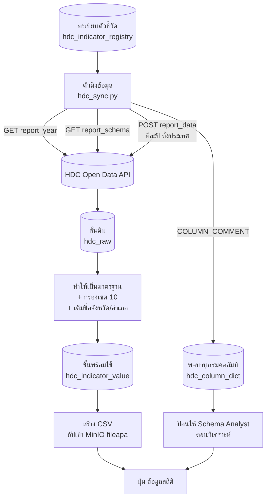

# 🔄 ออกแบบระบบดึงข้อมูลสถิติจาก HDC Open Data

← กลับไป [[00 - Architecture Overview]] · เกี่ยวข้อง → [[02 - Statistics Workflow]] · [[04 - Data Architecture & Schema]]

> **ที่มา:** ปัจจุบันชุดข้อมูลสถิติ 45 ไฟล์มาจากการรับไฟล์ Excel ต่อจาก สสจ. แล้วรวมมือ
> ทำให้ (ก) ได้แค่บางจังหวัด (ข) ครอบคลุมปีไม่เท่ากัน (ค) ชื่อคอลัมน์เพี้ยนตอน export
> (`F3`, `a_name`, `result1`) จนตีความไม่ได้ · MoPH เปิด **Open Data API สาธารณะ**
> ที่แก้ได้ทั้งสามข้อพร้อมกัน

## 1. สัญญาของแหล่งข้อมูล (ยืนยันด้วยการเรียกจริง 2026-07-31)

ไม่ต้องล็อกอิน ไม่ต้องมี API key · ปรับปรุงรายวัน

| Endpoint | Method | ใช้ทำอะไร |
|---|---|---|
| `/api/report_year/{table}` | GET | ถามว่าตารางนี้มีปีอะไรบ้าง |
| `/api/report_schema/{table}` | GET | **โครงสร้างคอลัมน์พร้อมคำอธิบายภาษาไทย** |
| `/api/report_data` | POST | ดึงข้อมูลจริง |

```jsonc
// POST https://opendata.moph.go.th/api/report_data
{ "tableName": "s_ckd_stage_hosp", "year": "2569", "type": "json" }
// ไม่ส่ง province = ได้ทั้งประเทศ
```

### ผลวัดจริง — ตัวเลขที่ใช้ตัดสินใจออกแบบ

| สิ่งที่วัด | ผล |
|---|---|
| ดึงทั้งประเทศ 1 ปี | **985 แถว · 0.5 วินาที** |
| ดึง 1 จังหวัด 1 ปี | 27 แถว · 0.14 วินาที |
| ปีที่มีให้ (`s_ckd_stage_hosp`) | **2555–2569 = 15 ปี** |
| ทดสอบดึงเขต 10 ย้อนหลัง 10 ปี | 2,074 แถว สำเร็จครบ |
| ตรวจความถูกต้อง | ปี 2569 เขต 10 ได้ 115,789 **ตรงกับหน้ารายงาน HDC เป๊ะ** |

> [!important] ดึงทั้งประเทศถูกกว่าดึงรายจังหวัด
> 985 แถวทั้งประเทศใน 0.5 วิ เทียบกับต้องยิง 5 ครั้งเพื่อได้ 5 จังหวัด
> ⇒ **ดึงทั้งประเทศแล้วกรองเขต 10 ในเครื่องเรา** ลดจำนวนคำขอจาก
> `5 จังหวัด × 15 ปี = 75` เหลือ **15 คำขอ** และได้ข้อมูลเทียบเคียงประเทศฟรี

## 2. โครงสร้างข้อมูลที่ได้

```
id · hospcode · areacode · date_com · b_year · <คอลัมน์ตัวชี้วัด...>
```

| ฟิลด์ | ความหมาย | ใช้ทำอะไรในระบบเรา |
|---|---|---|
| `hospcode` | รหัสหน่วยบริการ 5 หลัก | หน่วยย่อยที่สุด (ละเอียดกว่า CSV ปัจจุบันที่หยุดที่อำเภอ) |
| `areacode` | รหัสพื้นที่ มท. 8 หลัก = `PP DD TT VV` | **แกนพื้นที่** — `[:2]`=จังหวัด `[2:4]`=อำเภอ `[4:6]`=ตำบล |
| `date_com` | วันที่ประมวลผล `YYYYMMDDHHMMSS` | **ใช้ตรวจว่าข้อมูลเปลี่ยนไหม** (ดูข้อ 6) |
| `b_year` | ปีงบประมาณ (พ.ศ.) | แกนเวลา |

**เขตสุขภาพที่ 10** = รหัสจังหวัด `34` อุบลราชธานี · `33` ศรีสะเกษ · `35` ยโสธร · `37` อำนาจเจริญ · `49` มุกดาหาร

## 3. สถาปัตยกรรม



### ทำไมต้องมี 2 ชั้น (raw → mart)

**ชั้นดิบเก็บตามที่ API ส่งมาเป๊ะ ๆ ห้ามแก้** — เมื่อพบว่าตีความผิดภายหลัง
จะย้อนกลับมาทำใหม่ได้โดยไม่ต้องยิง API ซ้ำ และมีหลักฐานว่า ณ วันนั้นต้นทางให้ค่าอะไร
(สำคัญมากเพราะ HDC **ปรับปรุงย้อนหลังได้** — ตัวเลขปีเดิมเปลี่ยนได้)

## 4. ทะเบียนตัวชี้วัด — หัวใจของระบบ

```sql
CREATE TABLE hdc_indicator_registry (
    table_name    VARCHAR(64) PRIMARY KEY,  -- s_ckd_stage_hosp
    report_id     VARCHAR(32),              -- 47a33f68... (ใช้เปิดหน้า HDC)
    title_th      TEXT NOT NULL,
    domain        VARCHAR(8),               -- d2 | d3 | d4
    vault_folder  TEXT,                     -- โฟลเดอร์ปลายทางใน fileapa
    enabled       BOOLEAN NOT NULL DEFAULT TRUE,
    last_sync_at  TIMESTAMP,
    last_date_com VARCHAR(14),              -- ใช้ตรวจว่ามีของใหม่ไหม
    note          TEXT
);
```

**เริ่มจาก 3 ตัวที่แก้ปัญหาค้างอยู่ก่อน** แล้วค่อยขยาย:

| ลำดับ | ตาราง HDC | แก้ปัญหาอะไร | สถานะ |
|---|---|---|---|
| 1 | `s_ckd_stage_typearea` | ผู้ป่วยไตเรื้อรัง **ในเขตรับผิดชอบ** | ✅ นำเข้าแล้ว 2026-07-31 — 10 ปี · 75,557 แถว · 5 จังหวัด (`file_id` 220830) |
| 1b | `s_ckd_stage_hosp` | ไฟล์ `476686` มีแค่ 3 ปี/อุบลฯ | ⏳ **ยังไม่ได้นำเข้า** — ดูกล่องเตือนด้านล่าง |
| 2 | `s_dm_ckd1` | ไฟล์ `802827` — `F3/F8/result1/result2` ตีความไม่ได้ | 🔍 พบชื่อตารางแล้ว (2026-07-31) · ยังไม่นำเข้า |
| 3 | `s_kpi_cvd_risk` | ไฟล์ `238260` — ไม่รู้ว่า `B` นับแบบไหน | 🔍 พบชื่อตาราง + ยืนยันตัวเลขตรงทุกอำเภอ · ยังไม่นำเข้า |

> [!danger] `s_ckd_stage_typearea` **ไม่ได้** แทนไฟล์ `476686`
> เฟส 1 นำเข้า `s_ckd_stage_typearea` = *"ผู้ป่วยไตเรื้อรัง **ในเขตรับผิดชอบ**"*
> แต่ไฟล์ `476686` คือ *"ผู้ป่วยไตเรื้อรัง**ที่มารับบริการที่โรงพยาบาล**"* = `s_ckd_stage_hosp`
> **คนละตัวชี้วัด คนละตัวหาร** — typearea นับตามประชากรที่รับผิดชอบ (1 คนนับครั้งเดียว)
> ส่วน hosp เป็น Work Load (1 คนไปหลาย รพ. ก็นับหลายครั้ง ตามข้อ 9)
>
> การเลือก typearea เป็นการตัดสินใจที่ดี — เลี่ยงกับดัก Work Load ไปเลย — แต่ต้องรู้ว่า
> **ไฟล์ `476686` ยังคาอยู่ ยังไม่ถูกแทนที่** ถ้าต้องการแทนจริงต้องนำเข้า `s_ckd_stage_hosp` เพิ่ม

### 🔑 แผนที่ API ทั้งหมด — **มี 2 ระบบ คนละโฮสต์ คนละข้อมูล**

นี่คือเรื่องที่ทำให้หลงทางง่ายที่สุด **opendata กับ HDC เป็นคนละระบบที่ sync กัน**
มีข้อมูลคนละชุด และตัวที่ต้องใช้จริงกระจายอยู่ทั้งสองฝั่ง

| ระบบ | โฮสต์ | ให้อะไร |
|---|---|---|
| **opendata** | `opendata.moph.go.th` | ข้อมูลดิบ · schema คอลัมน์ · รายการปี · สารบัญ |
| **HDC** | `api-center-hdc.moph.go.th/v1` | **นิยามเชิงปฏิบัติการ** (รหัสโรค/LAB/เกณฑ์) |

```
── opendata ─────────────────────────────────────────────────────
POST /api/report_data                 ดึงข้อมูลจริง
GET  /api/report_schema/{table}       คอลัมน์ + คำอธิบายไทยสั้น ๆ
GET  /api/report_year/{table}         ปีที่ประกาศ (เชื่อไม่ได้ทั้งหมด — ดูข้อ 6)
GET  /api/report_name/{คำค้น}/{หน้า}/{จำนวน}          ค้นด้วยคำ (จับผิดได้ ดูข้อ 10.3)
GET  /opendata_api/reports/by-report-id/{reportId}    reportId → ชื่อตาราง
GET  /opendata_api/reports/categorie/by-category-id/{catId}   ← สารบัญทั้งหมวด
GET  /opendata_api/reports/categories                 รายชื่อหมวดทั้งหมด

── HDC (คนละโฮสต์!) ─────────────────────────────────────────────
GET  /v1/report-public/info?reportCode={id}&subCatalogId={cat}
GET  /v1/report-public/detail?reportCode={id}&byear={ปี}   ← หมายเหตุ/นิยาม
```

> [!warning] กับดักที่เสียเวลาไปมาก
> - `/opendata_api/*` **ต้องส่ง `User-Agent` ที่ไม่ว่าง** ไม่งั้น Cloudflare ตอบหน้า
>   challenge แทน JSON (ส่งอะไรก็ได้ ไม่ต้องปลอมเป็นเบราว์เซอร์) ส่วน `/api/report_*` ไม่ต้อง
> - `report-public/detail` **ไม่ส่ง `byear` แล้วคืน HTTP 500** (ไม่ใช่ 400 ที่ควรเป็น)
>   ⇒ ต้องเรียก `info` เอาปีล่าสุดมาก่อนเสมอ
> - `/v1/common/reports/detail/sys_report/{id}` ที่เห็นในโค้ดหน้าเว็บ **ใช้ไม่ได้** —
>   ต้องมี Bearer token · ตัวที่เป็น public คือ `report-public/*` เท่านั้น
> - ทั้งสองระบบ **หลุดเป็นครั้งคราวจริง** เจอ 403/404/500 ชั่วคราวแล้วหายเองเมื่อลองใหม่
>   หลายรอบระหว่างทำงานวันนี้ ⇒ ทุกจุดที่เรียกต้องมี retry และห้ามเชื่อผลครั้งเดียว

### 🔬 นิยามเชิงปฏิบัติการ — สิ่งที่ opendata ไม่มีเลย (ค้นพบ 2026-08-01)

`report_schema` บอกแค่ *"จำนวนผู้ป่วย (B1)"* ซึ่ง **ตอบไม่ได้ว่านับใคร**
แต่ `report-public/detail` มีฟิลด์ `notice` / `bname` / `aname` ที่บอกครบ เช่น

```
B = ผู้ป่วยเบาหวานและหรือความดันสัญชาติไทย ในเขตรับผิดชอบที่ไม่เคยวินิจฉัยว่าเป็น CKD
    1. (E10* ถึง E14*) ลบออกด้วย (E102, E112, E122, E132, E142)
    2. และ/หรือ (I10* ถึง I15*) ลบออกด้วย (I12*, I13*, I151)
    3. และไม่มีรหัสโรค N181-189
    4. ได้รับการตรวจ LAB: microalbumin 0440204 / macroalbumin 0440203 / UPCR 0440205
       ร่วมกับ creatinine 0581902 หรือ eGFR 0581904 ในปีงบประมาณเดียวกัน
A = ผู้ป่วยตาม B ที่ผล microalbumin/macroalbumin = 2 (positive)
    หรือ UPCR > 150 mg/g หรือ eGFR < 60
```

**คำถามแรกที่คนทำนโยบายถามคือ "ตัวเลขนี้นับใคร"** ถ้าไม่มีข้อมูลชุดนี้ AI ตอบได้แค่ตัวเลข
และที่แย่กว่าคือ **ไม่รู้ตัวว่าตอบไม่ได้** จึงเก็บลง `csv_data_dict.definition` /
`numerator_th` / `denominator_th` (migration `034`)

⚠️ ต้นทางเก็บเป็น HTML — `<br>` เป็นตัวแบ่งข้อ 1/2/3/4 ที่มีความหมาย
**ต้องแปลงเป็นบรรทัดใหม่ ไม่ใช่ลบทิ้ง** ไม่งั้นนิยามเชื่อมติดกันจนอ่านไม่รู้เรื่อง

### 🔑 วิธีหา `tableName` — มี API 2 ตัวที่ไม่มีในเอกสาร (ค้นพบ 2026-07-31)

ไม่ต้องเปิดหน้าเว็บไล่หาทีละการ์ด · หน้า `summary-table` เป็น Angular SPA ที่ยิง API เหล่านี้
(ขุดเจอจาก lazy chunk — `runtime-es2015.*.js` เก็บ mapping ของ chunk hash ไว้)

```
ค้นหาด้วยคำ:
GET https://opendata.moph.go.th/api/report_name/{คำค้น}/{หน้า}/{จำนวน}
→ { data: [ { source_table, report_name, category_name, main_report_id, ... } ] }

แปลง reportId → ชื่อตาราง (คนละ base path!):
GET https://opendata.moph.go.th/opendata_api/reports/by-report-id/{reportId}
→ { source_table, report_name, category_name, cat_id, main_report_id, ... }
```

⚠️ **ต้องส่ง `User-Agent` ที่ไม่ว่าง** ไม่งั้น Cloudflare ตอบหน้า challenge แทน JSON
— ส่งอะไรก็ได้ ไม่ต้องปลอมเป็นเบราว์เซอร์ (`HDRS` ที่โค้ดใช้อยู่ผ่านสบาย)
ต่างจาก `report_data`/`report_schema`/`report_year` ที่ไม่ต้องมี header อะไรเลย

**ตัวที่สองสำคัญมาก** เพราะหน้า metadata ของ HDC ที่คนใช้งานจริงเปิดดูนิยามตัวชี้วัด
(`hdc.moph.go.th/.../standard-report-detail/{reportId}`) **มีแต่ reportId ไม่มีชื่อตาราง**
ถ้าไม่มี API ตัวนี้ ผู้ใช้ต้องไปเปิด opendata หาชื่อตารางเองก่อน ซึ่งไม่มีใครทำ

## 4.2 แผง Metadata ในหน้า `/fileapa` (2026-08-01)

**ปัญหาที่มองข้ามมานาน:** AI ได้อ่านพจนานุกรมข้อมูลทุกครั้งที่วิเคราะห์อยู่แล้ว
(ผ่าน `describe_for_prompt`) แต่ **คนที่เปิดดูไฟล์กลับไม่เห็นอะไรเลย** — เห็นแค่ตาราง
ที่มีคอลัมน์ `F3 / F5 / a_name` ที่ตีความไม่ได้ ทั้งที่ระบบรู้คำตอบอยู่แล้ว

`FileMetadata.tsx` เรียก `GET /api/datadict/{fileId}` แล้วแสดงเหนือตัวอย่างไฟล์
เรียงตาม **"สิ่งที่ทำให้ตอบผิดได้" ก่อน**:

1. ⚠️ ข้อควรระวัง (แถวผลรวมปน · Work Load · รอยต่อวิธีนับ)
2. ขอบเขตจริง — ปี/จังหวัด/ระดับ/จำนวนแถว + หมายเหตุว่าอ่านจากเนื้อไฟล์ ไม่ใช่ชื่อไฟล์
3. ความหมายคอลัมน์ + บทบาท (ตัวตั้ง/ตัวหาร/ร้อยละ)
4. คอลัมน์ที่ยังไม่มีใครยืนยันความหมาย
5. ลิงก์ไปหน้านิยามตัวชี้วัดที่ HDC

ไฟล์ที่ยังไม่มีพจนานุกรม (เช่น PDF) **แผงจะไม่ขึ้นเลย** ดีกว่าโชว์กล่องว่าง

## 4.3 ลบโฟลเดอร์จากเมนูคลิกขวา

เมนูคลิกขวาโฟลเดอร์เดิมมีแค่ Upload / New Folder — เพิ่ม **"ลบโฟลเดอร์นี้"**

กล่องยืนยัน **แสดงรายชื่อไฟล์ทั้งหมดที่จะหายไป** ไม่ใช่แค่ถามว่าแน่ใจไหม เพราะลบโฟลเดอร์
= ลบหลายไฟล์พร้อมกันและกู้คืนไม่ได้ · ปุ่มบอกจำนวนชัด ("ลบ 3 ไฟล์") · โฟลเดอร์ว่างก็บอกว่า
ไม่มีไฟล์ไหนหาย · ไฟล์เดียวลบไม่สำเร็จไม่ทำให้ที่เหลือค้างครึ่ง ๆ กลาง ๆ

## 4.1 หน้าจอนำเข้า (`/fileapa` → ปุ่ม "ดึงจาก HDC")

ผู้ใช้**ไม่ต้องรู้จักชื่อตารางเลย** — วางลิงก์หน้า metadata ที่เปิดดูอยู่แล้วได้เลย

```
วางลิงก์/ชื่อตาราง → [ตรวจสอบ] → เห็นชื่อตัวชี้วัด หมวด ปีที่มี คำอธิบายคอลัมน์ไทย
                   → แก้ชื่อ/โฟลเดอร์ → [นำเข้า] → ตารางผลรายปี
```

รับได้ 3 รูปแบบผ่าน `resolve_source()`:

| วาง | วิธีแกะ |
|---|---|
| `.../standard-report-detail/{reportId}` | ถาม `by-report-id` ว่าเป็นตารางไหน |
| `.../summary-table/{catalog}/{table}/{reportId}` | ชื่อตารางอยู่ใน URL แล้ว (ถามต้นทางเพิ่มแค่ชื่อไทย) |
| `s_ckd_stage_typearea` | ใช้ตรง ๆ ไม่ยิงเน็ต |

**แยก "ตรวจสอบ" กับ "นำเข้า" เป็นคนละปุ่มเสมอ** เพราะการดึงจริงกินเวลาเป็นนาที
และเขียนไฟล์ลงคลัง ไม่ควรเกิดจากการกดพลาดครั้งเดียว

> [!tip] หน้าจอเตือนความยาว path ให้ตั้งแต่ก่อนกด
> นับ `โฟลเดอร์/ชื่อไฟล์` เทียบลิมิต 150 ตัว แล้วปิดปุ่มนำเข้าถ้าเกิน
> เป็นการกันบั๊กข้อ 5 ในหัวข้อ "สิ่งที่ของจริงสอนเราเพิ่ม" ไม่ให้ผู้ใช้เจอ

> [!tip] วิธีหา `tableName` ของตัวชี้วัดที่ต้องการ
> เปิด `https://opendata.moph.go.th/th/services/summary-table` → เลือกหมวด →
> ชื่อตารางขึ้นต้นด้วย `s_` แสดงอยู่บนการ์ดแต่ละใบพร้อมชื่อไทย

## 5. พจนานุกรมคอลัมน์ — แก้ปัญหา "ชื่อคอลัมน์ไม่สื่อความหมาย" ที่ต้นตอ

`report_schema` คืน `COLUMN_COMMENT` เป็นภาษาไทยครบทุกคอลัมน์ เช่น

```
stage1 · int(11) · "จำนวนผู้ป่วยโรคไตเรื้อรังที่มารับบริการที่โรงพยาบาล stage1"
```

```sql
CREATE TABLE hdc_column_dict (
    table_name  VARCHAR(64),
    column_name VARCHAR(64),
    column_type VARCHAR(32),
    comment_th  TEXT,
    PRIMARY KEY (table_name, column_name)
);
```

**นี่คือ data dictionary ที่ไม่ต้องเขียนเอง** — ดึงมาพร้อมข้อมูลเลย แล้วส่งเข้า
Schema Analyst ตอนวิเคราะห์ ทำให้ AI เข้าใจว่าคอลัมน์ไหนเก็บอะไรโดยไม่ต้องเดา

> [!warning] แต่แก้ปัญหาไฟล์เก่าไม่ได้
> `F3` / `a_name` / `result1` เกิดจาก **การ export ที่ทำหัวคอลัมน์หาย** ไม่ใช่ชื่อจริง
> ในระบบต้นทาง ⇒ พจนานุกรมช่วยได้เฉพาะข้อมูลที่ดึงใหม่ผ่าน API
> ส่วนไฟล์เก่าต้องเทียบตำแหน่งคอลัมน์เอาเอง (แบบที่ทำสำเร็จกับ `476686`
> ซึ่งพิสูจน์ได้ว่า `F3 = stage1/allstage×100` ตรงทั้ง 75/75 แถว)

### 5.1 ผลถอดรหัสคอลัมน์ไฟล์เก่า (ทำแล้ว 2026-07-31)

ถึงจะแก้ที่ต้นตอไม่ได้ แต่ `report_schema` ของตารางต้นทางใช้เป็น **กุญแจถอดรหัส**
ไฟล์เก่าได้ — เทียบตำแหน่งคอลัมน์แล้วยืนยันด้วยเลขจริง

**ไฟล์ `802827` ← `s_dm_ckd1`** — เป็น **2 ชุดตัวชี้วัดที่มีตัวหารคนละแบบ** ไม่ใช่ชุดเดียว

| คอลัมน์ในไฟล์ | ความหมายจริง |
|---|---|
| `target` / `result` | **(B1/A1)** ผู้ป่วยในเขตรับผิดชอบ Typearea 1,3 — จำนวน / ได้รับการตรวจ |
| `F3` | `result ÷ target × 100` ✅ ตรวจแล้วตรง (30,606÷62,856 = 48.692%) |
| `result1` / `result2` | ผลปกติ / ผลผิดปกติ (ชุด Typearea) |
| `target_1` / `result_1` | **(B2/A2)** ผู้ป่วยจากแฟ้ม **ChronicFU** — จำนวน / ได้รับการตรวจ |
| `F8` | `result_1 ÷ target_1 × 100` ✅ ตรวจแล้วตรง (41,475÷79,740 = 52.013%) |
| `result1_1` / `result2_1` | ผลปกติ / ผลผิดปกติ (ชุด ChronicFU) |
| `a_name` | ชื่อจังหวัด (เกิดจากการ export ไม่มีในต้นทาง) |

> [!warning] `result1 + result2 ≠ result`
> ศรีสะเกษ 2565: ปกติ 29,852 + ผิดปกติ 2,200 = **32,052** แต่ `result` = **30,606**
> ตัวเลขปกติ/ผิดปกติเกินจำนวนคนที่ได้รับการตรวจ ⇒ น่าจะนับ **รายครั้งที่ตรวจ** ไม่ใช่รายคน
> **ห้ามเอา `result1`/`result2` ไปหารด้วย `result`** เพื่อหาสัดส่วนผลผิดปกติ

**ไฟล์ `238260` ← `s_kpi_cvd_risk`** — `B` = `target`, `A` = `result`, `ร้อยละ` = `A÷B×100`

ยืนยันด้วยการดึงจริง: มุกดาหาร 2565 **ตรงทุกอำเภอทั้ง 7 อำเภอ + ยอดรวม**
(คำชะอี B=1,797 A=1,629 90.65% · รวม B=13,374 A=11,968 89.49%)

## 6. กลยุทธ์การดึงและตรวจของใหม่

```
สำหรับแต่ละตารางในทะเบียนที่ enabled:
  1. GET report_year  →  ได้รายการปีทั้งหมด
  2. สำหรับแต่ละปี:
       POST report_data {tableName, year}      ← ไม่ส่ง province
       เทียบ date_com สูงสุด กับ last_date_com ที่เก็บไว้
       ถ้าเท่าเดิม → ข้าม (ไม่มีของใหม่)
       ถ้าต่าง     → เขียนทับชั้นดิบของปีนั้น
  3. กรองเฉพาะ areacode ที่ขึ้นต้นด้วย 34/33/35/37/49
  4. เติมชื่อจังหวัด/อำเภอจากรหัส มท.
  5. อัปเดต last_sync_at, last_date_com
```

**ต้นทุนต่อรอบ** (จากตัวเลขที่วัดจริง): 15 ปี × 0.5 วิ ≈ **8 วินาทีต่อตัวชี้วัด**
ถ้ามี 45 ตัวชี้วัด ≈ **6 นาที** ⇒ รันคืนละครั้งสบาย ๆ

**หน่วงระหว่างคำขอ 0.3 วินาที** — เป็นบริการสาธารณะที่ไม่มี rate limit ประกาศไว้
ยิงรัวเป็นการเบียดเบียนทรัพยากรส่วนรวมโดยไม่จำเป็น ในเมื่องานนี้ไม่ได้เร่งด่วน

## 7. ชั้นพร้อมใช้

```sql
CREATE TABLE hdc_indicator_value (
    table_name    VARCHAR(64),
    b_year        VARCHAR(4),
    hospcode      VARCHAR(5),
    areacode      VARCHAR(8),
    province_code VARCHAR(2),
    province_name VARCHAR(64),
    district_code VARCHAR(2),
    district_name VARCHAR(64),
    metric        VARCHAR(64),   -- ชื่อคอลัมน์ต้นทาง เช่น stage1
    value         NUMERIC,
    date_com      VARCHAR(14),
    PRIMARY KEY (table_name, b_year, hospcode, metric)
);
```

**เก็บเป็น long format (metric/value) ไม่ใช่ wide** เพราะแต่ละตัวชี้วัดมีคอลัมน์ไม่เท่ากัน
(6 ถึง 50 คอลัมน์) การทำ wide จะได้ตารางที่มีคอลัมน์ NULL เต็มไปหมด และเพิ่มตัวชี้วัดใหม่
ทีต้อง `ALTER TABLE` ทุกครั้ง

## 8. เชื่อมกับปุ่ม "ข้อมูลสถิติ" ที่มีอยู่

**ทางเลือก A — สร้าง CSV อัปเข้า MinIO** *(แนะนำสำหรับเฟสแรก)*

สร้างไฟล์หน้าตาเหมือนที่ pipeline ใช้อยู่ (`จังหวัด · ปีงบประมาณ · อำเภอ · <ตัวชี้วัด>`)
แล้วอัปเข้า `fileapa` พร้อม `x-amz-meta-path` ให้ตรงโครงสร้างโฟลเดอร์เดิม

- ✅ ไม่ต้องแตะ CSV pipeline เลย ใช้ File Finder / Code Gen / Executor ชุดเดิม
- ✅ ย้อนกลับง่าย ถ้าไม่ดีก็ลบไฟล์ทิ้ง
- ⚠️ ข้อมูลซ้ำสองที่ (DB + MinIO)

**ทางเลือก B — ให้ pipeline อ่านจาก DB ตรง**

- ✅ ไม่ซ้ำซ้อน · query ยืดหยุ่นกว่ามาก
- ⚠️ ต้องแก้ File Finder / Schema Analyst / Code Generator ทั้งชุด — งานใหญ่

## 9. กับดักที่ต้องระวัง (พบจากข้อมูลจริงแล้ว)

> [!danger] จำนวนหน่วยบริการเปลี่ยนวิธีนับกลางทาง
> ปี 2560–2562 มี **486–539 แห่ง** แต่ 2563 เป็นต้นมาเหลือ **73–75 แห่ง**
> (น่าจะเดิมรวม รพ.สต. ต่อมานับเฉพาะโรงพยาบาล)
>
> **ห้ามนำสองช่วงนี้มาเทียบแนวโน้มกันตรง ๆ** ต้องมีคอลัมน์บอกความไม่ต่อเนื่อง
> หรือตัดปีก่อน 2563 ออกจากกราฟแนวโน้ม

> [!danger] ตัวเลขนี้เป็น Work Load ไม่ใช่จำนวนคน
> หมายเหตุ HDC เขียนไว้ว่า *"ผู้ป่วย 1 คน สามารถเป็นผู้รับบริการได้มากกว่า 1 โรงพยาบาล"*
> ⇒ ห้ามตอบว่า "จังหวัดนี้มีผู้ป่วยไต N คน" ต้องตอบว่า "มีการมารับบริการ N ราย"
> **ต้องเก็บหมายเหตุนี้ไว้ใน `hdc_indicator_registry.note` แล้วส่งต่อให้ AI ด้วย**

- **API ให้เฉพาะตัวนับ ไม่มีร้อยละ** — ต้องคำนวณเอง และต้องรู้ตัวหารที่ถูกต้อง
- **HDC ปรับปรุงย้อนหลังได้** — ตัวเลขปีเก่าเปลี่ยนได้ จึงต้องเทียบ `date_com` ไม่ใช่ดึงครั้งเดียวจบ

> [!success] ✅ แก้แล้ว: คอลัมน์ `อำเภอ` เป็นชื่อไทยแล้ว (2026-07-31)
> เดิม `to_csv()` เขียน `areacode[2:4]` ⇒ ได้ `05` ไม่ใช่ `คำชะอี` ทำให้ผู้ใช้ถาม
> *"อำเภอคำชะอีเป็นยังไง"* แล้ว File Finder หาไม่เจอ เพราะในไฟล์ไม่มีคำนั้นเลย
> — **ไฟล์เก่าจาก สสจ. มีชื่ออำเภอ แต่ไฟล์ใหม่กลับไม่มี** เป็นการถอยหลังด้านการใช้งาน
>
> ตอนนี้มีตาราง `src/tools/amphoe_zone10.py` ครบ **70 อำเภอ** ของ 5 จังหวัดแล้ว
> (อุบลฯ 25 · ศรีสะเกษ 22 · ยโสธร 9 · อำนาจเจริญ 7 · มุกดาหาร 7) และยังเก็บ `areacode`
> ไว้ให้ join ได้ · ไฟล์ที่นำเข้าไปก่อนหน้า (`220830`, `143685`, `278218`) รีเฟรชใหม่แล้ว
> จำนวนแถวเท่าเดิมเป๊ะทั้ง 3 ไฟล์ ⇒ ไม่มีข้อมูลหาย

> [!note] รหัสอำเภอที่แปลงไม่ได้ — เก็บรหัสไว้ ไม่ทิ้งแถว
> เจอ 1 แถวจาก 76,758 (0.001%) ที่ `areacode = 33000610` คือหลักอำเภอเป็น `00`
> ซึ่งไม่มีอยู่จริง (หน่วยบริการ `77466` ศรีสะเกษ, target 64) — **เป็นข้อมูลต้นทางที่ไม่ได้ระบุอำเภอ
> ไม่ใช่ตารางแปลงผิด** · พฤติกรรมที่ถูกคือคงรหัสเดิมไว้ ไม่ใช่ปล่อยว่าง
> เพราะถ้ามีอำเภอตั้งใหม่แล้วแถวหายเงียบ ๆ จะจับไม่ได้เลย (มี `unknown_codes()` ไว้ตรวจ)

## 10. แผนลงมือ

| เฟส | งาน | ผลลัพธ์ที่วัดได้ | สถานะ |
|---|---|---|---|
| 1 | ตัวดึง + ทะเบียน + พจนานุกรม · นำร่อง CKD | ดึงได้ 10 ปี × 5 จังหวัด | ✅ **เสร็จ** — `s_ckd_stage_typearea` 75,557 แถว |
| 2 | หา `tableName` ของ `802827` และ `238260` · ดึงพร้อมพจนานุกรม | ปลดล็อก 2 ไฟล์ที่ตีความไม่ได้ | ✅ **เสร็จ** — `s_dm_ckd1` (`143685`, 4,800 แถว/5 ปี) · `s_kpi_cvd_risk` (`278218`, 76,758 แถว/10 ปี) · `unknown_cols` เหลือ 0 ทั้งคู่ · ของเดิมยังอยู่ไม่ได้ลบ |
| 2b | นำเข้า `s_ckd_stage_hosp` แทนไฟล์ `476686` | ขยายจาก 3 ปี/อุบลฯ → 10 ปี/5 จังหวัด | ✅ **เสร็จ** — `298407` 2,074 แถว / 10 ปี |
| 3 | ส่งพจนานุกรมเข้า Schema Analyst | AI เลิกเดาความหมายคอลัมน์ | ✅ **เสร็จ** — ตรวจครบ 49 ไฟล์ · เตือนแล้ว 25 ไฟล์ (เหลือเฉพาะข้อควรระวังเชิงนิยามที่คนต้องเขียนเอง) |
| 4 | ไล่ทำทะเบียนให้ครบ 45 ตัวชี้วัด | เลิกพึ่งไฟล์ Excel จาก สสจ. | 🟡 จับคู่อัตโนมัติได้ 36/45 · นำเข้าชุดใหญ่แล้ว (ดูข้อ 10.3) |
| 5 | ตั้งรอบดึงอัตโนมัติรายคืน | ข้อมูลสดตลอด | ⏳ ยังไม่เริ่ม |

**เฟส 1 คือจุดที่คุ้มที่สุด** — พิสูจน์ทั้งเส้นทางด้วยตัวชี้วัดที่ตรวจสอบความถูกต้องได้แล้ว

### สิ่งที่ของจริงสอนเราเพิ่ม (บันทึกไว้กันลืม)

1. **`report_year` โกหก** — ประกาศ 15 ปี แต่ 2555–2559 คืน HTTP 400
   ⇒ ต้องแยกเก็บ `declared_years` กับ `usable_years` (ทำแล้วใน `033_hdc_import.sql`)
2. **รีเฟรชแล้วข้อมูลหายเงียบได้** — เจอจริง: รอบ 2 ได้ 9 ปี/72,724 แถว จากเดิม 10 ปี/75,557 แถว
   เพราะปีหนึ่งพลาดชั่วคราว ⇒ มีการ์ด HTTP 409 หยุดไว้ ต้อง `force=true` ถึงเขียนทับ
3. **ต้นทางพลาดเป็นครั้งคราวจริง ๆ** — ระหว่างทำเฟส 2 ก็เจอ 404 ชั่วคราวแล้วหายเองเมื่อลองใหม่
   ⇒ ยืนยันว่าการ์ดข้อ 2 ไม่ได้ระแวงเกินเหตุ
4. **บั๊ก `unknown_cols` ค้างธง (แก้แล้วในโค้ด 2026-07-31)** — `build_data_dict()` ตัดสินว่า
   คอลัมน์ไหน "ไม่รู้จัก" จาก**ชื่อคอลัมน์**ก่อนที่ `hdc_import` จะเติมคำอธิบายไทยจาก
   `report_schema` ⇒ คอลัมน์อย่าง `target`/`result1` ที่ต้นทางอธิบายไว้ครบ ยังติดธงว่าไม่รู้จัก
   ทำให้ Schema Analyst เห็นเป็นคอลัมน์ปริศนาทั้งที่มีนิยามแล้ว — **ซึ่งทำลายจุดประสงค์ของเฟส 3 ทั้งหมด**
   แก้โดยล้างธงตามหลังใน `hdc_import.py` · ⚠️ `src/` ถูกอบเข้า image ไม่ได้ mount
   **ต้อง rebuild image ถึงจะมีผลกับการนำเข้าครั้งต่อไป** (แถวที่นำเข้าไปแล้วแก้ใน DB ตรง ๆ แล้ว)
5. **`x-amz-meta-path` ตัดที่ 150 ตัวอักษรเงียบ ๆ** — `f"{vault_path}/{file_name}"[:150]`
   ชื่อตัวชี้วัดไทยยาว ๆ ทะลุง่ายมาก (ชื่อเต็มของ CVD Risk = 176 ตัว) พอโดนตัดกลางคัน
   `_load_path_index()` จะสร้าง folder tree ผิด **ไฟล์จะหาไม่เจอจากปุ่ม "ข้อมูลสถิติ"**
   ⇒ เลี่ยงชั่วคราวด้วยการตั้งชื่อโฟลเดอร์ให้สั้น · ที่ถูกควรตัดตรงกลางแล้วคงนามสกุลไว้ หรือขยายลิมิต

## 10.4 ผลตรวจทุกลิงก์ในหมวด (`audit_hdc_subcatalog.py`)

ผู้ใช้รายงานว่า "บางลิงก์ไม่สมบูรณ์ ดึง JSON ไม่ได้" — ตรวจทั้งหมวดสาขาไตแล้ว

**ใช้ได้ 19 · เสีย 1 จาก 20 ตัวชี้วัด**

| ตาราง | ปัญหา |
|---|---|
| `s_kpi_ckd_egfr` | `report_schema` คืน **404** — HDC มีรายการนี้ แต่ opendata ยังไม่เปิดตารางออกมา |

สคริปต์แยกผลเป็น **4 ขั้น** เพราะแต่ละขั้นแก้คนละวิธี:

| ขั้น | ถ้าตกขั้นนี้แปลว่า |
|---|---|
| `schema` | opendata ไม่รู้จักตารางนี้ — รอต้นทาง sync ไม่มีทางแก้ฝั่งเรา |
| `report_year` | รู้จักตาราง แต่ไม่ประกาศปี |
| `report_data` | ประกาศปีแต่ดึงจริงไม่ได้สักปี |
| `zone10` | ดึงได้ แต่**ไม่มีข้อมูลเขต 10** — ใช้กับระบบเราไม่ได้ แต่ไม่ใช่ลิงก์เสีย |

> [!note] แยก "ลิงก์เสีย" ออกจาก "ไม่มีข้อมูลเขต 10"
> สองอย่างนี้ดูเหมือนกันจากภายนอก (นำเข้าไม่ได้เหมือนกัน) แต่คนละเรื่อง —
> อย่างแรกต้องรอต้นทาง อย่างหลังคือตัวชี้วัดนั้นไม่เกี่ยวกับเราตั้งแต่ต้น

## 10.5 การจัดไฟล์ลงคลัง (`vault_placement.py`) — จากบั๊กที่ผู้ใช้จับได้

**บั๊ก 1 — "/" ในชื่อตัวชี้วัดทำโฟลเดอร์ซ้อน**
`"ร้อยละของผู้ป่วย DM และ/หรือ HT ..."` → MinIO ตีความ `/` เป็นตัวคั่นโฟลเดอร์
กลายเป็นโฟลเดอร์ซ้อน 3 ชั้นที่อ่านไม่รู้เรื่อง
⇒ `safe_segment()` แปลง `/` เป็น **ช่องว่าง** (ไม่ใช่ลบทิ้ง — ต้องอ่านออกและยังค้นเจอด้วยคำเดิม)
กันไว้ 2 ชั้น: ตอนเสนอชื่อ และอีกครั้งตอนเขียนไฟล์จริง

**บั๊ก 2 — ไฟล์ไปกองที่ `HDC/` แทนที่จะเข้าโดเมนจริง**
⇒ `classify()` ดูทั้งชื่อตัวชี้วัด**และชื่อหมวดของ HDC** แล้วจัดตามโครงสร้างที่คลังใช้อยู่

```
<โดเมน>/<กลุ่มโรคหรือกลุ่มวัย>/<ชื่อตัวชี้วัด>/<ไฟล์>.csv
```

| โดเมน | ตัวอย่างกลุ่มย่อย |
|---|---|
| `D2_Mental Health` | ผู้ป่วยสุขภาพจิต |
| `D3_NCDs` | โรคไต · โรคเบาหวาน · โรคความดัน · โรคระบบหัวใจหลอดเลือด |
| `D4_Nutrition` | หญิงตั้งครรภ์ · เด็ก 0-2/3-5/6-14 ปี · วัยรุ่น · วัยทำงาน · ผู้สูงอายุ |
| `D1_Road` | อุบัติเหตุทางถนน |
| `D5_Population` | 🆕 โครงสร้างประชากร — ฐานประชากรรายอำเภอ/ตำบล แยกเพศและช่วงอายุ |
| `D6_Other` | ตกถัง สำหรับตัวชี้วัดที่ไม่เข้าโดเมนใดเลย |

**ต้องดูชื่อหมวดด้วย** เพราะตัวชี้วัดอย่าง *"CKD 2.7 ... ตรวจ serum K"* ไม่มีคำว่า "ไต"
ในชื่อเลย แต่หมวดบอกว่า *Service Plan สาขาไต*

> [!success] ชื่อโฟลเดอร์โดเมนมาจาก `domains.py` ที่เดียวแล้ว (2026-08-01)
> เดิมเป็นแหล่งความจริง 2 ที่ที่ขัดกันเอง — `domains.py` เขียน `D3_NCD` แต่
> `vault_placement.py` ประกาศ `D3_NCDs` เอง (ซึ่งตรงกับคลังจริง)
> **ถ้าใครแก้ทีละที่ ไฟล์ใหม่จะไปลงคนละโฟลเดอร์กับของเดิมโดยไม่มีอะไรฟ้อง**
>
> ตอนนี้ `domains.py` เก็บชื่อโฟลเดอร์จริง (`D2_Mental Health` / `D3_NCDs`)
> และ `vault_placement.py` อ่านจากที่นั่น พร้อมเทสต์ล็อกว่าค่าต้องตรงกันเสมอ
>
> ระบบยังจับคู่ด้วย **2 ตัวแรก** ของ prefix (`FOLDER_PREFIX_TO_DOMAIN`)
> ⇒ `D3` ตรงกับ `d3` เผื่อชื่อโฟลเดอร์จริงยาวกว่า prefix ในอนาคต
>
> **ผลที่ตามมา: ตัวเลข 2 หลักห้ามซ้ํากันเด็ดขาด** ตกถังเคยชื่อ `D5_Other` แล้วพอเพิ่ม
> โดเมน `d5` (ประชากร) เข้ามา ไฟล์ยาเสพติด 43 ตัวใน `D5_Other` ก็กลายเป็นข้อมูล
> ประชากรในสายตาระบบทันที — ย้ายไป `D6_Other` แล้วเมื่อ 2 ส.ค. 2569
> มีเทสต์ `test_vault_placement_domains.py` คอยกันไม่ให้ prefix ซ้ําอีก
## 10.3 เฟส 4 — จับคู่ตัวชี้วัดกับตาราง HDC โดยไม่ให้จับผิด

คอขวดของเฟส 4 ไม่ใช่การดึงข้อมูล (ทำได้แล้ว) แต่คือ **"ตัวชี้วัดนี้คือตารางไหนของ HDC"**
× 45 รายการ · ทำมือช้ามาก แต่ทำอัตโนมัติแล้วเชื่อเลยก็อันตราย

> [!danger] API ค้นหาจับคู่ผิดได้ง่ายมาก
> เจอจริง: *"ร้อยละของผู้ป่วยเบาหวานชนิดที่ 2 ที่เข้าสู่โรคเบาหวานระยะสงบ (DM Remission)"*
> ถูกจับคู่กับ *"ร้อยละของผู้ป่วยโรคซึมเศร้าหายทุเลา (Remission)"* — **ตรงกันแค่คำว่า Remission คำเดียว**
> ถ้านำเข้าทับโดยไม่ตรวจ = เอาข้อมูลซึมเศร้าไปใส่แฟ้มเบาหวาน โดยไม่มีใครรู้

`match_hdc_tables.py` จึงแยกผลเป็น **3 ชั้นความมั่นใจ** โดยเทียบชื่อหลัง normalize
(ตัดวงเล็บ ช่องว่าง เครื่องหมาย และคำต่อท้ายอย่าง `(Work Load)` / `(Coverage)`)

| ชั้น | เกณฑ์ | จำนวน | ทำยังไงต่อ |
|---|---|---|---|
| **ตรงเป๊ะ** | ชื่อตรงกันหลัง normalize | **36** | นำเข้าอัตโนมัติได้ |
| **ต้องเลือก** | มีผู้สมัครแต่ไม่ตรงเป๊ะ | 6 | คนตัดสิน |
| **ไม่พบ** | ค้นไม่เจออะไรเลย | 3 | ชื่อในคลังไม่ตรงศัพท์ HDC |

เคส Remission ตกไปอยู่ชั้น "ต้องเลือก" สำเร็จ — **ไม่หลุดเข้าชั้นอัตโนมัติ**

3 ตัวที่ไม่พบเพราะชื่อในคลังกว้างเกินไป: `ผู้ป่วยพยายามฆ่าตัวตาย` · `ผู้ป่วยสุขภาพจิต` ·
`ค่ามาตฐาน BMI แต่ละช่วงอายุ` (สองตัวแรกเป็นชื่อโฟลเดอร์ ไม่ใช่ชื่อตัวชี้วัด)

`bulk_import_hdc.py` นำเข้าเฉพาะชั้นตรงเป๊ะ · ข้ามตารางที่นำเข้าไปแล้ว ·
**ตัวเดียวพังไม่ล้มทั้งชุด** · และคำนวณความยาว path ให้ไม่เกิน 150 ตัวเองอัตโนมัติ
(ถ้าโฟลเดอร์ยาวจนตั้งชื่อไม่ได้ จะถอยขึ้นไปหนึ่งชั้น ดีกว่าปล่อยให้ path โดนตัดกลางคัน)

## 10.2 ข้อควรระวังอัตโนมัติ (`caveats`) — เฟส 3 ภาคปฏิบัติ

`csv_data_dict.caveats` มีมาตั้งแต่ migration 032 และ `describe_for_prompt()` ก็แนบ
เข้าพรอมต์ให้ทุกครั้งอยู่แล้ว (ต่อท้าย `schema_result` → ไหลถึง Code Generator ด้วย)
**แต่ไม่มีใครเติมข้อมูลลงไปเลย — 0 จาก 49 ไฟล์** ท่อสร้างไว้ครบแต่ว่างเปล่า

ตอนนี้ `_detect_caveats()` ตรวจให้อัตโนมัติตอนนำเข้า **จากตัวเลขจริง ไม่ใช่เดาจากชื่อ**

| ตรวจอะไร | เงื่อนไข | ทำไมสำคัญ |
|---|---|---|
| รอยต่อวิธีนับ | จำนวนแถวปีติดกันต่างกัน ≥ 3 เท่า | กัน AI สรุปว่า "ผู้ป่วยลดลง 85%" ทั้งที่เปลี่ยนวิธีนับ |
| Work Load | ชื่อตารางลงท้าย `_hosp` | 1 คนไปหลาย รพ. นับหลายครั้ง — ต้องตอบ "N ราย" ไม่ใช่ "N คน" |
| ปีที่ข้อมูลไม่ครบเขต | ปีที่มีแถวแต่ขาดบางจังหวัด | ปีนั้นไม่ถูกบันทึก ต้องบอกผู้ใช้ ไม่ใช่เงียบ |

**ผลจริง:** `298407` (`s_ckd_stage_hosp`) ได้ 2 ข้อ — รอยต่อ *2562 (535 แถว) → 2563 (75 แถว)*
พร้อมตัวเลขจริง และคำเตือน Work Load · ส่วนอีก 3 ไฟล์ไม่ได้เลย ซึ่งถูกต้อง
(ไม่ใช่ `_hosp` และจำนวนแถวนิ่ง ~7,600–7,780 ทุกปี) — **ไม่มี false positive**

### กับดักที่ใหญ่กว่า: แถว "รวม" ปนกับแถวรายอำเภอ

ตรวจไฟล์อัปโหลดทั้ง 45 ตัวแล้วพบว่า **24 ไฟล์** มีแถวผลรวมปนอยู่กับแถวรายอำเภอ
(ปกติ 25 แถว = 5 จังหวัด × 5 ปี) — `sum()` ทั้งก้อนจะนับซ้ำ

พิสูจน์กับ `238260` มุกดาหาร 2565:

| | |
|---|---|
| รายอำเภอ 7 แถว รวมได้ | 13,374 |
| แถว "รวม" 1 แถว | 13,374 |
| ถ้า AI สั่ง `sum()` ทั้งก้อน | **26,748 = ผิดพอดี 2.00 เท่า** |

**อันตรายกว่าคอลัมน์ที่ตีความไม่ได้มาก** เพราะคอลัมน์แปลก ๆ อย่าง `F3` อย่างน้อย AI
ก็รู้ตัวว่าไม่เข้าใจ แต่เคสนี้ตัวเลขออกมาหน้าตาปกติทุกประการ ไม่มีสัญญาณเตือนอะไรเลย

`detect_frame_caveats()` (ใน `data_dict.py`) ตรวจจากตัว DataFrame จึงใช้ได้กับ
**ทุกไฟล์ ไม่ว่าอัปโหลดเองหรือดึงจาก API** และย้อนไปเติมของเดิมได้ด้วย
`src/scripts/backfill_caveats.py`

| แหล่ง | มีคำเตือนแล้ว |
|---|---|
| ไฟล์อัปโหลด | **24 / 45** |
| ไฟล์จาก HDC | 1 / 4 (`298407`) |

ที่เหลือไม่มีคำเตือนเพราะ**ตรวจแล้วไม่พบปัญหาจริง** ไม่ใช่เพราะยังไม่ได้ตรวจ

> [!note] ยังไม่ครอบคลุมทุกความเสี่ยง
> ตอนนี้ตรวจได้ 4 อย่าง (แถวผลรวมปน · รอยต่อวิธีนับ · Work Load · ปีข้อมูลไม่ครบเขต)
> ข้อควรระวังเชิงนิยามตัวชี้วัด เช่น *"ตัวหารนับเฉพาะ Typearea 1,3"* หรือ
> *"ผลปกติ+ผิดปกติ นับรายครั้งไม่ใช่รายคน"* (ดูข้อ 5.1) ยังต้องให้คนเขียนเอง
> — สคริปต์ backfill รักษาของที่คนเขียนไว้เสมอ ไม่เขียนทับ

## 10.1 คำตอบ: `B` ใน CVD Risk นับ "และ" หรือ "หรือ" (ตอบด้วยข้อมูลจริง 2026-07-31)

คำอธิบายคอลัมน์ต้นทางเขียนว่า *"ผู้ป่วยเบาหวาน ความดันโลหิตสูง ที่ขึ้นทะเบียนและอยู่ใน
พื้นที่รับผิดชอบ ที่ยังไม่ป่วยด้วย CVD"* — **เว้นวรรคเฉย ๆ ไม่มีคำว่า และ/หรือ** จึงยังกำกวม
แต่เทียบตัวเลขกับตารางที่นับ DM/HT แยกกัน (`s_dm_visit`, `s_ht_visit`) ปี 2565 ได้ผลชัด

| จังหวัด | DM อย่างเดียว | HT อย่างเดียว | ถ้าเป็น "หรือ" ต้อง ≥ | `B` จริง | B/DM |
|---|---|---|---|---|---|
| อุบลราชธานี | 109,931 | 186,456 | 186,456 | **77,982** | 71% |
| ศรีสะเกษ | 62,858 | 125,967 | 125,967 | **47,352** | 75% |
| ยโสธร | 30,266 | 46,953 | 46,953 | **20,147** | 67% |
| อำนาจเจริญ | 23,026 | 36,121 | 36,121 | **15,357** | 67% |
| มุกดาหาร | 17,806 | 28,923 | 28,923 | **13,374** | 75% |

> [!success] **ตัด "หรือ" ทิ้งได้แน่นอน**
> ถ้า `B` เป็น union (เบาหวาน **หรือ** ความดัน) ค่าต้องไม่น้อยกว่าตัวที่มากกว่า คือ HT
> แต่ `B` จริง **น้อยกว่าจำนวนผู้ป่วยเบาหวานอย่างเดียวเสียอีก** ทุกจังหวัด (67–75% ของ DM)
> ⇒ เป็น union ไม่ได้เด็ดขาด

**ข้อจำกัดของข้อสรุปนี้:** ยืนยันได้แค่ว่า *ไม่ใช่ "หรือ"* — ยัง **ไม่ได้พิสูจน์ว่าเป็น "และ" (intersection) เป๊ะ ๆ**
เพราะ `B` ยังถูกกรอง "ที่ยังไม่ป่วยด้วย CVD" ออกอีกชั้น (และอาจมีเกณฑ์อายุ 35 ปีขึ้นไป)
ซึ่งก็ทำให้ตัวเลขเล็กลงได้เหมือนกัน · ค่าที่ได้ (67–75% ของผู้ป่วยเบาหวาน) สอดคล้องกับ
อัตราการมีความดันร่วมในผู้ป่วยเบาหวานตามตำราคลินิก จึงเอนไปทาง "และ" แต่ยังไม่ปิดคดี

**เวลาตอบผู้ใช้ให้พูดว่า** *"ผู้ป่วยเบาหวาน/ความดันที่ขึ้นทะเบียน ยังไม่ป่วยด้วยโรคหัวใจและหลอดเลือด"*
อย่าพูดว่า "ผู้ป่วยเบาหวานทั้งหมด" หรือ "เบาหวานรวมความดัน" เพราะผิดทั้งคู่

## 11. คำถามที่ยังต้องตัดสินใจ

1. เอาข้อมูลระดับ **โรงพยาบาล** เข้ามาด้วยไหม หรือรวบเป็นระดับอำเภอพอ
   (ระดับ รพ. ละเอียดกว่าที่ระบบเคยมี แต่ทำให้ข้อมูลใหญ่ขึ้น ~3 เท่า)
2. ดึงเฉพาะเขต 10 หรือเก็บทั้งประเทศไว้เทียบเคียง
   (ทั้งประเทศ 985 แถว/ปี ไม่ได้ใหญ่ และได้ค่าเฉลี่ยประเทศมาเปรียบเทียบฟรี)
3. เอาปีก่อน 2563 มาด้วยไหม ทั้งที่วิธีนับต่างกัน
4. ~~ทางเลือก A หรือ B ในข้อ 8~~ → **ตอบแล้วโดยโค้ดที่ทำจริง: เลือก A**
   `hdc_import.py` เขียน CSV เข้า MinIO ตรง ๆ ไม่ได้ทำชั้น raw→mart ตามข้อ 3
   และใช้ตารางทะเบียนเดียว `hdc_import` แทน 4 ตารางที่ออกแบบไว้ (ข้อ 4/5/7)
   **ข้อ 3, 4, 5, 7 ของโน้ตนี้จึงเป็นแบบที่ยังไม่ได้สร้าง — อ่านเป็น "ทางที่ไม่ได้เลือก"**
   ผลพลอยเสีย: ไม่มีชั้นดิบไว้ย้อนทำใหม่ ถ้าตีความผิดต้องยิง API ซ้ำ

### 11.1 คำถามที่เพิ่งโผล่จากการทำจริง

5. **จะทำยังไงกับไฟล์เก่าที่ถอดรหัสได้แล้ว** (`802827`, `238260`) — นำเข้าใหม่ทับ
   (ได้ 5 ปี + คำอธิบายคอลัมน์ไทย แต่ `file_id` เดิมถูกอ้างในบทสนทนาเก่า)
   หรือนำเข้าเป็นไฟล์ใหม่แล้วปล่อยของเดิมไว้ (ไม่กระทบใคร แต่มีข้อมูลซ้ำสองชุด)
6. **`s_kpi_cvd_risk` มี 15 ปี แต่ไฟล์เดิมมีแค่ 5 ปี (2565–2569)** — จะดึงย้อนถึง 2555 ไหม
   (เกี่ยวกับคำถามข้อ 3 เรื่องความไม่ต่อเนื่องของวิธีนับ)
