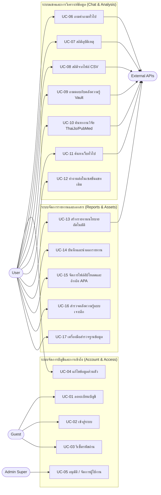

# 🎬 ผู้ใช้งานระบบและแผนผังกรณีการใช้งาน (Actors & Use-Case Map)

← [[index|หน้าหลัก (Vault Home)]] · กลับไปที่ SRS: [[03 - Functional Requirements]]

## ผู้ใช้งานระบบ (Actors)

ระบบแบ่งผู้ใช้งานออกเป็นหลายระดับและหลายประเภทตามสิทธิ์และเป้าหมายการใช้งาน:

| ผู้ใช้งาน (Actor) | ประเภท (Kind) | เป้าหมายหลัก (Goals) |
|---|---|---|
| **Guest (บุคคลทั่วไป)** | มนุษย์, ไม่ได้ยืนยันตัวตน | เข้าชมหน้าแรกเพื่อลงทะเบียน (Register), เข้าสู่ระบบ (Log in), หรือกู้คืนรหัสผ่านเมื่อลืม (Recover password) |
| **User (ผู้ใช้ทั่วไป)** | มนุษย์, สิทธิ์ `role=user` (ผ่านการอนุมัติ) | ตั้งคำถามปรึกษา (Ask questions), สร้างและบันทึกรายงานนโยบาย, จัดการไฟล์อ้างอิงและบรรณานุกรม APA, รวมไปถึงการสืบค้นข้อมูลในคลังความรู้ (Browse knowledge) |
| **Admin (ผู้ดูแลระบบ)** | มนุษย์, สิทธิ์ `role=admin` | สามารถทำทุกอย่างที่ผู้ใช้ทั่วไปทำได้ พร้อมสิทธิ์ในการดูข้อมูลภาพรวมระบบที่เพิ่มมากขึ้น |
| **Admin Super (ผู้ดูแลระบบสูงสุด)** | มนุษย์, สิทธิ์ `role=adminsuper` | ควบคุมสิทธิ์ของผู้ใช้อื่นทั้งหมด สามารถอนุมัติ (Approve), ปฏิเสธ (Reject), และระงับบัญชีผู้ใช้ในระบบ |
| **Backend (python-ai)** | ระบบประมวลผล (System) | ทำหน้าที่รับคำสั่งแล้วรันการทำงานของ Agent (Memory→Router→pipelines) และส่งคำตอบกลับไปหาผู้ใช้ในรูปแบบสตรีมมิ่ง |
| **External APIs (บริการภายนอก)** | ระบบบริการภายนอก (System) | เชื่อมต่อข้อมูลความรู้และโมเดลต่างๆ เช่น Gemini, ระบบวารสารวิชาการ ThaiJo, ฐานข้อมูลการแพทย์ PubMed, เครื่องมือค้นหา Tavily, และข้อมูลสภาพอากาศ Open-Meteo |

## แผนผังกรณีการใช้งาน (Use-case Diagram)

แผนผังด้านล่างแสดงถึงการเชื่อมโยงระหว่างผู้ใช้งานแต่ละประเภทและฟังก์ชันการทำงานหลักที่พวกเขาสามารถเข้าถึงได้:

## ดัชนีกรณีการใช้งาน (Use-case Index)

รายการ Use-case ทั้งหมดพร้อมลิงก์ไปยังเอกสารที่มีคำอธิบายขั้นตอนโดยละเอียด:

| UC ID | ชื่อกรณีการใช้งาน (Name) | อ้างอิงเอกสาร (Note) | ผู้เล่นหลัก (Primary Actor) |
|---|---|---|---|
| UC-01 | ลงทะเบียนบัญชี (Register account) | [[01 - Account & Access]] | Guest |
| UC-02 | เข้าสู่ระบบ (Log in) | [[01 - Account & Access]] | Guest |
| UC-03 | รีเซ็ตรหัสผ่าน (Reset password) | [[01 - Account & Access]] | Guest |
| UC-04 | แก้ไขข้อมูลส่วนตัว (Edit profile) | [[01 - Account & Access]] | User |
| UC-05 | อนุมัติ / จัดการผู้ใช้งาน (Approve / manage users) | [[01 - Account & Access]] | Admin Super |
| UC-06 | ถามคำถามแบบปกติ (Ask a question - normal) | [[02 - Chat & Domain Analysis]] | User |
| UC-07 | ดึงสถิติอุบัติเหตุ (Get accident statistics) | [[02 - Chat & Domain Analysis]] | User |
| UC-08 | ดึงสถิติจากไฟล์ CSV (Get CSV-domain statistics) | [[02 - Chat & Domain Analysis]] | User |
| UC-09 | ถามคำถามจากคลังความรู้ภายใน (Ask the knowledge vault) | [[02 - Chat & Domain Analysis]] | User |
| UC-10 | ค้นหางานวิจัย (ThaiJo / PubMed) | [[02 - Chat & Domain Analysis]] | User |
| UC-11 | ค้นหาข้อมูลจากเว็บทั่วไป (General web search) | [[02 - Chat & Domain Analysis]] | User |
| UC-12 | แชทต่อในเซสชันเดิม (Continue a chat session) | [[02 - Chat & Domain Analysis]] | User |
| UC-13 | สร้างรายงานนโยบายอัตโนมัติ (Generate a policy report) | [[03 - Report Generation]] | User |
| UC-14 | บันทึกและนำออกไฟล์รายงาน (Save & export a report) | [[03 - Report Generation]] | User |
| UC-15 | จัดการไฟล์เอกสารและการอ้างอิง APA (Manage files & APA citation) | [[04 - Knowledge, Files & Admin]] | User |
| UC-16 | เรียกดูและสำรวจคลังความรู้ (Browse the knowledge vault) | [[04 - Knowledge, Files & Admin]] | User |
| UC-17 | สำรวจข้อมูลโครงสร้างในฐานข้อมูล (Explore the database) | [[04 - Knowledge, Files & Admin]] | User |

## รูปแบบมาตรฐานสำหรับเขียน Use-case (Use-case Template)

กรณีการใช้งานทั้งหมดในชุดเอกสารนี้จะถูกเขียนโดยใช้รูปแบบมาตรฐานดังต่อไปนี้ เพื่อให้ง่ายต่อการทำความเข้าใจและตรวจสอบ:

> **ชื่อผู้ทำ (Actor) · เป้าหมายหลัก (Goal) · เงื่อนไขก่อนหน้า (Preconditions) · จุดกระตุ้น (Trigger) · ขั้นตอนปกติ (Main flow) · ขั้นตอนทางเลือก/ข้อผิดพลาด (Alternate/Exception flows) · เงื่อนไขผลลัพธ์ (Postconditions) · รหัสอ้างอิงไปถึง Requirement (Traces: FR/NFR)**
