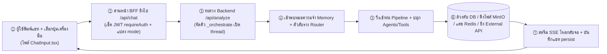

# 🔧 สารบัญดัชนีเวิร์กโฟลว์ทั้งระบบ (Workflow Index)

← กลับไป [[index|หน้าหลัก]] · ดูภาพรวมสถาปัตยกรรม: [[00 - Architecture Overview]] · ดูคู่มือ API: [[06 - API Reference — Backend]] · [[07 - API Reference — Frontend (BFF)]]

> เอกสารในโฟลเดอร์นี้เปรียบเสมือนคู่มือพิมพ์เขียวที่อธิบาย **ขั้นตอนการทำงานจริงแบบทีละสเต็ป (Step-by-step)** 
> ไล่ตั้งแต่จังหวะที่ผู้ใช้คลิกปุ่มบนหน้าจอ → วิ่งผ่านด่านหน้า BFF → ทะลวงเข้า Backend → แตะดึงข้อมูลจากฐานข้อมูล/MinIO → ก่อนจะสตรีมผลลัพธ์กลับมาแสดงผลสวยๆ บนจอ
> — โดยเราจะแยกโน้ตตามหมวดหมู่ **เครื่องมือ (tool)** แต่ละตัวที่มีให้กดในเมนูแชท ซึ่งรายละเอียดทั้งหมดถูกแกะรอยมาจากโค้ดจริงทุกขั้นตอน (ระบุไฟล์/ชื่อฟังก์ชัน + ชี้เป้าตาราง/แหล่งเก็บข้อมูลที่เกี่ยวข้องไว้หมดแล้ว)

---

## 🧭 แกนกลางกระดูกสันหลังที่ทุกเวิร์กโฟลว์ต้องวิ่งผ่าน (Common Spine)

| ลำดับขั้น | พิกัดที่เกิดเหตุ (ไฟล์) | ทำอะไรบ้าง |
|---|---|---|
| ① หน้าบ้าน Frontend | `component/chat/ChatInput.tsx` | คำนวณหาค่า `mode` จากปุ่มที่ผู้ใช้กด (ผ่าน `getEffectiveMode`) แล้วแพ็กของเตรียมยิง `POST /api/chat` |
| ② ด่านหน้า BFF | `app/api/chat/route.ts` | ตรวจบัตรคิว `requireAuth()` (ดู JWT) → map ค่า `mode` → แล้วทำตัวเป็นนกต่อโยนไปหา Backend โดยแอบแนบบัตรผ่าน `x-internal-key` ไปด้วย → เตรียมตัวรับสตรีม `tee()` กลับ |
| ③ หลังบ้าน Backend | `routers/analyze.py` (ฟังก์ชัน `_handle_analyze`) | มีพนักงานจัดคิว `BoundedSemaphore(5)` (รับแขกพร้อมกันได้ 5 คิว) → ถ้าคิวว่างจะเปิด thread รับงานแยกใน `_orchestrate()` |
| ④ Memory+Router | `agents/question_resolver.py`, `agents/router.py` | กองกลางทำงาน: เกลาคำถามสั้นๆ ให้ยาวขึ้น (ขยาย follow-up) + จัดหมวดหมู่โดเมน/เลือกท่อ pipeline ที่เหมาะสม |
| ⑤ ท่อ Pipeline | `agents/*` | ปลุกเสกทีมงาน CrewAI (crew) ขึ้นมาลุยงานตามเครื่องมือที่เลือก |
| ⑥ ล้วงข้อมูล Data | PostgreSQL / MinIO / Redis / External API | ลงมือขุดเดต้า - คำนวณเลข - ค้นหาไฟล์ - หรือยิง API คุยกับโลกภายนอก |
| ⑦ สตรีมกลับ | `analyze.py` (ปล่อย SSE) + `chat/route.ts` (เซฟแชท) | พ่น event กลับไปให้จอแสดงผลทีละบรรทัด (SSE) + เขียนประวัติแชทลง `chat_sessions` |

---

## 📚 แยกย่อยเวิร์กโฟลว์ตามเครื่องมือ (Workflow per Tool)

| อ่านเวิร์กโฟลว์เชิงลึก | ปุ่มเมนูหน้าจอ | โหมด `mode` | แหล่งขุดข้อมูลหลัก |
|---|---|---|---|
| [[01 - Chat Normal Workflow]] | (แชททั่วไป ไม่กดปุ่ม) | `normal` | คลังความรู้ Obsidian vault / เอกสาร CSV |
| [[02 - Statistics Workflow]] | 📊 กดปุ่มสถิติ | `stats` | ฐานข้อมูล PostgreSQL (แบบ star schema) / ไฟล์ CSV ใน MinIO |
| [[03 - Knowledge Vault Workflow]] | 🌿 กดปุ่มคลังความรู้ | `obsidian` | อ่านไฟล์ `.md` โดยตรง + ตารางคิวรี `obsidian_*` |
| [[04 - Research Workflow]] | 📖 กดปุ่มวิจัย | `research` / `thaijo` / `pubmed` | ต่อสายตรง ThaiJo API / ดึง PubMed / พักของใน Redis cache |
| [[05 - Web Search Workflow]] | 🔍 กดค้นหาเน็ตทั่วไป | `tavily` | พึ่งบริการ Tavily API |
| [[06 - Report Generation Workflow]] | 📋 กดสร้างรายงาน | `report-gather` | ปลุกผี 5 แหล่งพร้อมกัน → โกยผลลัพธ์ลง `journal_reports` |
| [[07 - Auth & Session Workflow]] | (ระบบล็อกอิน/จำประวัติ) | — | ฐานข้อมูล PostgreSQL ตาราง `accounts` / `chat_sessions` |
| 🆕 [[08 - PDF Ingest Workflow]] | (หน้า `/pdf-upload`) | — | MinIO `pdf-library` → ตาราง `obsidian_notes` |

---

## 🗺️ แผนที่ขุมทรัพย์: "เวิร์กโฟลว์ไหน ไปแตะตาราง/แหล่งเก็บไหนบ้าง"

| เวิร์กโฟลว์ (Workflow) | ฐานข้อมูล PostgreSQL | ถังไฟล์ MinIO | แคช Redis | โลกภายนอก External |
|---|---|---|---|---|
| 💬 ถามแชททั่วไป (Normal) | `obsidian_*` (ใช้บางจังหวะ) | — | ประวัติแชท history | ถาม Gemini |
| 📊 โหมดสถิติ (Statistics) | `fact_*` / `mart_*` / `dim_*` (สายอุบัติเหตุ) | อ่าน CSV (จากถัง `fileapa`) | ประวัติแชท history | ถาม Gemini |
| 🌿 คลังความรู้ (Knowledge) | `obsidian_*` (ผ่านระบบ search/tool) | เปิดดู PDF assets | ประวัติแชท history | ถาม Gemini |
| 📖 งานวิจัย (Research) | — | — | เก็บแคช thaijo | ควานหาจาก ThaiJo, PubMed |
| 🔍 ค้นหาเน็ต (Web Search) | — | — | ประวัติแชท history | ควานหาจาก Tavily |
| 📋 สร้างรายงาน (Report) | กวาดทุกแหล่งมารวมกัน + เซฟลง `journal_reports` | ดึงไฟล์รายงานมาแปะ | ประวัติแชท history | ThaiJo / PubMed / Tavily |
| 🔐 ล็อกอิน/จำประวัติ (Auth) | ตาราง `accounts`, ตาราง `chat_sessions` | — | — | — |
| 🆕 📄 ย่อย PDF (Ingest) | เขียน `obsidian_notes` / `obsidian_pdf_assets` | อ่าน `pdf-library` | มิเรอร์สถานะคิว (ข้าม worker) | ถาม Gemini |

*ถ้าอยากดูว่าแต่ละตารางหน้าตาเป็นยังไง ไปส่องที่: [[04 - Data Architecture & Schema]] · หรือถ้าอยากดูลำดับเหตุการณ์ตามเวลา แวะไปที่: [[03 - Runtime Views]]*
