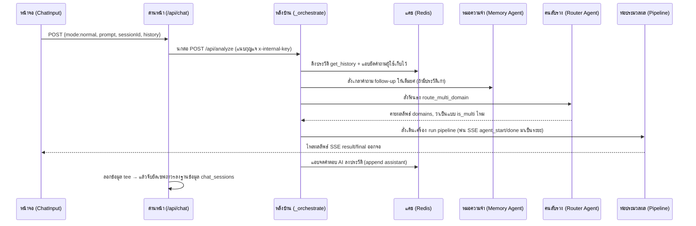

# 💬 เวิร์กโฟลว์: โหมดถามแชททั่วไป (Chat Normal · `mode=normal`)

← กลับไป [[00 - Workflow Index]] · ตอนถัดไป → [[02 - Statistics Workflow]]

> สถานการณ์นี้จะเกิดขึ้นก็ต่อเมื่อ ผู้ใช้พิมพ์คำถามลอยๆ ขึ้นมาโดย **ไม่ได้กดเลือกปุ่มเครื่องมือใดๆ (UI tool buttons) เลย** 
> ภาระอันหนักอึ้งจึงตกไปอยู่ที่ **ผู้ว่าการสับราง (Router Agent)** ที่จะต้องเป็นคนนั่งวิเคราะห์และตัดสินใจเองว่า ควรจะพาคำถามนี้ไปโยนลงตะกร้าโดเมนไหนดี

## 📊 แผนภาพลำดับเหตุการณ์ (Sequence Diagram)

## 🛠️ เจาะลึกขั้นตอนแบบละเอียด (Step by step)

1. **หน้าบ้าน (Frontend)** — `ChatInput.tsx`: ระบบเช็คว่าไม่มี tool ตัวไหนถูกกดเลย → ฟังก์ชัน `getEffectiveMode()` จึงคายคำว่า `"normal"` ออกมา →
   ส่งผลให้ยิงรีเควส `POST /api/chat` พร้อมหอบบอดี้ `{sessionId, prompt, history, mode:"normal", tools:[]}` ไปให้ด่านหน้า
2. **ด่านหน้า (BFF)** — `app/api/chat/route.ts`: จ่าฝูง `requireAuth()` จะขอดูบัตร JWT ก่อนว่าล็อกอินจริงไหม → เช็คแล้วพบว่า `mode` นี้ไม่ได้มี endpoint พิเศษ →
   จึงจัดการเปลี่ยนทิศ (upstream) ชี้เป้าไปที่ `/api/analyze` → กด `fetch` ส่งต่อ โดยแอบแนบตั๋ว VIP `internalHeaders()` (`x-internal-key`) ไปด้วย (ตั้งเวลารอสูงสุด timeout 10 นาที)
3. **จัดคิวเข้าหลังบ้าน (Backend)** — `analyze.py` (ใน `_handle_analyze`): เจอพนักงานต้อนรับ `_AI_SEMAPHORE.acquire()` (รับแขกได้แค่ทีละ 5 คิว) ถ้าเต็ม → เด้ง SSE error บอกผู้ใช้ว่า "ระบบยุ่ง ขออภัย"
4. **เปิดโรงงาน (Thread)** — ฟังก์ชัน `_orchestrate()` จะถูกปลุกให้ตื่นขึ้นมารันในโหมด daemon thread, คอยรับส่ง event ชิ้นงานผ่านสายพาน `asyncio.Queue`
5. **รื้อฟื้นความหลัง (ประวัติ)** — ไปงัดกรุ `history.get_history(session_id)` (จาก Redis) + ยัดคำถามใหม่ใส่ตะกร้า `append_history(user)` + แล้วรวบยอดด้วย `build_history_context`
6. **เข้าพบหมอความจำ (Memory Agent)** — ถ้าดูแล้วพบว่ามีประวัติคุยค้างไว้ → จะเรียก `question_resolver.resolve_question()` (ใช้สมอง Gemini flash-lite) มาช่วยแปลงคำถามสั้นๆ ด้วนๆ (follow-up) ให้กลายเป็นประโยคเต็มที่เข้าใจง่าย
7. **สะกิดบอกใบ้คลังความรู้ (Vault RAG hint)** — เรียกสุนัขดมกลิ่น `vault_rag.detect_province_from_prompt()` → ถ้าดมเจอว่าผู้ใช้พิมพ์ชื่อ "จังหวัด" → จะรีบไปดูดเนื้อหาโน้ตจากคลัง `read_vault_context()` (จำกัดแค่ ≤8000 ตัวอักษร) มาแนบเป็นคำใบ้ (hint) เผื่อใช้
8. **ผู้ว่าการสับราง (Router)** — ส่งเข้าเครื่อง `router.route_multi_domain(prompt, history)` → เครื่องจะฟันธงคายเป้าหมายมาเป็น `domains[]` (โดเมนไหนบ้าง) และ `is_multi` (เป็นคำถามควบโดเมนไหม)
9. **สับสวิตช์เลือกท่อทำงาน (Pipeline):**
   - **กฎเหล็กพิเศษ:** ถ้าถูกจับโยนลงโดเมน `d1` (อุบัติเหตุ) ในโหมด normal → **ระบบจะลักไก่เปลี่ยนเส้นทางไปหาท่อห้องสมุด Obsidian แทน** (เพราะถือว่าเป็นการถามความรู้/นโยบาย ไม่ใช่การสั่งให้ไปงัด SQL ดึงตัวเลขดิบ)
   - ถ้าตกโดเมน `obsidian` → โยนเข้าท่อ `obsidian_fullcontext.run_obsidian_ask_fullcontext()`
   - ถ้าตกโดเมน `dt`/thaijo → โยนเข้าท่อวิจัย `thaijo_agent.run_thaijo_pipeline()`
   - ถ้าเป็นโดเมน CSV เดี่ยวๆ → โยนเข้าท่อ `csv_pipeline.run_pipeline()` · แต่ถ้าเป็นโจทย์ข้ามโดเมน (multi) → โยนเข้า `multi_csv_pipeline.run_multi_pipeline()`
10. **สตรีมพ่นผลลัพธ์** — ระหว่างที่ท่อ pipeline ทำงาน มันจะแอบโยน (`put()`) สถานะต่างๆ เช่น `agent_start` (เริ่มคิด), `agent_done` (คิดเสร็จ), `result` (ผลย่อย), จนถึง `final` (คำตอบสุดท้าย) ไหลออกไป
11. **จดบันทึกฝั่ง BE** — ไม่ลืมที่จะแอบจดคำตอบ AI `append_history(assistant)` กลับเข้าไปฝากไว้ใน Redis
12. **หน้าจอรับของ (Frontend รับ SSE)** — ไฟล์ `ChatInput.tsx` จะคอยงับอ่าน event ทีละก้อนที่ไหลมา → เอาไปปั้นโชว์สดๆ อัปเดต `streamingStore` (เห็นตัวหนังสือไหลๆ) + พอจบก็เซฟลง `chatSessionStore`
13. **จารึกลงฐานข้อมูลถาวร** — หน้าจอแอบยิงคำสั่ง `chat/history POST` หรือถ้าเน็ตหลุดก็จะใช้แผนสำรอง `persistFallbackCompletion()` เอาข้อความไปฝังดินเขียนลง `chat_sessions.messages_json` ให้คงอยู่ตลอดไป

## 📍 จุดตัดที่น่าสนใจ (Touchpoints)

| แวะที่ไฟล์ / ฟังก์ชัน | ทำหน้าที่อะไร | ชี้เป้าแหล่งเก็บ (Storage) |
|---|---|---|
| `ChatInput.tsx` ฟังก์ชัน `getEffectiveMode` | คนคอยคิดคำนวณหา mode ปัจจุบัน + เป็นมือปืนยิง request | — |
| `chat/route.ts` | เป็นทั้งการ์ดหน้าคลับ (auth) + นกต่อ proxy + ภารโรงคอยเก็บกวาด persist ข้อมูล | ตาราง `chat_sessions` |
| `analyze.py` ฟังก์ชัน `_orchestrate` | ผู้ควบคุมวงดนตรี (orchestrate) สั่งการทุกอย่าง | — |
| `question_resolver.py` | หมอศัลยกรรม ขยายประโยค follow-up ให้ดูดี | ถัง Redis (เก็บ history) |
| `router.py` ฟังก์ชัน `route_multi_domain` | คนขับรถเมล์ จัดสรรโดเมนพาไปส่งถูกป้าย | — |
| `obsidian_fullcontext.py` / `csv_pipeline.py` | ทีมลงมือขุดหาคำตอบ | งัดไฟล์ `.md` / โหลด MinIO CSV |
| `history.py` | สมุดจดประวัติแชทระยะสั้น | ถัง Redis |

## ⚠️ ป้ายเตือนอันตราย (ข้อควรระวัง)
- โปรดจำไว้ว่า การถามเรื่องอุบัติเหตุในโหมด Normal **จะไม่มีทาง** ไปปลุกตัว Accident SQL Agent ขึ้นมาทำงาน — ถ้าผู้ใช้อยากเห็นตัวเลขตาราง SQL แบบลึกๆ **ต้องสั่งให้ผู้ใช้กดปุ่ม "สถิติ"** ([[02 - Statistics Workflow]]) เท่านั้น
- ความจำใน Redis เป็นโรคอัลไซเมอร์อ่อนๆ มีอายุ (TTL) อยู่ได้แค่ 24 ชม. → ถ้าอยากรำลึกความหลังแบบถาวร ต้องไปคุ้ยดูประวัติที่ฝังไว้ใน `chat_sessions` (จัดการโดยด่านหน้า BFF) แทน
