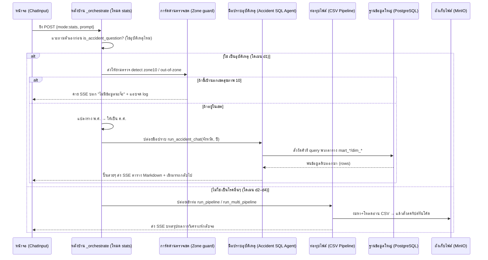

# 📊 เวิร์กโฟลว์: โหมดวิเคราะห์สถิติ (Statistics · `mode=stats`)

← กลับไป [[01 - Chat Normal Workflow]] · ตอนถัดไป → [[03 - Knowledge Vault Workflow]]

> เมื่อผู้ใช้กดปุ่ม **สถิติ** ระบบจะเดินหน้าแยกเส้นทางแบบเด็ดขาดตามชนิดคำถาม: **ถ้าเป็นเรื่องอุบัติเหตุ (โดเมน d1)** จะดิ่งไปคุยกับฐานข้อมูล SQL (PostgreSQL) ตรงๆ,
> แต่ถ้าเป็นหมวด **สุขภาพจิต/โรคไม่ติดต่อ NCD/โภชนาการ (โดเมน d2–d4)** จะเบนเข็มไปใช้แก๊งท่อทุบ CSV pipeline ที่ต้องไปงัดไฟล์จาก MinIO แทน

## 📊 แผนภาพลำดับเหตุการณ์ (Sequence Diagram)

## 🛤️ เส้นทางสาย A — สิงห์อุบัติเหตุทางถนน (สาย d1, คุย SQL ตรง)

1. **หน้าบ้าน (Frontend)** — ผู้ใช้จิ้มเลือกปุ่ม **สถิติ** → บังคับเปลี่ยน `mode="stats"` → ยิง `POST /api/chat` → ทะลุด่านหน้า BFF → ตรงเข้า `/api/analyze`
2. **สแกนชนิดคำถาม** — เรียกใช้ฟังก์ชัน `router.is_accident_question(prompt, history)` (ระบบจะสแกนหา keyword ก่อนเพื่อความไว ถ้ายังงงๆ ค่อยปลุก LLM มาช่วยวิเคราะห์)
3. **การ์ดด่านตรวจพรมแดน** — ปลุก `accident_chat_sql.detect_out_of_zone10_provinces()` + คู่กับ `detect_zone10_provinces()`
   - กฎเหล็ก: ถ้าผู้ใช้ถามถึงจังหวัดที่อยู่ **นอกเขตสุขภาพ 10** โดดๆ → ระบบจะแอบฟ้อง `missing_data_logger.log_missing_data()` + พ่นข้อความ SSE เด้งบอกหน้าตาเฉยว่า "ไม่มีข้อมูล" พร้อมโชว์ป้ายรายชื่อ 5 จังหวัดในเขต 10 ให้ดู แล้ว **ตัดจบกระบวนการทันที**
4. **สกัดพารามิเตอร์** — แกะรอยหาชื่อจังหวัด (ถ้าเจาะจง) + ดึงตัวเลขปี `25xx` ออกมา → แล้วเข้าเครื่อง **แปลง พ.ศ. ให้เป็น ค.ศ.** (เอาไปลบ 543, เพื่อให้ตกในช่วงข้อมูลที่มีคือปี 2021–2026)
5. **ปล่อยเอเจนต์ลงสนาม** — รันคำสั่ง `accident_chat_orchestrator.run_accident_chat(prompt, province, "", y_start, y_end, history)`
   - ตัวแรก **AccidentSQLAgent** (ใช้สมอง Gemini flash) จะวิ่งไปหยิบเครื่องมือใน `accident_chat_sql.py` (มีฟังก์ชัน SQL ให้ใช้กว่า 15+ ตัว) → เสกคิวรีเจาะ
     ตารางระดับลึก `mart_province_road`, `mart_province_year`, `mart_accident_hotspot`, และโหนด `dim_geography`
   - ตัวสอง **AccidentAnswerAgent** (ใช้สมอง Gemini pro) จะรับข้อมูลดิบมาขัดสีฉวีวรรณ เรียบเรียงเป็นคำตอบภาษาไทยสละสลวย + วาดตาราง Markdown + แปะเชิงอรรถกันเหนียวเรื่องข้อจำกัดของตัวเลข
6. **ส่งของกลับบ้าน** — พ่น SSE `result` ออกจอ + ฝากคำตอบไว้ในความทรงจำ `append_history(assistant)` (บน Redis)

## 🛤️ เส้นทางสาย B — สิงห์นักขุดตาราง CSV (สาย d2–d4)

1. **จัดระเบียบโดเมน** — เรียก `router.route_stats_domains()` → เพื่อกรองให้เหลือเป้าหมายแค่ `d2/d3/d4` (ถ้าจับได้ว่าถาม ≥2 หมวด จะตีตราเป็นสาย multi ทันที)
2. **ถ้ามาเดี่ยว (Single)** → จับโยนเข้า `csv_pipeline.run_pipeline()` — ใช้ตี้ 6 agent รุมกินโต๊ะ:
   `นักหาไฟล์ → นักถอดสคีมา → คนสับพรอมต์ → มือเขียนโค้ด Python → ห้องรันโค้ด Executor → ปิดที่นักวิเคราะห์ Insight`
3. **ถ้ามาเป็นฝูง (Multi)** → จับโยนเข้า `multi_csv_pipeline.run_multi_pipeline()` — เริ่มจากนักเดินป่า (AI นั่งนึกจิ้มเลือก "ชื่อโฟลเดอร์ตัวชี้วัด") → ส่งต่อให้โค้ดหลังบ้านไปมุดหา file ID จริงๆ ออกมา (`_resolve_folders_to_files` + คู่กับ `path_index`) → ตามด้วยหมาดมกลิ่น Geo-Key → ตรวจสอบโดเมน → มือปั้นโค้ด → ปิดที่ห้องรันโค้ด
4. **เครื่องมือหากิน** — ใช้ท่อ `tools/minio.py`: พกฟังก์ชัน `list_csv_files` / `read_csv_schema` / และพระเอก **`execute_python_code`** (สั่งรันไลบรารี pandas
   อยู่ในโซนกักกัน subprocess แยกต่างหาก) — โดยไฟล์ตารางทั้งหมดนอนรออยู่ในถัง MinIO ชื่อ `fileapa` (ไฟล์ใช้รหัส id เป็นตัวเลข, ส่วนชื่อ path จริงๆ จะซ่อนใน metadata → ระบบใช้ทริค fuzzy match ในการคลำหา)
5. **สรุปผลงาน** — ปล่อยให้นักวิเคราะห์ Insight Analyst จรดปากกาเขียนสรุปภาษาไทย → แล้วสตรีม SSE โชว์ขึ้นจอ

## 📍 จุดตัดที่น่าสนใจ (Touchpoints)

| แวะที่ไฟล์ / ฟังก์ชัน | ทำหน้าที่อะไร | ชี้เป้าแหล่งเก็บ (Storage) |
|---|---|---|
| `analyze.py` (บล็อกเช็ค `mode=="stats"`) | คนคุมประแจ สับรางแยกว่าจะไปเส้นทาง A หรือ B | — |
| `router.is_accident_question` | เครื่องสแกนหาคำใบ้อุบัติเหตุ | — |
| `accident_chat_sql.py` | คลังแสง เก็บอาวุธ SQL tools กว่า 15+ ชิ้น | ดาต้าเบส PostgreSQL (แบบ star schema) |
| `accident_chat_orchestrator.py` | ผู้บังคับบัญชาคุมตี้ 2-agent สายอุบัติเหตุ | ฐานข้อมูล PostgreSQL |
| `missing_data_logger.py` | สมุดจดพฤติกรรม ดักจับคนชอบถามจังหวัดนอกเขต | เก็บลงไฟล์ log |
| `csv_pipeline.py` / `multi_csv_pipeline.py` | โรงงานชำแหละตาราง CSV | ถัง MinIO ถังชื่อ `fileapa` |
| `tools/minio.py` | คีมจับ อ่านไฟล์ CSV + สว่านปั่นรันโค้ด | ถัง MinIO |

## ⚠️ ป้ายเตือนอันตราย (ข้อควรระวัง)

> [!danger] `or [_DOMAINS["d3"]]` — จุดที่กลืนคำว่า "ไม่รู้" ทิ้ง
> ที่ [`analyze.py:316`](../../chatapi.python/src/routers/analyze.py) เขียนว่า
> `[d for d in csv_domains if d.code in ("d2","d3","d4")] or [_DOMAINS["d3"]]`
>
> ✅ **แก้แล้ว** — ตอนนี้เป็น `[d for d in csv_domains if d.code in _CSV_DOMAIN_CODES]`
> โดยไม่มี fallback ต่อท้าย และ `_CSV_DOMAIN_CODES` คำนวณจาก `folder_prefix`
> ใน `domains.py` ที่เดียว (ครอบคลุม d1–d6) ไม่ใช่รายชื่อที่เขียนไว้เอง
>
> เวลาผู้ใช้ถามเรื่องนอกขอบเขต (เช่น *"การควบคุมโรคพยาธิใบไม้ตับ"*) LLM router
> **ตอบถูกแล้ว** ว่า *"เป็นหัวข้อใหม่ ไม่เกี่ยวข้องกับ domain ที่ให้มา"* แต่โค้ดกลับ
> แปลง "ไม่รู้" ให้เป็น **d3 (NCD)** เสมอ ผลเสีย 2 ชั้น:
> 1. ผู้ใช้เห็น badge ว่ากำลังค้น **"สถิติ: โรคไม่ติดต่อ"** ซึ่งไม่จริง
> 2. ได้ข้อความ "ไม่พบข้อมูล" ลอย ๆ ทั้งที่เหตุผลจริงคือ *คำถามนี้ไม่อยู่ในขอบเขตของปุ่มนี้*
>
> เทียบกับเส้นทางอุบัติเหตุที่ทำถูก — มี out-of-zone guard บอกตรง ๆ ว่า
> *"ระบบไม่มีข้อมูลจังหวัด X ครอบคลุมเฉพาะเขต 10 มี 5 จังหวัด..."* พร้อม
> `log_missing_data()` · **เส้นทาง CSV ยังไม่มี guard แบบนี้ (ค้างอยู่)**

- อย่าลืมว่าตัวเลขปีที่ฝังอยู่ในฐานข้อมูลนั้นเป็น **ค.ศ. 2021–2026 ล้วนๆ** — ดังนั้นถ้าผู้ใช้พิมพ์ถามเป็นปี พ.ศ. เราต้องผ่านเครื่องแปลงเลขเสมอ (แวะไปดู [[04 - Data Architecture & Schema]])
- **ปุ่มนี้เป็นเจ้าของ CSV pipeline แต่ผู้เดียวแล้ว** (ตั้งแต่ 2026-07-30) — โหมด normal ที่เคยแอบวิ่งเข้าท่อเดียวกันถูกดันกลับไป `d0` หมด ดู [[01 - Chat Normal Workflow]]
- **ขอบเขตข้อมูลจริงมีแค่ 3 domain** (สุขภาพจิต / NCD / โภชนาการ รวม 45 ไฟล์ CSV) — ไม่มีโรคติดต่อ ระบาดวิทยา หรืออนามัยสิ่งแวดล้อม คำถามนอกนี้ relevance gate จะปฏิเสธ ซึ่ง**ถูกต้องแล้ว** อย่าไปแก้ให้มันใจดีขึ้น
- ทริคเด็ด: ถ้าผู้ใช้ดันไปถามเรื่องพฤติกรรมคนขับ (ใส่หมวกไหม/คาดเข็มขัดป่าว/อายุเท่าไหร่/เพศอะไร) → พอไปงัดตาราง `fact_accident_person` **มันจะโบ๋ตี๋ ว่างเปล่าไม่มีข้อมูล** → ระบบถูกสั่งให้โชว์เชิงอรรถแจ้งเตือนข้อจำกัดนี้แทนการปล่อยให้ AI หน้าแตก
- กฎประหาร: ถ้าถามถึงจังหวัดนอกเขตสุขภาพที่ 10 → ระบบจะหน้านิ่งแล้วบอกว่าไม่มีข้อมูลเสมอ **ห้ามใจดีแอบเอาสถิติของเขต 10 ไปตีเนียนสวมรอยให้เด็ดขาด**
