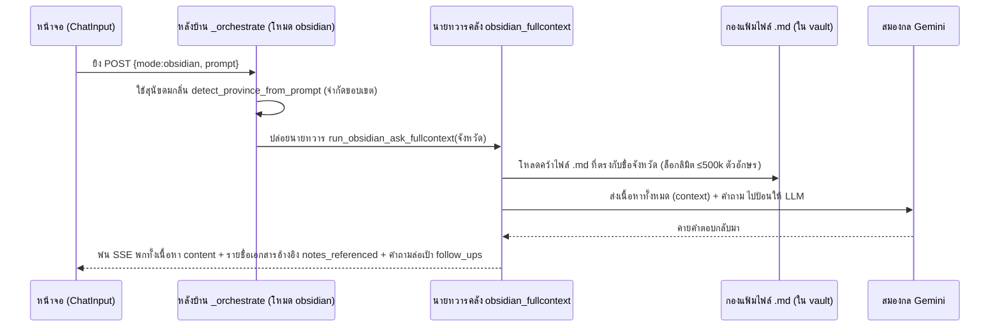

# 🌿 เวิร์กโฟลว์: โหมดคลังความรู้รายงาน (Knowledge Vault · `mode=obsidian`)

← กลับไป [[02 - Statistics Workflow]] · ตอนถัดไป → [[04 - Research Workflow]]

> เมื่อถูกถามเจาะเรื่องนโยบาย แนวทาง หรือองค์ความรู้ที่เฉพาะเจาะจงของเขตสุขภาพที่ 10 ระบบจะวิ่งมาพึ่งคลังสมบัติ Obsidian ซึ่งมีฟันเฟืองทำงาน 2 ระบบคู่ขนานกัน:
> **(A) ระบบแชทแบบโยนของเต็มเหนี่ยว (full-context)** (งัดเนื้อหาไฟล์ `.md` ไปให้อ่านตรงๆ) และ **(B) ระบบค้นหาผ่านหน้า Search API** (แอบใช้ตาราง `obsidian_*` ผสมกับเวทมนตร์ค้นหา pg_trgm)

## 📊 แผนภาพลำดับเหตุการณ์ (เวอร์ชันโหมดแชท chat mode)

## 🛠️ เจาะลึกขั้นตอน — (A) ฝั่งถาม-ตอบผ่านกล่องแชท (เมื่อกดปุ่มคลังความรู้รายงาน)

1. **หน้าบ้าน (Frontend)** — ผู้ใช้จิ้มเลือกปุ่ม **คลังความรู้รายงาน** → บังคับให้ `mode="obsidian"` → ยิงออก `/api/chat` → ทะลุผ่าน BFF → ตรงไปที่ `/api/analyze`
2. **ตีกรอบพื้นที่** — แอบใช้หมาดมกลิ่น `vault_rag.detect_province_from_prompt(prompt)` วิ่งหาชื่อจังหวัด (เพื่อป้องกันไม่ให้หอบข้อมูลมากไปจน AI จุก context อ้วกแตก)
3. **ปล่อยของลงท่อ (run pipeline)** — เรียกใช้ `obsidian_fullcontext.run_obsidian_ask_fullcontext(prompt, province, "health_region_10", history)`
   - เริ่มจากโหลดเนื้อหา note ออกมาจาก **ตาราง `obsidian_notes` (ใน PostgreSQL)** — ถ้าระบบจับได้ว่าถามระบุจังหวัด มันจะฉลาดโหลดเฉพาะ note ที่แปะป้ายจังหวัดนั้นมา (ประหยัดที่ไปเยอะ เหลือแค่ ~100–200 KB แทนที่จะต้องแบกมาทั้ง vault ~1.1 MB)
   - แอบตั้งตาวิเศษดักไว้ที่ `OBSIDIAN_MAX_CONTEXT_CHARS = 500000` เพื่อตัดหางปล่อยวัดข้อมูลส่วนเกิน ป้องกันอาการ `ContextWindowExceededError` (AI รับข้อมูลไม่ไหว) ของ Gemini
   - **ข้อสังเกตสำคัญ: โหมดนี้ไม่ได้จ้างลูกหาบ CrewAI agent** — แต่มันใช้ท่าไม้ตาย เรียกคุยตรงกับ Gemini ตัวต่อตัว พร้อมยัด `SYSTEM_PROMPT` ก้อนมหึมาทีเดียวจบ (แวะไปอ่านสเปคเต็มๆ ได้ที่ [[03 - Knowledge Tool Agent]])
4. **ให้ Gemini รวบยอด** → ผลที่ได้จะคลอดมาในรูปแบบก้อน `ObsidianAskResponse(content, notes_referenced[], follow_ups[])`
5. **สตรีมไหลกลับจอ** — ระบบจะทยอยพ่น SSE รหัส `result` พร้อมชูป้ายอ้างอิง `notesReferenced` + เสนอคำถามชวนคุย `followUps`; ไม่ลืมจดประวัติแชทเก็บไว้ด้วย `append_history(assistant)`

## 🛠️ เจาะลึกขั้นตอน — (B) ฝั่งระบบค้นหาและจัดการหลังบ้าน (API เฉพาะหน้า `/musyaend/obsidian`)

1. **หน้าบ้าน (Frontend)** — ถ้าใช้งานผ่านหน้าแดชบอร์ด `/musyaend/obsidian` → จะยิงรีเควส `POST /api/obsidian/[...path]` (ให้ BFF ช่วยเป็นนกต่อ proxy ให้) → วิ่งเข้าเส้นทาง backend ท่อ `/api/obsidian/*`
2. **โหมดนักสืบ (ค้นหา)** — ยิง `POST /api/obsidian/search` → ไปปลุกเครื่องมือ `tools/obsidian.py` **(โหมดนี้ไม่พึ่งพลังสมอง LLM เลยแม้แต่น้อย)**:
   - **งัดวิชาด่านที่ 1 (Tier 1):** ควานหาระดับชิ้นเนื้อ chunk ด้วยวิชา `pg_trgm` โดยมุดไปค้นบนตาราง `obsidian_note_chunks` + แอบไต่ตามสายสัมพันธ์ของ `obsidian_note_links` (ใช้กราฟ wikilink ช่วยขยายผล)
   - **งัดวิชาด่านที่ 2 (Tier 2 ท่าไม้ตายก้นหีบ):** ถ้าท่าแรกวืด จะงัดเวทมนตร์ `LIKE` ไปสาดค้นหาแบบคลุมๆ บนตารางใหญ่ `obsidian_notes` แทน
3. **ระบบจัดการห้องสมุด (ดัชนี/ตัวซิงก์ข้อมูล operator):**
   - คำสั่ง `POST /api/obsidian/index` → จะไปปลุกสคริปต์ `scripts/index_obsidian.py` ให้เดินสายกวาดอ่านไฟล์ `.md` → แล้วจัดการอัปเดต (upsert) ยัดข้อมูลเข้าตาราง `obsidian_vaults/notes/chunks/links`
   - คำสั่ง `POST /api/obsidian/pdfs/sync` → จะไปปลุกสคริปต์ `scripts/sync_obsidian_pdfs.py` ให้หอบเอาไฟล์ PDF ไปฝากไว้ในถัง MinIO + จดบัญชีรายชื่อลงตาราง `obsidian_pdf_assets`
4. **ระบบขอดู PDF** — ยิง `GET /api/pdf/obsidian-view/[...assetId]` → ส่งเข้าท่อ backend `/pdf/view/obsidian/{id}` → ไปงัดไฟล์มาจากถัง MinIO ให้ดูสดๆ

## 📍 จุดตัดที่น่าสนใจ (Touchpoints)

| แวะที่ไฟล์ / ฟังก์ชัน | ทำหน้าที่อะไร | ชี้เป้าแหล่งเก็บ (Storage) |
|---|---|---|
| `obsidian_fullcontext.py` | ห้องแชทโยนตู้มเดียว (คุยตรง Gemini ไม่ผ่าน Crew) | ตาราง `obsidian_notes` (บน PostgreSQL) |
| `vault_rag.detect_province_from_prompt` | เครื่องมือตีกรอบจังหวัด | — |
| `routers/obsidian.py` (เร้าต์ `/search`) | กลไกเสิร์ชค้นหาแบบไม่พึ่ง LLM | ตาราง `obsidian_notes/chunks/links` |
| `tools/obsidian.py` | กางตำราเสิร์ชด่าน 1 และด่าน 2 | PostgreSQL (ใช้วิชา pg_trgm) |
| `scripts/index_obsidian.py` | ภารโรงจัดหนังสือเข้าชั้น (index vault) | แก๊งตาราง `obsidian_*` |
| `scripts/sync_obsidian_pdfs.py` | ภารโรงจัดการไฟล์ PDF | ถัง MinIO + ตาราง `obsidian_pdf_assets` |

## ⚠️ ป้ายเตือนอันตราย (ข้อควรระวัง)
- **จำไว้ว่าโหมดแชท (chat mode) จะไปงัดข้อมูล (note) จากตาราง `obsidian_notes` (ใน PostgreSQL)** มายัดใส่ปาก Gemini โดยตรง (ไม่มีการจัดตั้งกองทัพเอเจนต์หลายตัวแต่อย่างใด) — ดังนั้น ถ้าคุณอัปเดตไฟล์แต่ลืมสั่ง index vault โหมดนี้ก็จะตาบอดทันที
- กรณีผู้ใช้ถามคำถามกว้างๆ ไม่ชี้เป้าจังหวัด ระบบจะจำใจหอบข้อมูลกว้างขึ้นมาป้อน แต่ก็ยังโดนกรรไกรตัดฉับทิ้งที่โควต้า 500k ตัวอักษรอยู่ดี
- ห้องสมุด vault ใบนี้จะไร้ค่าไปเลย ถ้าไม่มีการกดปุ่มทำดัชนี (index) ก่อน — API ฝั่งค้นหา search ถึงจะมองเห็น (แวะไปดูโครงสร้างที่ [[04 - Data Architecture & Schema]])
