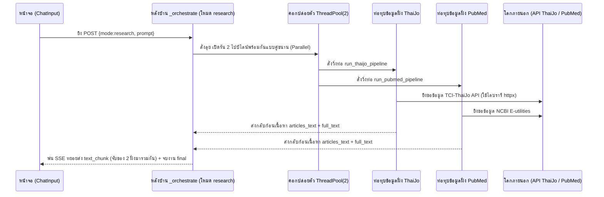

# 📖 เวิร์กโฟลว์: โหมดวิจัยวิชาการ (Research · `mode=research`/`thaijo`/`pubmed`)

← กลับไป [[03 - Knowledge Vault Workflow]] · ตอนถัดไป → [[05 - Web Search Workflow]]

> เมื่อกดปุ่ม **วิจัย** ผู้ใช้จะมีอิสระในการเลือกฐานข้อมูลเป้าหมาย: **ThaiJo (งานวิจัยไทย)**, **PubMed (งานวิจัยแพทย์สากล)** หรือจะ **เหมาทั้งคู่** (ซึ่งเป็นค่า default)
> โดยเบื้องหลัง ฟังก์ชัน `getEffectiveMode()` จะแปลงโหมดให้ตามนี้: เหมาทั้งคู่ตีเป็นโหมด `research` · เลือกแค่ ThaiJo ตีเป็น `thaijo` · เลือกแค่ PubMed ตีเป็น `pubmed`

## 📊 แผนภาพลำดับเหตุการณ์ (กรณีเหมา 2 แหล่ง `research = ทั้งคู่`)

## 🛠️ เจาะลึกขั้นตอนการทำงาน (Step by step)

1. **หน้าบ้าน (Frontend)** — ผู้ใช้กดปุ่ม **วิจัย** + ติ๊กเลือกแหล่งข้อมูล (`researchSources`: ThaiJo/PubMed) →
   ส่งผ่านตัวคำนวณ `getEffectiveMode()` → แล้วยิงไปหา `/api/chat`
   - กติกาสับราง: ถ้าเลือกแค่แหล่งเดียว ด่านหน้า BFF จะจับโยนไปท่อตรง เช่น `thaijo`→`/api/thaijo`, หรือ `pubmed`→`/api/pubmed`
   - แต่ถ้าติ๊กมาทั้งคู่: ระบบจะยึดเป็น `mode=research` → BFF จะโยนก้อนนี้ส่งไปให้ `/api/analyze` จัดการต่อ
2. **หลังบ้าน (Backend คุมวง)** — ไฟล์ `analyze.py` ตรงบล็อกเช็ค `mode=="research"`:
   - ปลุกเสก `ThreadPoolExecutor(2)` ขึ้นมา เพื่อปล่อยม้าวิ่งแข่งรัน `run_thaijo_pipeline()` + ควบไปพร้อมๆ กับ `run_pubmed_pipeline()` ในเวลาเดียวกัน
   - ใช้ท่าพิสดาร (wrapper queue) ในการคอยดักฟัง event ว่าใครเริ่มทำงาน `agent_start` หรือใครเสร็จแล้ว `agent_done` เพื่อส่งรายงานหน้าจอแบบ real-time, แถมแอบสูบ `articles_text`/`full_text` ของแต่ละแหล่งเก็บตุนไว้
3. **ท่อสาย ThaiJo (งานวิจัยไทย)** — เจาะไฟล์ `thaijo_agent.run_thaijo_pipeline()`:
   - **ตัวดูด (Fetcher)** — งัด `httpx` โทรสายตรงหา **TCI-ThaiJo API** (อ้างอิงลิงก์ `THAIJO_API_URL`, ล็อกเป้ากวาดมา 5 ผลลัพธ์) ดูดทั้งบทความและโหลด PDF
   - **ตู้เย็นแคช (cache)** — รัน `tools/thaijo_cache.py` เอาเนื้อหาสรุปของ PDF ไปแช่แข็งไว้บน **Redis** (ตั้งรหัสผ่านกุญแจ `thaijo_pdf:{sha256(url)}`) วันหลังโหลดอีกจะได้ไม่ต้องอ่านซ้ำ
   - **วางโครง + ปั่น (Planner → Generator)** — เรียก LLM วางโครงร่าง + เสก HTML ออกมาเป็นชิ้นๆ (ใช้ litellm สตรีมพ่นออกจอ)
4. **ท่อสาย PubMed (งานวิจัยสากล)** — เจาะไฟล์ `pubmed_agent.run_pubmed_pipeline()`:
   - พุ่งเป้าไปหาท่อ **NCBI E-utilities** (ล็อกเป้าขอ `retmax=10`, ถ้ามีคีย์ `NCBI_API_KEY` ก็จะใช้เพื่อความไว) → ผลลัพธ์ที่กระเด็นออกมาคือข้อมูลบทความเนื้อๆ (ชื่อ Title/ผู้แต่ง Authors/สำนักพิมพ์ Journal/รหัส PMID/ลิงก์ URL/บทคัดย่อ Abstract)
5. **ประกอบร่าง (รวมผล)** — ลูกพี่ใหญ่ `analyze.py` จะจับผลลัพธ์ของ 2 ท่อมายำรวมกันใส่ตะกร้า `combined_text` → แล้วสตรีมยิง `text_chunk` โชว์รายงานยาวๆ ไปที่หน้าจอซีกขวา +
   ส่วนจอกลางจะสรุปเนื้อหาเป็น "รายการแบบสั้น" (แค่ชื่อ/ผู้แต่ง/URL/และสรุปย่อๆ) → ปิดท้ายด้วยการตะโกนบอกหน้าจอว่าจบงาน `final` พร้อมแอบแพ็กของฝาก `articlesText` (เก็บเผื่อไว้ให้
   เอเจนต์สร้างรายงานดึงไปใช้อ้างอิงต่อได้เลย) + ไม่ลืมจดลงสมุด `append_history(assistant)`

## 📍 จุดตัดที่น่าสนใจ (Touchpoints)

| แวะที่ไฟล์ / ฟังก์ชัน | ทำหน้าที่อะไร | ชี้เป้าแหล่งภายนอก |
|---|---|---|
| `analyze.py` (บล็อกเช็ค research) | คนคุมเปิดสวิตช์ รัน 2 แหล่งพร้อมกันแบบคู่ขนาน | — |
| `thaijo_agent.py` | กองกำลังย่อย: นักดูด→คนวางโครง→เครื่องจักรเขียน | วิ่งหา ThaiJo API |
| `thaijo_cache.py` | คนเฝ้าตู้เย็นแคช PDF | ฝากไว้ที่ Redis |
| `pubmed_agent.py` | คนงมหาข้อมูลหมอ NCBI | วิ่งหา PubMed API |
| `routers/thaijo.py`, `routers/pubmed.py` | จุดจอดป้าย ถ้าผู้ใช้เลือกค้นแบบท่อเดี่ยว | โลกภายนอก External |

## ⚠️ ป้ายเตือนอันตราย (ข้อควรระวัง)
- ระบบฝั่ง ThaiJo ชอบงอแง บางทีก็เด้ง 403 Access Denied หรือ timeout ปล่อยให้รอเก้อ (ถือเป็นความเสี่ยงจากโลกภายนอก) → ระบบป้องกันไว้แล้ว ถ้าพัง error จะถูกจด log ทิ้งไว้ และท่ออีกแหล่งนึง (เช่น PubMed) จะยังคงวิ่งทำงานหน้าตาเฉยต่อไปได้
- ก้อนของฝาก `articlesText` จะถูกระบบอมเก็บซ่อนไว้เฉยๆ รอจนกว่าผู้ใช้จะอยากเล่นใหญ่สั่งทำรายงาน ([[06 - Report Generation Workflow]]) เอเจนต์ตัวสร้างรายงานถึงจะรู้ว่าควรล้วงอ้างอิงแยกทีละแหล่งจากไหน
