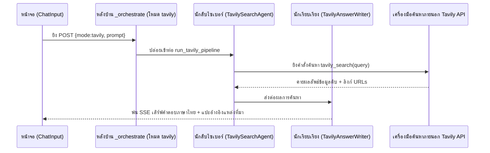

# 🔍 เวิร์กโฟลว์: โหมดค้นหาทั่วไป (Web Search · `mode=tavily`)

← กลับไป [[04 - Research Workflow]] · ตอนถัดไป → [[06 - Report Generation Workflow]]

> โหมด **ค้นหาทั่วไป** นี้เกิดมาเพื่อการสูบข้อมูลข่าวสารแบบเรียลไทม์สดๆ ร้อนๆ จากโลกอินเทอร์เน็ต ผ่านเอ็นจิ้นพระเอกชื่อ **Tavily Search** ก่อนจะจับข้อมูลฝรั่งมาย่อยแล้วเคี้ยวป้อนเป็นคำตอบภาษาไทยให้ผู้ใช้

## 📊 แผนภาพลำดับเหตุการณ์ (Sequence Diagram)

## 🛠️ เจาะลึกขั้นตอนการทำงาน (Step by step)

1. **หน้าบ้าน (Frontend)** — ผู้ใช้จิ้มปุ่ม **ค้นหาทั่วไป** → ระบบตีตราว่า `mode="tavily"` → ยิงออก `/api/chat` → ทะลุผ่านเพื่อนรัก BFF → วิ่งเข้าป้าย `/api/analyze`
2. **หลังบ้าน (Backend)** — ลูกพี่ใหญ่ `analyze.py` สังเกตเห็นบล็อกที่ติดป้าย `mode=="tavily"` → สั่งเดินเครื่อง `tavily_pipeline.run_tavily_pipeline(prompt, queue, loop, session_id, history_section)`
3. **ปล่อยมือนักสืบ (Search Agent)** — สายลับ `TavilySearchAgent` จะทำการงัดเอาอุปกรณ์ `tools/tavily_search.py` ออกมา → เพื่อวิ่งไปเต๊าะ **Tavily API**
   (พกอาวุธเสริมไปดังนี้: ถือกุญแจ `TAVILY_API_KEY`, ขอลิมิตไม่เกิน `TAVILY_MAX_RESULTS=10` เว็บ, สั่งบูสต์เน้นเจาะจงผลภาษาไทยด้วย `TAVILY_COUNTRY=thailand`, และขอดูดอักษรกลับมา `TAVILY_CONTENT_CHARS=1200` ตัวอักษร/เว็บ)
4. **ลงมือเขียนรายงาน (Answer Writer)** — พอได้ของดิบกลับมา ปล่อยให้เป็นคิวของนักเรียบเรียง `TavilyAnswerWriter` มานั่งถักทอสังเคราะห์ ปั้นเป็นคำตอบภาษาไทยสละสลวย + บังคับแปะลิงก์ URL อ้างอิงแหล่งที่มาเสมอ
5. **สตรีมไหลกลับจอ** — พ่นข้อมูลออกหน้าจอแบบ SSE; โดยความฉลาดคือมันจะแอบเก็บก้อนข้อมูลดิบ (title/url/summary) หลบซ่อนเอาไว้ด้วย เพื่อเป็นเสบียงสำรองเผื่อให้เครื่องจักรสร้างรายงาน (report generator) แวะมาดึงไปอ้างอิงแยกเป็นทีละแหล่งได้ในอนาคต
   (ส่องโค้ดท่านี้ได้ที่ฟังก์ชัน `_tavily_raw_to_articles_text` ในไฟล์ `analyze.py`); แล้วก็ปิดจ๊อบจดบันทึกลงความจำ `append_history(assistant)`

## 📍 จุดตัดที่น่าสนใจ (Touchpoints)

| แวะที่ไฟล์ / ฟังก์ชัน | ทำหน้าที่อะไร | ชี้เป้าแหล่งภายนอก |
|---|---|---|
| `analyze.py` (บล็อกเช็ค tavily) | คนส่งสัญญาณ สั่งให้เปิดท่อการทำงาน | — |
| `tavily_pipeline.py` | กองบัญชาการ วิ่งผลัดทีม: ค้นหา → แล้วส่งไปให้ทีมเขียน | — |
| `tools/tavily_search.py` | ไกปืน ยิงทะลุออกไปหา Tavily API | เครื่องมือ Tavily (external) |
| `config.py` | กล่องเก็บกุญแจ API คีย์ + ที่พักตัวแปรพารามิเตอร์ Tavily | ซ่อนอยู่ในไฟล์ `.env` |

## ⚠️ ป้ายเตือนอันตราย (ข้อควรระวัง)
- เป็นกฎประหารว่าระบบต้องฝังรหัส `TAVILY_API_KEY` เข้าไปในระบบไว้แล้ว — ถ้ากุญแจหาย หรือลืมเติมเงิน ฟีเจอร์ทั้งก้อนนี้จะกลายเป็นง่อยใช้งานไม่ได้ทันที
- คำเตือนเตือนใจ: แหล่งข้อมูลเหล่านี้มันควานหามาจาก "เว็บขยะและเว็บทั่วไปในเน็ต" — ความน่าเชื่อถือของเนื้อหามันจึงขึ้นอยู่กับบุญพาวาสนาส่งของเว็บต้นทาง ล้วนๆ ระบบจึงมีมาตรการบังคับให้เก็บ URL ไว้โชว์เสมอ เพื่อให้ผู้ใช้กดเข้าไปตรวจสอบจับผิด (Verify) แหล่งที่มาได้ด้วยตาตัวเอง
