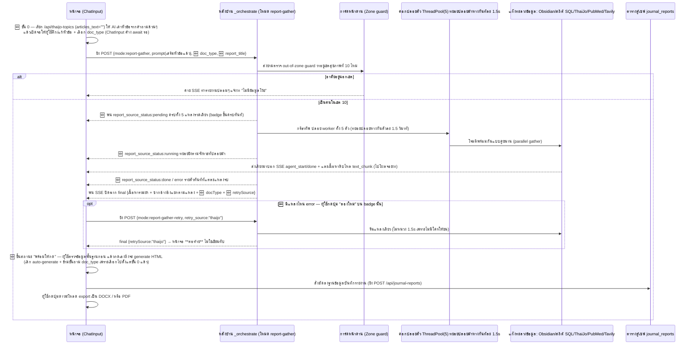

# 📋 เวิร์กโฟลว์: โหมดคอมโบสร้างรายงาน (Report Generation · `mode=report-gather`)

← กลับไป [[05 - Web Search Workflow]] · ตอนถัดไป → [[07 - Auth & Session Workflow]]

> เมื่อกดปุ่ม **สร้างรายงาน** ระบบจะไม่ทำงานแค่แบบก๊อกๆ แก๊กๆ แต่มันจะสั่งเรียกระดมพลปล้นข้อมูลจาก **5 แหล่งขุมทรัพย์พร้อมๆ กัน** → เอามากองยำรวมเป็น "ข้อมูลพื้นฐาน (Base Data)" →
> จากนั้นเด้งหน้าต่าง Wizard เสกมนต์ให้ผู้ใช้จิ้มเลือกชนิดของเอกสาร → แล้วค่อยประดิดประดอยปั้นโค้ดออกมาเป็นหน้า HTML สวยๆ → บันทึกฝังไว้ในคลังสมบัติ `journal_reports` → เพื่อรอให้ผู้ใช้กดสูบออกเป็นไฟล์ DOCX/PDF ไปปรินต์ใช้งาน

## 📊 แผนภาพลำดับเหตุการณ์ (Sequence Diagram)

## 🛠️ เจาะลึกขั้นตอนการทำงานแบบทะลุปรุโปร่ง

0. **🆕 ขั้นเลือกหัวข้อก่อนยิง (Pre-gather)** — ของเดิมกดปุ่มปุ๊บยิง prompt ดิบ ๆ ไปเลย ตอนนี้มีขั้นคั่นก่อน: `ChatInput` เรียก `/api/thaijo-topics` ด้วย `articles_text=""` (ยังไม่มีข้อมูลจริง ให้ AI เดาหัวข้อจากคำถามอย่างเดียว) → `preGatherTopicsStore` เปิดจอให้ผู้ใช้ **ติ๊ก/แก้หัวข้อ + เลือกประเภทเอกสาร** → `ChatInput` **ค้าง `await` Promise รอ** จนผู้ใช้กด "ยิงไปหาข้อมูล →" ถึงจะไปต่อขั้น 1
1. **หน้าบ้าน (Frontend)** — ผู้ใช้กดปุ่ม **สร้างรายงาน** → ฟังก์ชัน `getEffectiveMode()` คายค่าออกมาเป็น `"report-gather"` → วิ่งไปที่ `/api/chat` → แล้วเข้าประตูหลังที่ `/api/analyze` (🆕 แนบ `doc_type` + `report_title` ที่ได้จากขั้น 0 ไปด้วย)
2. **การ์ดคัดกรองด่านพรมแดน** — ในไฟล์ `analyze.py` บล็อก `report-gather` จะสั่งตรวจ out-of-zone เป็นอย่างแรก; ถ้าจับได้ว่าเป็นชื่อจังหวัด นอกเขตสุขภาพที่ 10 โดดๆ ล้วนๆ → ระบบจะประท้วงด้วยการสตรีมรายงานแห้งๆ ตอบกลับไปว่า "ไม่มีข้อมูล" แล้วก็จบเห่ทันที
3. **ปล้นสะดมภ์ 5 แหล่งพร้อมกัน** — ใช้ท่าไม้ตาย `ThreadPoolExecutor(5)` ปล่อยตัว worker วิ่งชนเป้าหมาย แต่มีทริคแอบหน่วงเวลาปล่อยห่างกัน **ตัวละ ~1.5 วินาที** (กันเหนียว API ปลายทางด่าและแจก error limit 429 ให้):
   - ตัวที่ 1 `_worker_obsidian` → โจมตีท่อ `run_obsidian_ask_fullcontext` (ล้วงคลังความรู้)
   - ตัวที่ 2 `_worker_stats` → โจมตีท่ออุบัติเหตุ โดยสาดคิวรี SQL ตรงเผง (`_query_kpi_trend`/`_query_province_executive_summary`/`_query_hotspot_roads`) หรือถ้าเป็นโรคอื่นก็ไปสับรางท่อตารางรวม `run_multi_pipeline` (พวก d2–d4)
   - ตัวที่ 3 `_worker_thaijo` → โจมตีท่อ `run_thaijo_pipeline` (งานวิจัยไทย)
   - ตัวที่ 4 `_worker_pubmed` → โจมตีท่อ `run_pubmed_pipeline` (งานวิจัยสากล)
   - ตัวที่ 5 `_worker_tavily` → โจมตีท่อ `run_tavily_pipeline` (ค้นอินเทอร์เน็ต)
4. **พ่นสตรีมรายงานสด** — worker แต่ละตัวจะส่งเสียงตะโกนสถานะการทำงาน `agent_start/done` วิ่งผ่านท่อ wrapper queue; เมื่อได้เนื้อหามาจะจับมัดรวมกันแล้วสตรีมไปโชว์ที่จอภาพซีกขวาในก้อน `text_chunk` (แถบ RightPane)
4.5. **🆕 ป้ายสถานะรายแหล่ง (per-source badge)** — คู่ขนานไปกับข้อ 4 ระบบยิง event `report_source_status` แยกต่างหาก: ยิง `pending` ให้ครบทั้ง 5 แหล่งรวดเดียวก่อน (badge ขึ้นครบทันที ผู้ใช้เห็นว่ากำลังจะทำอะไรบ้าง) แล้วค่อยทยอย `running` ตามจังหวะปล่อยม้า และปิดท้ายด้วย `done`/`error` รายตัวทันทีที่แต่ละแหล่งจบ — **ไม่ต้องรอจบงานทั้งชุดถึงจะรู้ว่าแหล่งไหนพัง**
5. **ประกอบร่างปิดจ๊อบ** — ยำผลลัพธ์ใหญ่มาเป็น `combined_text` (ตัดหั่นแบ่งหัวข้อตามแหล่งที่มาสวยงาม) + ห่อพัสดุ `combined_articles_text` (ก้อนวัตถุดิบอ้างอิงของแท้ แยกเก็บทีละถุง ThaiJo/PubMed/Tavily 🆕 **และ Obsidian**) → ปิดฉากประกาศ event `final` (🆕 พ่วง `docType` + `retrySource`)
   - 🆕 **เอกสารคลังความรู้เพิ่งได้เข้าลิสต์อ้างอิงเป็นครั้งแรก** — เดิม `obsidian_result` เก็บแค่ `.content` (เนื้อหาคำตอบ) ไม่เคยส่ง `notes_referenced` ต่อมาเลย ทำให้เอกสารในคลังความรู้ **ไม่มี URL ติดไปกับรายงาน** ต่างจาก ThaiJo/PubMed/Tavily ที่มีครบ ตอนนี้ `_obsidian_notes_to_articles_text()` แปลงให้เป็นบล็อกแบบเดียวกัน
   - ⚠️ และต้องเติมโดเมนจาก **`PUBLIC_APP_URL`** ให้ `pdf_url` กลายเป็น URL เต็มก่อนฝังลงข้อความ เพราะเคยลองส่ง path สัมพัทธ์ตรง ๆ แล้ว LLM เขียนออกมาเป็นข้อความธรรมดา (`URL: /api/pdf/view/815316`) ไม่ทำเป็นลิงก์ให้ — ต่างจากฝั่งแชท (`LeftPane.tsx`) ที่ path สัมพัทธ์ใน `<a href>` ของ React ทำงานได้ปกติอยู่แล้ว
6. **🆕 ตรวจก่อน แล้วค่อยกดสร้าง (เปลี่ยนจากเดิม)** — ของเดิม wizard เด้งมาถาม `doc_type` แล้ว auto-generate ทันที **ตอนนี้ไม่ใช่แล้ว**: `doc_type` ถูกเลือกไปตั้งแต่ขั้น 0 และ backend echo กลับมาใน `final.docType` → wizard **ข้ามขั้นถามซ้ำ** ไปเลย จากนั้น `reportReadyStore` แค่ขึ้นสถานะ "พร้อมให้กด" ผู้ใช้ต้อง**อ่านข้อมูลพื้นฐานที่รวบรวมมาก่อน แล้วกดปุ่มเองถึงจะเริ่ม generate HTML จริง**
   - ประเภทเอกสารยังเหมือนเดิม 3 แบบ: `policy` (Policy Brief) / `plan` (แผนยุทธศาสตร์) / `workplan` (แผนปฏิบัติการ)
   - โดยมีหน้าม้าจัดเลย์เอาต์หน้ากระดาษซ่อนอยู่ที่: `app/chat/journal-template/*` (แก๊งฟังก์ชันพวก `buildJournalHtml`, `journalHtmlStyles`, กะ `journalDocxStyles`)
6.5. **🆕 กันงานหายตอน reload** — `wizardPersist.ts` เซฟความคืบหน้าขั้นเลือก/แก้หัวข้อแบบ debounce ลง `messages_json` ของ `chat_sessions` ส่วน `reportSavePersist.ts` เซฟ `id`+`title` ของรายงานที่ auto-save สำเร็จ เพื่อให้**ปุ่มเปิดรายงานในแชทเก่ายังกดได้หลัง reload** (เดิมอยู่ใน `thaijoStore` ซึ่งเป็น in-memory ล้วน รีเซ็ตทุกครั้งที่รีเฟรช)
7. **ฝังลงตู้เซฟ (บันทึก)** — กดเซฟยิง `POST /api/journal-reports` → แล้วไปอัดแถวข้อมูลรัวๆ ลงในตาราง `journal_reports` (มีฟิลด์เด็ดๆ เช่น `title`, `query`, `doc_type`, นับจำนวนวิจัย `article_count`, `topic_plan`, ยัดไส้ `html_content`, และเอาป้ายชื่อคนเขียนแปะไว้ที่ `user_id`)
8. **นำออกไปโชว์ (Export)** — ไปที่หน้า `/journal` กดเปิดดูรายงานย้อนหลังได้ → จากนั้นกดปุ่ม export เป็นหน้าตา **DOCX (Word) หรือ PDF** โดยดึงจาก HTML ที่ซ่อนในตู้เซฟ; และมีกฎคือ อนุญาตให้ลบกระดาษรายงานทิ้งได้เฉพาะรายงานของตัวเองเท่านั้น

## 📍 จุดตัดที่น่าสนใจ (Touchpoints)

| แวะที่ไฟล์ / ฟังก์ชัน | ทำหน้าที่อะไร | ชี้เป้าแหล่งเก็บ (Storage) |
|---|---|---|
| `analyze.py` (บล็อกเช็ค report-gather **และ 🆕 report-gather-retry**) | หัวโจกคุม worker 5 ตัว + เป็นยามหน้าด่านคัดกรองเขต (🆕 โหมด retry ใช้โค้ดเส้นเดียวกัน ต่างแค่เลือก worker ตัวเดียวจาก `_ALL_WORKERS`) | — |
| 🆕 `_obsidian_notes_to_articles_text()` (ใน `analyze.py`) | แปลง `notes_referenced` ของ Obsidian เป็นบล็อกอ้างอิงพร้อม URL เต็ม (ใช้ `PUBLIC_APP_URL`) | 🧪 มีเทสต์คุมที่ `tests/test_analyze_report_gather.py` |
| 🆕 `preGatherTopicsStore.ts` / `reportReadyStore.ts` | คุมขั้นเลือกหัวข้อก่อนยิง / ขั้นรอผู้ใช้กดสร้าง | — |
| 🆕 `reportSourceStore.ts` + `ReportSourceBadges.tsx` + `reportRetry.ts` | ป้ายสถานะ 5 แหล่ง + ปุ่มลองใหม่รายแหล่ง | ผลของ retry ถูกเซฟทับลง `chat_sessions` |
| 🆕 `wizardPersist.ts` / `reportSavePersist.ts` | กันความคืบหน้า wizard + ปุ่มรายงานหายตอน reload | ตาราง `chat_sessions` (คอลัมน์ `messages_json`) |
| `obsidian_fullcontext` / accident SQL / `thaijo_agent` / `pubmed_agent` / `tavily_pipeline` | กลุ่มเป้าหมายที่โดนปล้นข้อมูล (แหล่งสกัด) | ดาต้าเบส PG / ถัง MinIO / ท่อ external |
| โฟลเดอร์ `journal-template/*` (ฝั่ง frontend) | ช่างตัดเสื้อ ปั้นหน้าตา HTML + ตัดชุดให้เหมาะตอน export | — |
| `app/api/journal-reports/route.ts` | เสมียนจดเซฟรายงาน | ตาราง `journal_reports` |
| หน้าเว็บเพจ `/journal` | แกลลอรี โชว์/ให้โหลด/หรือให้ลบ รายงาน | ตาราง `journal_reports` |

## ⚠️ ป้ายเตือนอันตราย (ข้อควรระวัง)
- ระบบมีความยืดหยุ่นสูง: ถ้าบังเอิญมีท่อไหนล่มหรือไปต่อไม่ไหว (เช่น จู่ๆ ฝั่ง ThaiJo แบนเด้ง 403 ใส่) → ระบบจะหน้าด้านข้ามหัวข้อพังๆ นั้นไปเลย แล้วปล่อยให้แหล่งที่เหลือยังคงเดินหน้าทำผลงานต่อไปได้อย่างไม่สะดุด — 🆕 และตอนนี้ badge ของแหล่งนั้นจะขึ้น `error` พร้อมข้อความสาเหตุ **และมีปุ่มลองใหม่ให้กดยิงซ้ำเฉพาะแหล่งเดียว** ไม่ต้องรัน gather ใหม่ทั้ง 5 ตัว
- 🆕 **`retry_source` ที่ส่งค่ามั่วมาจะได้ event `error` กลับ ไม่ใช่ HTTP 4xx** — เพราะการตรวจเกิดขึ้นหลังเปิดสตรีมไปแล้ว ฝั่งหน้าจอจึงต้องดักที่ event ไม่ใช่ที่ status code
- 🆕 **ห้ามให้ผลของ retry เขียนทับเนื้อหาเดิม** — ต้องเช็ค `final.retrySource` ก่อนเสมอ ถ้าไม่ใช่ `null` ให้ append เท่านั้น ไม่งั้นผลของอีก 4 แหล่งที่สำเร็จไปแล้วจะหายวับ
- แต่ถ้าโชคร้ายไม่มีแหล่งไหนทำงานรอดจนได้ของมาเลยสักแหล่ง → ระบบจะแจ้งเตือนผู้ใช้ให้ลองปรับคำถามให้คมและแคบเจาะจงขึ้นอีกนิด (เช่น บอกให้แนะชื่อจังหวัดมาตรงๆ เลย หรือบีบหัวข้อให้แคบลง)
- โปรดทราบว่า ด่านคัดกรองเขต 10 นี่เขี้ยวมาก มันบังคับครอบทั้งตารางฝั่ง SQL และฝั่งคลังความรู้ — แปลว่าต่อให้ฝืนพิมพ์ชื่อจังหวัดที่อยู่นอกเขต 10 ยังไง ระบบก็ไม่มีวันสร้างรายงานออกมาให้ดูได้เด็ดขาด!
