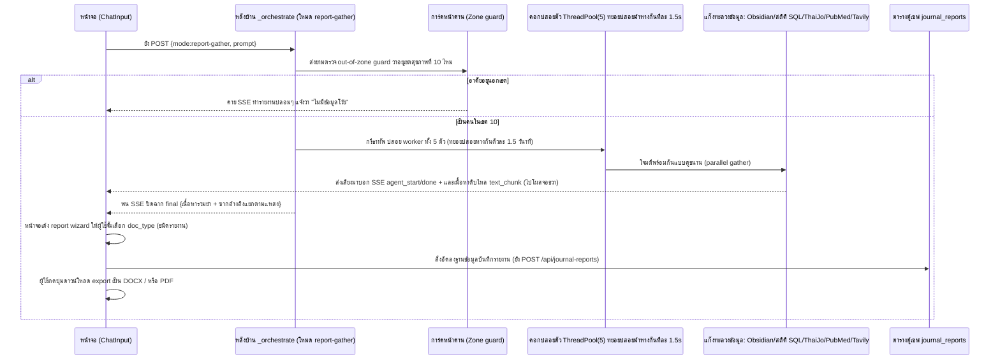

# 📋 เวิร์กโฟลว์: โหมดคอมโบสร้างรายงาน (Report Generation · `mode=report-gather`)

← กลับไป [[05 - Web Search Workflow]] · ตอนถัดไป → [[07 - Auth & Session Workflow]]

> เมื่อกดปุ่ม **สร้างรายงาน** ระบบจะไม่ทำงานแค่แบบก๊อกๆ แก๊กๆ แต่มันจะสั่งเรียกระดมพลปล้นข้อมูลจาก **5 แหล่งขุมทรัพย์พร้อมๆ กัน** → เอามากองยำรวมเป็น "ข้อมูลพื้นฐาน (Base Data)" →
> จากนั้นเด้งหน้าต่าง Wizard เสกมนต์ให้ผู้ใช้จิ้มเลือกชนิดของเอกสาร → แล้วค่อยประดิดประดอยปั้นโค้ดออกมาเป็นหน้า HTML สวยๆ → บันทึกฝังไว้ในคลังสมบัติ `journal_reports` → เพื่อรอให้ผู้ใช้กดสูบออกเป็นไฟล์ DOCX/PDF ไปปรินต์ใช้งาน

## 📊 แผนภาพลำดับเหตุการณ์ (Sequence Diagram)

## 🛠️ เจาะลึกขั้นตอนการทำงานแบบทะลุปรุโปร่ง

1. **หน้าบ้าน (Frontend)** — ผู้ใช้กดปุ่ม **สร้างรายงาน** → ฟังก์ชัน `getEffectiveMode()` คายค่าออกมาเป็น `"report-gather"` → วิ่งไปที่ `/api/chat` → แล้วเข้าประตูหลังที่ `/api/analyze`
2. **การ์ดคัดกรองด่านพรมแดน** — ในไฟล์ `analyze.py` บล็อก `report-gather` จะสั่งตรวจ out-of-zone เป็นอย่างแรก; ถ้าจับได้ว่าเป็นชื่อจังหวัด นอกเขตสุขภาพที่ 10 โดดๆ ล้วนๆ → ระบบจะประท้วงด้วยการสตรีมรายงานแห้งๆ ตอบกลับไปว่า "ไม่มีข้อมูล" แล้วก็จบเห่ทันที
3. **ปล้นสะดมภ์ 5 แหล่งพร้อมกัน** — ใช้ท่าไม้ตาย `ThreadPoolExecutor(5)` ปล่อยตัว worker วิ่งชนเป้าหมาย แต่มีทริคแอบหน่วงเวลาปล่อยห่างกัน **ตัวละ ~1.5 วินาที** (กันเหนียว API ปลายทางด่าและแจก error limit 429 ให้):
   - ตัวที่ 1 `_worker_obsidian` → โจมตีท่อ `run_obsidian_ask_fullcontext` (ล้วงคลังความรู้)
   - ตัวที่ 2 `_worker_stats` → โจมตีท่ออุบัติเหตุ โดยสาดคิวรี SQL ตรงเผง (`_query_kpi_trend`/`_query_province_executive_summary`/`_query_hotspot_roads`) หรือถ้าเป็นโรคอื่นก็ไปสับรางท่อตารางรวม `run_multi_pipeline` (พวก d2–d4)
   - ตัวที่ 3 `_worker_thaijo` → โจมตีท่อ `run_thaijo_pipeline` (งานวิจัยไทย)
   - ตัวที่ 4 `_worker_pubmed` → โจมตีท่อ `run_pubmed_pipeline` (งานวิจัยสากล)
   - ตัวที่ 5 `_worker_tavily` → โจมตีท่อ `run_tavily_pipeline` (ค้นอินเทอร์เน็ต)
4. **พ่นสตรีมรายงานสด** — worker แต่ละตัวจะส่งเสียงตะโกนสถานะการทำงาน `agent_start/done` วิ่งผ่านท่อ wrapper queue; เมื่อได้เนื้อหามาจะจับมัดรวมกันแล้วสตรีมไปโชว์ที่จอภาพซีกขวาในก้อน `text_chunk` (แถบ RightPane)
5. **ประกอบร่างปิดจ๊อบ** — ยำผลลัพธ์ใหญ่มาเป็น `combined_text` (ตัดหั่นแบ่งหัวข้อตามแหล่งที่มาสวยงาม) + ห่อพัสดุ `combined_articles_text` (ก้อนวัตถุดิบอ้างอิงของแท้ แยกเก็บทีละถุง ThaiJo/PubMed/Tavily) → ปิดฉากประกาศ event `final`
6. **ตัวช่วยหน้าตาดี (Wizard หน้าจอ)** — หน้าต่าง UI เด้งขึ้นมาให้ผู้ใช้เป็นคนเคาะเลือก **`doc_type`** (ประเภทของรายงาน): ไม่ว่าจะเป็น `policy` (เอกสาร Policy Brief) / `plan` (เอกสารแผนยุทธศาสตร์) / หรือ `workplan` (เอกสารแผนปฏิบัติการ) แล้วค่อยออกคำสั่งปั่นเนื้อหา HTML ฉบับจริงออกมาให้ดู
   - โดยมีหน้าม้าจัดเลย์เอาต์หน้ากระดาษซ่อนอยู่ที่: `app/chat/journal-template/*` (แก๊งฟังก์ชันพวก `buildJournalHtml`, `journalHtmlStyles`, กะ `journalDocxStyles`)
7. **ฝังลงตู้เซฟ (บันทึก)** — กดเซฟยิง `POST /api/journal-reports` → แล้วไปอัดแถวข้อมูลรัวๆ ลงในตาราง `journal_reports` (มีฟิลด์เด็ดๆ เช่น `title`, `query`, `doc_type`, นับจำนวนวิจัย `article_count`, `topic_plan`, ยัดไส้ `html_content`, และเอาป้ายชื่อคนเขียนแปะไว้ที่ `user_id`)
8. **นำออกไปโชว์ (Export)** — ไปที่หน้า `/journal` กดเปิดดูรายงานย้อนหลังได้ → จากนั้นกดปุ่ม export เป็นหน้าตา **DOCX (Word) หรือ PDF** โดยดึงจาก HTML ที่ซ่อนในตู้เซฟ; และมีกฎคือ อนุญาตให้ลบกระดาษรายงานทิ้งได้เฉพาะรายงานของตัวเองเท่านั้น

## 📍 จุดตัดที่น่าสนใจ (Touchpoints)

| แวะที่ไฟล์ / ฟังก์ชัน | ทำหน้าที่อะไร | ชี้เป้าแหล่งเก็บ (Storage) |
|---|---|---|
| `analyze.py` (บล็อกเช็ค report-gather) | หัวโจกคุม worker 5 ตัว + เป็นยามหน้าด่านคัดกรองเขต | — |
| `obsidian_fullcontext` / accident SQL / `thaijo_agent` / `pubmed_agent` / `tavily_pipeline` | กลุ่มเป้าหมายที่โดนปล้นข้อมูล (แหล่งสกัด) | ดาต้าเบส PG / ถัง MinIO / ท่อ external |
| โฟลเดอร์ `journal-template/*` (ฝั่ง frontend) | ช่างตัดเสื้อ ปั้นหน้าตา HTML + ตัดชุดให้เหมาะตอน export | — |
| `app/api/journal-reports/route.ts` | เสมียนจดเซฟรายงาน | ตาราง `journal_reports` |
| หน้าเว็บเพจ `/journal` | แกลลอรี โชว์/ให้โหลด/หรือให้ลบ รายงาน | ตาราง `journal_reports` |

## ⚠️ ป้ายเตือนอันตราย (ข้อควรระวัง)
- ระบบมีความยืดหยุ่นสูง: ถ้าบังเอิญมีท่อไหนล่มหรือไปต่อไม่ไหว (เช่น จู่ๆ ฝั่ง ThaiJo แบนเด้ง 403 ใส่) → ระบบจะหน้าด้านข้ามหัวข้อพังๆ นั้นไปเลย แล้วปล่อยให้แหล่งที่เหลือยังคงเดินหน้าทำผลงานต่อไปได้อย่างไม่สะดุด
- แต่ถ้าโชคร้ายไม่มีแหล่งไหนทำงานรอดจนได้ของมาเลยสักแหล่ง → ระบบจะแจ้งเตือนผู้ใช้ให้ลองปรับคำถามให้คมและแคบเจาะจงขึ้นอีกนิด (เช่น บอกให้แนะชื่อจังหวัดมาตรงๆ เลย หรือบีบหัวข้อให้แคบลง)
- โปรดทราบว่า ด่านคัดกรองเขต 10 นี่เขี้ยวมาก มันบังคับครอบทั้งตารางฝั่ง SQL และฝั่งคลังความรู้ — แปลว่าต่อให้ฝืนพิมพ์ชื่อจังหวัดที่อยู่นอกเขต 10 ยังไง ระบบก็ไม่มีวันสร้างรายงานออกมาให้ดูได้เด็ดขาด!
