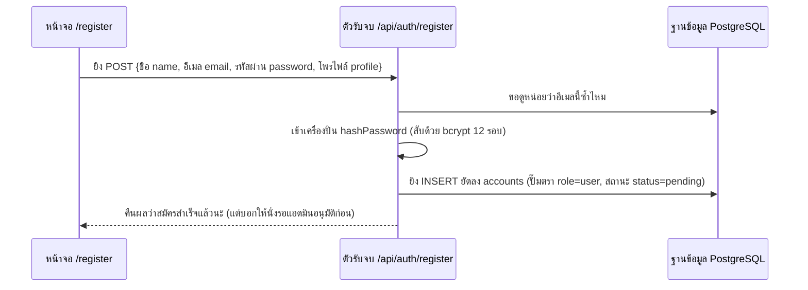
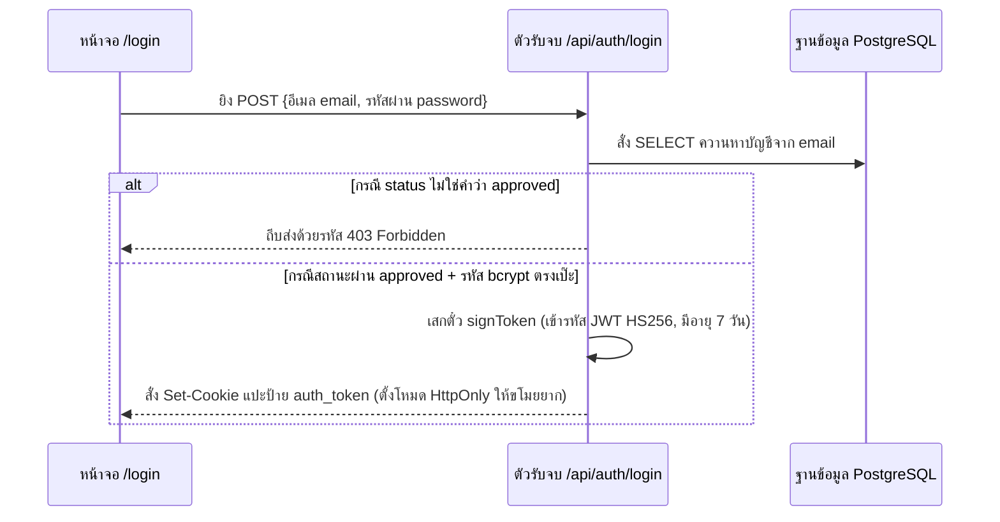
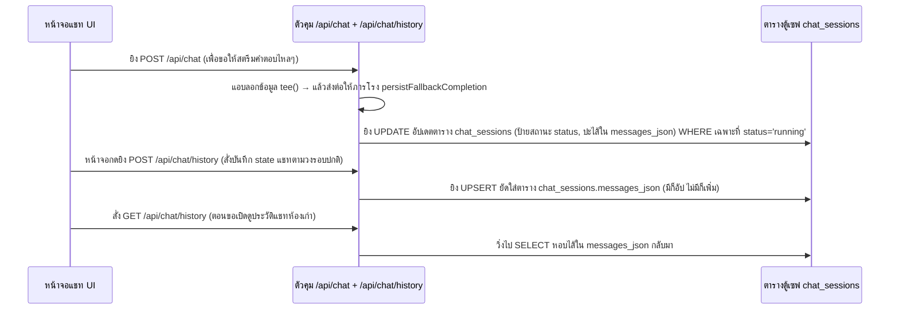

# 🔐 เวิร์กโฟลว์: ระบบด่านตรวจยืนยันตัวตน & ความจำเซสชัน (Auth & Session)

← กลับไป [[06 - Report Generation Workflow]] · กลับไปสารบัญดัชนีรวม → [[00 - Workflow Index]]

> มีเรื่องตื่นเต้นจะบอก: นี่คือเวิร์กโฟลว์เดียวในระบบที่ **หน้าบ้าน (Frontend) และแก๊ง BFF จะแอบข้ามหัว Backend ฝั่ง Python แล้วพุ่งตรงไปแตะฐานข้อมูล PostgreSQL ด้วยตัวเองตรงๆ** —
> โดยกระทำชำเราบน 2 ตารางหลักคือ `accounts` (ตารางรายชื่อ) และ `chat_sessions` (ตารางประวัติแชท)

## 1. การสมัครสมาชิกใหม่ (Register)

1. **หน้าบ้าน (Frontend)** ทักหน้า `/register` → แล้วโยนข้อมูลส่ง `POST /api/auth/register`
2. **BFF** จะเรียก `lib/auth.ts hashPassword()` เพื่อขยำสับรหัสผ่าน (ใช้เทคนิค bcrypt ตั้งระดับความโหด cost 12 รอบ) → แล้วยิง `INSERT` เข้าตาราง `accounts` พร้อมกับแปะป้ายประจานว่า `role=user`, แถมบังคับให้ `status=pending` (รอการพิจารณา)
3. ปล่อยให้ผู้ใช้นั่งตบยุงรอ **แอดมินระดับพระกาฬ (Admin Super)** มากดอนุมัติผ่านปุ่ม (`PATCH /api/auth/users`, เพื่อแก้ `status=approved` ซะ, แล้วอย่าลืมบันทึกลายเซ็นต์ทิ้งไว้ในช่อง `approved_by` และเวลาที่อนุมัติ `approved_at`)

## 2. การเข้าสู่ระบบ (Login)

1. **หน้าบ้าน (Frontend)** ทักหน้า `/login` → แล้วโยนข้อมูล `POST /api/auth/login`
2. **BFF** รัวคิวรี `SELECT` จากตาราง `accounts` → แวะเช็คตรวจดูป้าย `status` ว่าเป็น `approved` รึยัง (ถ้ายัง หรือโดนแบน → เด้งถีบส่ง 403 ทันที)
3. เข้าเครื่องสแกน `verifyPassword()` (ถอด bcrypt เทียบ) → ถ้าตรง จะสั่งโรงกษาปณ์ `signToken()` พิมพ์แบงก์ (ผลิตตั๋ว JWT ใช้ระบบ HS256, เซ็ตวันหมดอายุ 7 วัน, ผ่านไลบรารีเบาหวิว `jose`) → แล้วสั่งเบราว์เซอร์ set cookie รหัส `auth_token` (โดยติดยันต์ HttpOnly กันโดนขโมยจาก javascript, และเปิด sameSite=lax)
4. ตั้งแต่วินาทีนี้เป็นต้นไป รีเควสทุกเส้นทางจะต้องถูกเรียกตรวจตั๋ว `requireAuth()` ก่อนเข้า route handler เสมอ (โปรเจกต์รีโพนี้ล้ำกว่าชาวบ้าน เพราะไม่ได้ใช้ไฟล์สกัดกั้น `middleware.ts` แบบเก่าๆ)

## 3. การรีเซ็ตรหัสผ่าน (เมื่อลืมรหัส) (Reset)

1. พิมพ์อีเมลขอความช่วยเหลือ `POST /api/auth/forgot-password` → ระบบจะผลิตตั๋วชั่วคราว `reset_token` + ตั้งวันตาย `reset_token_expires` ยัดใส่ไว้ในช่องตาราง `accounts`
2. ถือกุญแจใหม่มากด `POST /api/auth/reset-password` → ระบบตรวจก่อนว่า token บูดหรือยัง → ถ้ายัง จะจัดการอัปเดตรหัสใหม่ลงช่อง `password_hash` → เสร็จแล้วล้าง token ทิ้ง (บังคับให้ตั๋วนี้เป็นแบบใช้แล้วทิ้งครั้งเดียวเท่านั้น)

## 4. ระบบจำฝังใจ บันทึกและโหลดประวัติแชท (Session persistence)

1. **เริ่มวงสนทนาแชท** — ฝั่งหน้าจอ Client จะขยันยิงคำสั่งเซฟ state ข้อมูลผ่านทาง `POST /api/chat/history` (พร้อมปะสถานะว่า กำลังคิด `running` → จนคิดเสร็จเป็น `done`)
2. **ระบบประกันภัยกันเน็ตหลุด** — ท่อหลักใน `chat/route.ts` จะงัดท่าไม้ตายก๊อปปี้สตรีมด้วย `stream.tee()` + จ้างภารโรง `persistFallbackCompletion()` เอาผลลัพธ์คำตอบก้อนสุดท้ายไปจดลงตาราง
   `chat_sessions` โดยมีข้อแม้ว่า ต้องยิงทับเฉพาะแถวที่มี `WHERE status='running'` เท่านั้น (ท่ากันหมา เพื่อไม่ให้เผลอไปเขียนทับผลงานที่ฝั่ง client แก้วิธีเซฟไปแล้ว)
3. **เปิดสมุดประวัติเก่า** — ตอนคลิก Sidebar ไปที่ห้อง `/chat/sessions/[sessionId]` → หน้าบ้านจะยิง `GET /api/chat/history` → ฝั่งระบบก็ไปโหลดไส้ใน JSON `messages_json` มาเสิร์ฟ
4. แถบรายชื่อแชท Sidebar ด้านซ้าย จะถูกสั่งให้เรียงแถวโชว์ความใหม่สดตามเวลา `updated_at DESC` (แชทใหม่เด้งขึ้นบนเสมอ)

## 📍 จุดตัดที่น่าสนใจ (Touchpoints)

| แวะที่ไฟล์ / ฟังก์ชัน | ทำหน้าที่อะไร | ชี้เป้าไปที่ตาราง |
|---|---|---|
| `lib/auth.ts` | เครื่องปั่นรหัส bcrypt + โรงพิมพ์ตั๋ว JWT (ผ่าน jose) | — |
| `lib/internalFetch.ts` ฟังก์ชัน `requireAuth` | ยามหน้าประตู คอยขอดูตั๋วสิทธิ์ทุก route (ใครไม่มี ถีบ) | — |
| โฟลเดอร์ `app/api/auth/*` | ศูนย์บริการลูกค้า: สมัคร/ล็อกอิน/ลืมรหัส/ให้สิทธิ์คนใช้ | ตาราง `accounts` |
| `app/api/chat/route.ts` | ภารโรงคอยตามเช็ดตามเก็บเซฟก้อนแชทสำรอง (persist fallback) | ตาราง `chat_sessions` |
| `app/api/chat/history/route.ts` | เสมียนห้องสมุด คอยงัด/หรือจด บันทึก state แชท | ตาราง `chat_sessions` |

## ⚠️ ป้ายเตือนอันตราย (ระดับคนคุมระบบ Governance)
- อย่าหาทำ: คีย์ลับอย่าง `JWT_SECRET` และกุญแจผี `INTERNAL_API_KEY` ในเครื่องนี้มันเป็นค่าตั้งเล่นๆ สำหรับนักพัฒนา (dev) — **ต้องสับเปลี่ยนรหัสใหม่หมด** ก่อนจะเอาขึ้นเซิร์ฟเวอร์จริง (production)
- ระวังหนอนบ่อนไส้: ในไฟล์ตัวแม่ `schema.sql` มีการแอบฝังปลูกถ่ายบัญชีผี+พร้อมรหัสผ่านที่รู้กันเองไว้เพียบ (ตั้งแต่ `musya01` ถึง `musya50`, รวมถึงฝังบัญชีแอดมินด้วย) — **ต้องลบตัว seed ทิ้งให้เหี้ยน** ก่อนเปิดร้านใช้งานจริง
- ส่องความเชื่อมโยงของโครงสร้าง: แวะไปดูเอนทิตีตารางที่ [[04 - Data Architecture & Schema]] · หรือไปยลโฉมภาพรวมวิธีคิดระบบผู้ใช้ที่ [[01 - Account & Access]]
