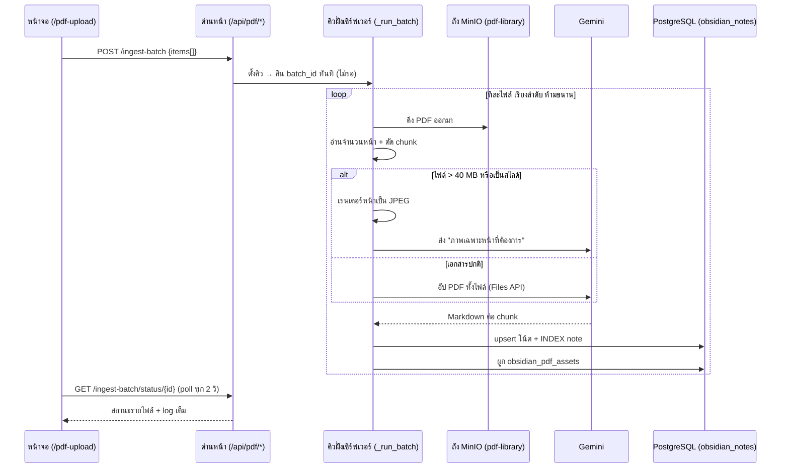

# 📄 เวิร์กโฟลว์: ย่อย PDF เข้าคลังความรู้ (PDF Ingest)

← กลับไป [[00 - Workflow Index]] · เกี่ยวข้อง → [[03 - Knowledge Vault Workflow]]

> หน้า `/pdf-upload` คือประตูที่ทำให้ PDF ก้อนหนึ่งกลายเป็นโน้ต `.md` หลายสิบใบใน
> คลังความรู้ที่ AI ค้นเจอได้ — เอกสารนี้บันทึกทั้งเส้นทางปกติและ **กับดักที่เคยตกไปแล้ว**

## 📊 แผนภาพลำดับเหตุการณ์



## 🛠️ ขั้นตอนสำคัญ

1. **อัปไฟล์** → เก็บใน MinIO bucket `pdf-library` (object name = เลข id, ชื่อจริงอยู่ใน metadata)
2. **`/analyze-placement`** (ถ้าใช้) — ให้ AI เดาจังหวัด/โฟลเดอร์ปลายทางก่อนกด ingest จริง
3. **สั่งคิว** `/ingest-batch` → คืน `batch_id` ทันที คิวเดินฝั่งเซิร์ฟเวอร์
4. **แต่ละไฟล์**: ดึงจาก MinIO → นับหน้า → ตัด chunk → เลือกโหมดส่งให้ Gemini → แปลงเป็น Markdown → เขียนโน้ต → สร้าง INDEX note → ผูก `obsidian_pdf_assets`
5. **หน้าจอ poll** สถานะทุก 2 วินาที แล้ววาดเป็น Ingest Log

## 🖼️ โหมดเรนเดอร์ภาพ — ทางแก้ไฟล์ใหญ่และสไลด์

**อาการ:** Gemini ตอบ `400 INVALID_ARGUMENT` กับ PDF ขนาด 92–95 MB
(สไลด์นำเสนอที่ฝังรูปความละเอียดสูง) ทดสอบยืนยัน: 23 MB ผ่าน / 92 MB พัง

**ทางแก้ที่วัดผลแล้ว** — เรนเดอร์เฉพาะหน้าของ chunk เป็น JPEG แทนการอัป PDF ทั้งไฟล์:

| | เดิม | เรนเดอร์เป็นภาพ |
|---|---|---|
| ขนาดที่ส่ง | 92 MB | **1.89 MB** (4 หน้า @150 DPI) |
| ผลลัพธ์ | ❌ 400 | ✅ **2,956 ตัวอักษร** |
| ต่อหน้า | 39 ตัวอักษร | **~740 ตัวอักษร** |

เข้าโหมดนี้อัตโนมัติเมื่อ **ไฟล์ > 40 MB** หรือ **ตรวจว่าเป็นสไลด์** (ใช้อัตราส่วนหน้า
เป็นหลัก) · สไลด์ยังได้พรอมป์พิเศษที่สั่งให้ **อธิบายภาพ/แผนภาพ** ด้วย เพราะความหมาย
ของสไลด์อยู่ในภาพ ไม่ใช่ข้อความ — ผลจริง: สไลด์ที่เคยพัง 312 → **8,291 ตัวอักษร (27 เท่า)**

> [!warning] ต้องคุมแรมด้วย
> เรนเดอร์เต็ม DPI กับสไลด์แผ่นใหญ่กินแรม ~370 MB/หน้า — จำกัดด้านยาวที่
> `_MAX_RENDER_PX = 1600`, เรนเดอร์ทีละหน้าทั้งโปรเซส (`_render_lock`),
> และ `page.close()` ทุกหน้า → peak RSS 1,249 → **788 MB**

## 🔁 กับดักคุณภาพเนื้อหา 3 ชั้น

### ชั้น 1 — ล้มเหลวแบบเงียบ (แก้แล้ว)

เดิม `_ai_convert_to_markdown` **จับ exception แล้วเขียนโน้ตเปล่า** (มีแต่ frontmatter
~32–39 ตัวอักษร/หน้า) แต่ job ยังรายงาน `completed` → ความล้มเหลวมองไม่เห็นเลย
**เจอโน้ตเปล่า 29 ใบจาก 6 เอกสารกว่าจะรู้ตัว**

ตอนนี้ raise แทน และ job เป็น `partial` พร้อมระบุส่วนที่พัง

### ชั้น 2 — เนื้อหาที่ "ไม่ว่าง" แต่ใช้ไม่ได้

เจอโน้ตหนึ่งได้ **128,067 ตัวอักษรจาก 15 หน้า** — เปิดดูแล้วเป็นจุดยาวเป็นหมื่นตัว
โมเดลวนลูป · เนื้อหาแบบนี้ผ่านการเช็ค "ไม่ว่าง" ได้สบาย จึงรอดทุกด่านมาตลอด

`_is_degenerate()` จับตัวอักษรเดียวซ้ำเกิน 80 ตัว → สแกนทั้ง vault พบอีก **22 ใบจาก 16 เอกสาร**

### ชั้น 3 — สาเหตุจริงของการวนลูป

วัดจริง: **15 หน้าสแกนวนลูปทุกครั้ง แต่ 6 หน้าผ่านสบาย**
⇒ ต้นเหตุคือ **จำนวนหน้าต่อครั้ง** ไม่ใช่ temperature

จึงมี 2 ชั้นป้องกัน:
1. ไล่ temperature `0.2 → 0.5 → 0.8` (`_CONVERT_TEMPERATURES`)
2. ถ้ายังวน → **แบ่งเป็นช่วงย่อยละ 6 หน้า** (`_SPLIT_MAX_PAGES`) แล้วประกอบ
   frontmatter/nav เองแทนที่จะให้โมเดลสร้างซ้ำหลายรอบ (แม่นกว่า)

## 🩺 สคริปต์ซ่อมโน้ตเสีย

[`repair_empty_notes.py`](../../chatapi.python/src/scripts/repair_empty_notes.py)
หาโน้ตที่เสียเอง (ทั้ง stub และวนซ้ำ) แล้วซ่อม **เฉพาะ chunk ที่เสียในที่เดิม**
ไม่ต้อง ingest ใหม่ทั้งเล่ม · มี `--dry-run` ให้ดูก่อน

```bash
docker exec chatapp-python-ai python -m src.scripts.repair_empty_notes --dry-run
docker exec chatapp-python-ai python -m src.scripts.repair_empty_notes
```

ผลจริงรอบล่าสุด: ซ่อม **49 ใบจาก 20 เอกสาร สำเร็จ 100%** (เช่น 640 → 22,957 / 27,880 / 95,286 ตัวอักษร)

## 📍 จุดตัดที่น่าสนใจ

| ไฟล์ / ฟังก์ชัน | หน้าที่ | แหล่งเก็บ |
|---|---|---|
| `pdf_ingest.py` `_do_ingest` | เครื่องยนต์หลัก ย่อย 1 ไฟล์ | MinIO → PostgreSQL |
| `pdf_ingest.py` `_run_batch` | เดินคิวทีละไฟล์ **ห้ามขนาน** (ยิงพร้อมกันชน 429 quota-per-minute) | Redis (มิเรอร์สถานะ) |
| `_render_page_images` | เรนเดอร์หน้า → JPEG | — |
| `_looks_like_slides` | ตรวจว่าเป็นสไลด์จากอัตราส่วนหน้า | — |
| `_is_degenerate` | จับเนื้อหาที่โมเดลวนซ้ำ | — |
| `repair_empty_notes.py` | ซ่อมโน้ตเสียในที่เดิม | PostgreSQL |
| `app/pdf-upload/page.tsx` | หน้าจอ + Ingest Log | — |

## ⚠️ ป้ายเตือนอันตราย

> [!danger] uvicorn รัน `--workers 4` — dict ในหน่วยความจำใช้ร่วมกันไม่ได้
> POST ลงไปที่ worker A แต่ GET status เด้งไป worker B แล้ว **404**
> แก้โดยมิเรอร์สถานะขึ้น **Redis** ทุกครั้งที่เปลี่ยน แล้วให้ฝั่งอ่านตกไปหา Redis
> ถ้าไม่เจอใน dict ตัวเอง — ไม่มี Redis ก็ยังทำงานได้เหมือนเดิม (fallback เงียบ)

> [!danger] ลำดับการเขียน FK สำคัญ
> `obsidian_pdf_assets` ต้องลงทะเบียน **หลัง** สร้าง INDEX note เสมอ
> เดิมสลับลำดับ ทำให้ตารางนี้พังเงียบมาตลอดเหลือแค่ 1 แถว (ตอนนี้ 15 แถว)

- **โค้ดไม่ได้ bind-mount** — แก้โค้ดแล้ว `docker restart` เฉย ๆ ไม่พอ ต้อง `docker compose build python-ai` ใหม่
- **สถานะ `partial` ต้องไม่ถูกมองข้าม** — ดู [[06 - API Reference — Backend]] ส่วนคิว ingest
- คิวเดินต่อแม้ผู้ใช้ปิดแท็บ เพราะสถานะอยู่ฝั่งเซิร์ฟเวอร์ ไม่ใช่ในหน้าเว็บ
